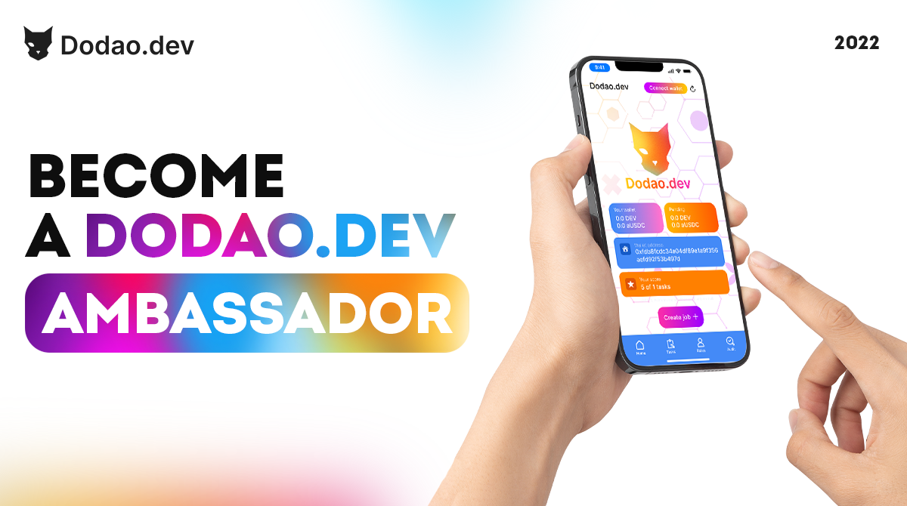

<<<<<<< HEAD
# Dodao Ambassador Program

*The image banner should feature a collage of ambassador-related visuals, such as community engagement, event hosting, and content creation, to represent the diverse responsibilities of Dodao Ambassadors.*

Are you passionate about blockchain technology and decentralized solutions? Do you want to help shape the future of work and contribute to the growth of a groundbreaking platform? The Dodao Ambassador Program is designed to help you showcase your leadership skills, collaborate with like-minded individuals, and get rewarded for your contributions.

## Why Join the Dodao Ambassador Program?

- **Unique Opportunity**: Dodao is the first decentralized job exchange platform, providing a unique opportunity for ambassadors to showcase their skills and collaborate with a global community of technologists and creators.
- **Collaborative Environment**: Join a vibrant community of ambassadors, share knowledge, and learn from one another.
- **Earn Rewards**: Get rewarded for your contributions to the Dodao platform and the community through various incentives and programs.
- **Gain Exposure**: Showcase your work to a global audience and gain exposure for your talent and skills.

## Who Can Join?
=======
ambassador-program.md

# Ambassador Program

The mission of Dodao is to become a major platform for software development in the blockchain community – not only because of its innovative technology, but also because of its close-knit community. Dodao will be owned and governed by its stakeholders (developers, shareholders, board members, and DAO Treasury). We have been inspired by the low gas fees and speed of the Moonbeam network and its compatibility with ERC20. We strongly believe that traditional recruitment processes in an epoch of post-covid shift from offices to home-office work need to be changed and decentralized. Our app aims to help the crypto community manage recruitment in a preferred crypto way, residing in the crypto space.

## Who are you?

- You are passionate about technology and Blockchain solutions
- You are a pioneer for current StartUps with a huge future potential based on technical facts
- You want access to the team building Dodao
- You are excited to impact the growth of Dodao
- You are interested in networking with other people in the Blockchain community

## What you'll do

- You share Content like Blog Posts, Social Media Content, Video Tutorials, Marketing Material, etc.
- You support teams in coding dApps
- You host meetups and present on behalf of Dodao
- You represent your region in the community
- You get support for initiatives that support the Dodao mission
- You participate in regular update calls with other ambassadors and Dodao team members
>>>>>>> 9bf46bb8b118ae3ef2a114345b64d4abdd2489e7

The Dodao Ambassador Program welcomes all types of individuals who are passionate about blockchain technology and decentralized solutions, including but not limited to:
- Community managers and organizers
- Content creators and influencers
- Developers and technologists
- Entrepreneurs and business leaders

<<<<<<< HEAD
Whether you're a seasoned professional or just starting your journey in the blockchain space, the Dodao Ambassador Program has a place for you.

## How to Join
=======
## Ambassador Benefits

As you help advance our vision for a serverless, cross-chain, and multi-chain future, you'll also benefit from a few great perks.
>>>>>>> 9bf46bb8b118ae3ef2a114345b64d4abdd2489e7

To join the Dodao Ambassador Program, simply follow these steps:
1. Fill out the [application form](https://forms.gle/X1BoC8rVJaDinncQ6) with your basic information and portfolio.
2. Our team will review your application and get back to you within 7 days.
3. If accepted, you'll receive an invitation to join our exclusive Discord community and get started with the program.

## Program Benefits

<<<<<<< HEAD
As a member of the Dodao Ambassador Program, you'll enjoy a range of benefits, including:
- Access to exclusive Discord channels and events
- Collaboration opportunities with other ambassadors and team members
- Participation in challenges and campaigns with prizes
- Showcase your work on the Dodao platform and social media channels
- Earn rewards for your contributions and engagement

## Ambassador NFTs

One of the key features of the Dodao platform is the use of Ambassador NFTs. These unique digital assets represent your identity and achievements as an ambassador on the platform. As you participate in the Ambassador Program and contribute to the community, you'll have the opportunity to earn and level up your Ambassador NFT, unlocking new benefits and rewards along the way.

<!--  -->
=======
Networking

Access to a private ambassador Telegram Group and Discord Channel with regular calls
>>>>>>> 9bf46bb8b118ae3ef2a114345b64d4abdd2489e7

## Ambassador Responsibilities

<<<<<<< HEAD
As a Dodao Ambassador, you'll have the opportunity to contribute to the platform and the community in various ways, including:
- Organizing and hosting events and meetups
- Creating and sharing content about Dodao and blockchain technology
- Engaging with the community and providing support and guidance
- Providing feedback and suggestions for platform improvements
- Collaborating with other ambassadors and team members on special projects and initiatives

## Ambassador Levels and Rewards
=======
Priority access and first call to events, whitelisting spots, bounties, hackathons, and more
>>>>>>> 9bf46bb8b118ae3ef2a114345b64d4abdd2489e7

The Dodao Ambassador Program features a tiered system that rewards ambassadors based on their contributions and engagement. As you progress through the levels, you'll unlock new benefits and rewards, such as:
- Exclusive NFTs and badges
- Access to special events and networking opportunities
- Increased rewards and bonuses
- Opportunities to collaborate with the Dodao team on special projects
- Recognition and exposure on the Dodao platform and social media channels

<<<<<<< HEAD
## Get Started Today

Ready to join the Dodao Ambassador Program and help shape the future of work in the blockchain space? [Apply now](https://forms.gle/X1BoC8rVJaDinncQ6) and start your journey with Dodao today!

**ADDED: Community Engagement Ideas**

As a Dodao Ambassador, you'll have the opportunity to engage with the community and contribute to the growth of the platform in various ways. Here are some ideas to get you started:

1. **Host a Local Meetup**: Organize a local meetup for blockchain enthusiasts and professionals in your area. Share your knowledge about Dodao and lead discussions on the future of work in the blockchain space.

2. **Create a Tutorial Series**: Develop a series of tutorials or guides on how to use the Dodao platform effectively. Share your tips and tricks for creating successful tasks, collaborating with others, and earning rewards.

3. **Start a Podcast or Video Series**: Launch a podcast or video series featuring interviews with Dodao team members, ambassadors, and community members. Discuss the latest trends and developments in the blockchain space and how Dodao is revolutionizing the way we work.

4. **Write Blog Posts and Articles**: Share your insights and experiences with the Dodao platform through blog posts and articles. Offer your perspective on the benefits of decentralized work and how Dodao is empowering creators and developers around the world.

5. **Engage on Social Media**: Participate in discussions and conversations about Dodao and blockchain technology on social media platforms like Twitter, LinkedIn, and Reddit. Share updates and news about the platform and engage with other community members.

Remember, these are just a few ideas to get you started. As a Dodao Ambassador, you have the creativity and freedom to come up with your own unique ways to engage with the community and contribute to the growth of the platform.

**ADDED: Frequently Asked Questions**

1. **What is the time commitment for being a Dodao Ambassador?**
  The time commitment for being a Dodao Ambassador is flexible and can vary depending on your availability and level of engagement. We recommend dedicating at least a few hours per week to community engagement, content creation, and other ambassador activities.
=======
Help us grow our community, and we support you in realizing your visions supporting Dodao

Apply here

## How Ambassadors Contribute to the Community

There are many areas in which you can contribute to Dodao, depending on your background and skills. We also support your own initiatives that you feel could benefit the project.

- Community Management
- Project Promotion
- Contribute to growth
- Mentor the Community
- Code the future with us
- Blockchain Content Creation

Become an ambassador

## The Path to Ambassadorship

After becoming an ambassador, there will be additional levels to achieve where you will be able to lead your own category or region and enjoy more benefits following the increase in responsibility.

1. Submit an application
2. Do Ambassador Quests
3. Interview with the team
4. Become an Apprentice Ambassador
5. Join the private Telegram Ambassador Group
6. Complete two tasks within the first month
7. Advance to a full Ambassador status
8. Join the Ambassador Role in our Discord Server

Apply here

Speak with our Experts:
>>>>>>> 9bf46bb8b118ae3ef2a114345b64d4abdd2489e7

2. **Can I be an ambassador for other blockchain projects while being a Dodao Ambassador?**
  Yes, you can be an ambassador for other blockchain projects while being a Dodao Ambassador, as long as there is no direct conflict of interest. We encourage our ambassadors to be active and engaged members of the broader blockchain community.

3. **How do I level up my Ambassador NFT?**
  You can level up your Ambassador NFT by completing certain milestones and achieving specific goals, such as organizing a certain number of events, creating a certain amount of content, or referring a certain number of new users to the platform. The exact requirements for leveling up will be communicated to you as part of the Ambassador Program.

4. **What kind of support can I expect from the Dodao team?**
  As a Dodao Ambassador, you'll have access to a dedicated support team that can help you with any questions or issues you may have. You'll also have access to exclusive resources and materials to help you succeed in your role, such as branding guidelines, content templates, and promotional assets.

5. **How do I get paid for my contributions as an ambassador?**
  Dodao Ambassadors are rewarded for their contributions through a variety of means, including DODAO tokens, NFTs, and other exclusive benefits. The exact compensation structure will be communicated to you as part of the Ambassador Program, and will depend on your level of engagement and the specific activities you participate in.

If you have any additional questions or concerns, please don't hesitate to reach out to the Dodao team. We're here to support you and help you succeed as a Dodao Ambassador!