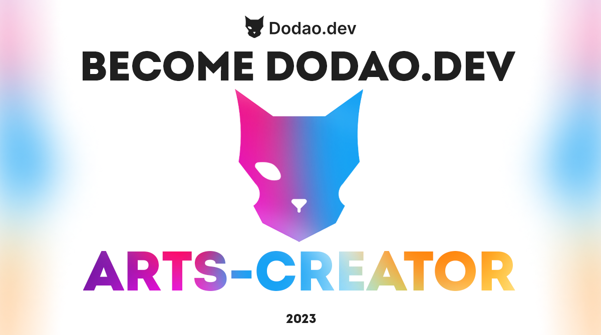

Join the testnet of the first decentralized Job Exchange in the world as a creator!

Why Dodao?

There is no other project comparable to ours currently in the market. We are launching as a fully decentralized mobile app available on iOS, Android, and also on Microsoft, macOS, and Linux.

We have won a prize at the first hackathon we have joined, which is a good sign that we are on the right path. Find more information here.
Apply now to become one of the first Dodao Creators!
Who are you?

- You are passionate about digital Content Creation
- You are an expert in visual creation, sound creation, or any kind of digital content creation
- You are an Influencer with up to 2K followers on any social platform
- You are interested in networking with other people in the Blockchain community
- You are excited to become one of the first creators on Dodao

What you'll do

- Testing of Dodao dApp
- You create dedicated Content based on your expertise
- You get access to private Discord Channels with like-minded people, all information you need, and access to the team
- Being creative and professional in any kind of content creation for Dodao

[Apply here to become an Arts Creator](https://forms.gle/X1BoC8rVJaDinncQ6)

Dodao Creator Benefits

Soon, we will announce why and how NFTs play a big role for experts selling their expertise on Dodao. By participating in our Content Creator Program, you will get an NFT based on your provided Content Creation during the program.

Creator NFT

Get the chance to receive one of the first Creator NFTs, enabling you to sell your work on Dodao.

Promotion

You promote Dodao while we are in Testnet, and we promote you when we launch on Mainnet!

First NFT Owners

Experts need NFTs to sell their expertise on Dodao. You will be one of the first NFT Owners!

Apply here
How it works in Detail

If you have any questions, feel free to ask in our public Discord Channel.

Application First

First, you have to apply and provide an example of your work to get a chance to attend this program. We will review everything carefully.

Creator Onboarding

If you pass the application process, you get access to our private Discord Content Creation Channels with all the information you need and access to all calls.

Dodao Content Creation

Based on your expertise, you get dedicated content creation tasks with guidelines you have to follow. Let's help each other build the future Dodao audience.

Access to our Reward Ranking

Weekly, we share a reward ranking to ensure transparency and motivation. Based on your rewards, you receive an NFT and promotion based on your ranking.

Get your Creator NFT

Receive your Creator NFT to ensure you are one of the first Creators selling their work on Dodao. Every Creator will need a Creator NFT.

Long-term Benefits

Continue with your work, even after you have received your NFT. Based on your Reward points, we will promote you during our mainnet launch.
Apply to become a Creator
Speak with our Experts:

Dodao is built by a smart team of blockchain and database engineers and project managers, passionate about improving and scaling blockchain technologies.
