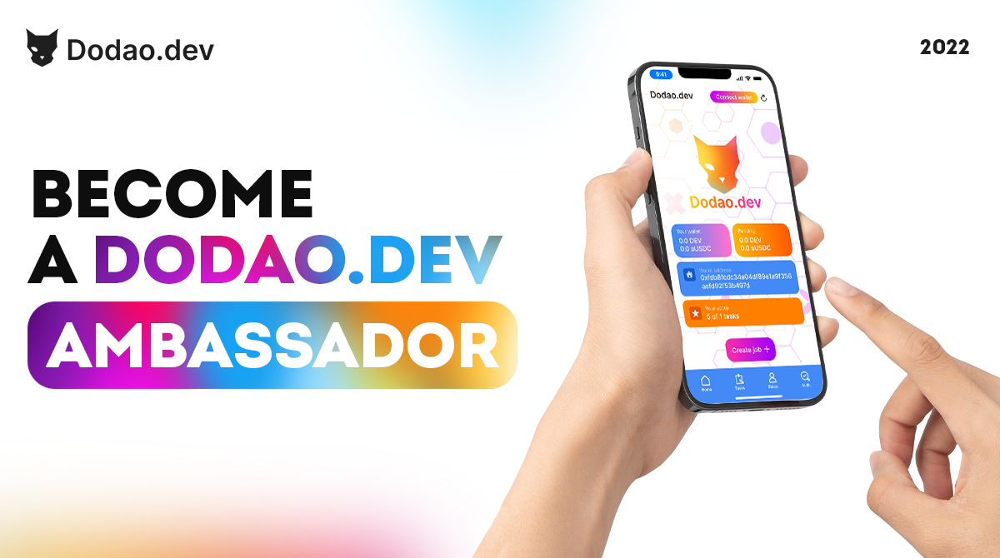

# Developer Program



**Where code meets community, innovation meets opportunity.**

*"The best developers don't just write code – they shape the future. Here's your chance to build the infrastructure that will power the next generation of work."*

Welcome to the frontier of decentralized development, where your code doesn't just solve problems – it transforms entire industries. The Developer Program isn't about finding another job; it's about joining the architects of the future economy, where your contributions directly shape how millions of people will work, collaborate, and prosper.

This is where technical excellence meets social impact, where blockchain innovation meets real-world solutions, and where your development skills become the foundation for a more equitable, transparent, and efficient global work ecosystem.

Your code. Your impact. Your future.

## The developer revolution

### 💻 Beyond traditional development roles

**The old paradigm (what we're disrupting):**
- Build features for someone else's vision
- Limited influence on product direction and architecture
- Compensation disconnected from value creation
- Proprietary code locked in corporate silos
- Career advancement through corporate hierarchies
- Innovation constrained by profit-driven priorities

**The Dodao paradigm (your development future):**
- Architect the infrastructure of the future economy
- Direct influence on platform evolution through governance
- Compensation tied to platform success and token appreciation
- Open-source contributions with lasting impact
- Career advancement through community recognition and merit
- Innovation driven by global collaboration and shared success

*"We're not just building another platform – we're building the operating system for the future of work."*

### 🌟 What makes this revolutionary

**True ownership of your contributions:**
Your code contributions are recognized, rewarded, and remembered. Unlike traditional employment where your work becomes corporate property, here your contributions earn you governance rights and long-term platform ownership.

**Technical sovereignty:**
Participate in architectural decisions, protocol upgrades, and technical roadmap planning. Your expertise shapes not just implementation details, but the fundamental direction of decentralized work infrastructure.

**Cross-chain innovation:**
Work on cutting-edge multi-chain architecture, cross-chain protocols, and interoperability solutions that are defining the future of blockchain technology.

**Global impact at scale:**
Your code will power work relationships for millions of people worldwide, creating economic opportunities and removing barriers to global collaboration.

## Program overview

### 🎯 Mission and vision

**Our mission:**
To build the world's most advanced, secure, and user-friendly decentralized work platform through collaborative development, open innovation, and community-driven technical excellence.

**Our vision:**
A future where the infrastructure of work is owned and governed by the developers who build it and the communities who use it, creating sustainable value for all stakeholders.

**Core principles:**
- **Technical excellence**: World-class code quality and architectural design
- **Open innovation**: Transparent development with community collaboration
- **Security first**: Uncompromising commitment to user safety and platform integrity
- **Scalable architecture**: Building for global adoption and cross-chain interoperability
- **Developer empowerment**: Recognition, rewards, and governance participation for contributors

### 🛠️ Technical focus areas

**Core platform development:**
- Smart contract architecture and Diamond pattern implementation
- Cross-chain protocol integration (Axelar, LayerZero, Hyperlane, Wormhole)
- Decentralized identity and reputation systems
- Advanced cryptographic security implementations
- Scalable backend infrastructure and API development
- Frontend applications and user experience optimization

**Blockchain infrastructure:**
- Multi-chain deployment and management
- Bridge protocol development and optimization
- Consensus mechanism research and implementation
- Layer 2 scaling solutions and rollup technology
- Interoperability protocols and cross-chain messaging
- Decentralized storage and data availability solutions

**Developer tools and ecosystem:**
- SDK development for multiple programming languages
- Developer documentation and educational resources
- Testing frameworks and quality assurance tools
- Deployment automation and DevOps infrastructure
- Analytics and monitoring systems
- Integration libraries and API wrappers

**Research and innovation:**
- Zero-knowledge proof implementations
- Privacy-preserving technologies
- Decentralized governance mechanisms
- Economic mechanism design and tokenomics
- User experience research and optimization
- Emerging blockchain technology evaluation

## Membership tiers and opportunities

### 🌱 Contributing Developer (Entry Level)

**Qualification requirements:**
- Demonstrated programming skills in relevant technologies
- Understanding of blockchain fundamentals and Web3 concepts
- Completion of technical assessment and code review
- Commitment to open-source development principles

**Technical focus areas:**
- Bug fixes and minor feature implementations
- Documentation improvements and code comments
- Test coverage expansion and quality assurance
- Community support and developer assistance
- Learning advanced blockchain development concepts

**Benefits and opportunities:**
- Access to private developer Discord channels
- Mentorship from senior developers
- Code review and feedback from core team
- Governance voting rights on technical proposals
- Monthly developer calls and technical discussions
- Educational resources and skill development programs

**Earning potential:**
- $1,000-5,000 per month
- Bounty-based compensation for specific contributions
- Bonus rewards for exceptional work and innovation
- Governance token allocations for participation

**Growth pathway:**
- Complete 10+ meaningful contributions with positive reviews
- Demonstrate expertise in specific technical areas
- Mentor newer developers and contribute to community
- Participate actively in technical discussions and governance

### 🔧 Core Developer (Intermediate Level)

**Qualification requirements:**
- 6+ months as Contributing Developer with excellent track record
- Deep expertise in blockchain development and smart contracts
- Significant contributions to platform architecture and features
- Leadership in technical discussions and code reviews

**Technical responsibilities:**
- Major feature development and architectural improvements
- Smart contract development and security auditing
- Cross-chain protocol integration and optimization
- Technical documentation and developer guide creation
- Code review and mentorship of contributing developers

**Enhanced benefits:**
- Enhanced governance voting power (2x multiplier)
- Priority access to high-impact development projects
- Direct collaboration with platform architects
- Speaking opportunities at blockchain conferences
- Access to advanced development tools and resources
- Participation in technical roadmap planning

**Earning potential:**
- $5,000-15,000 per month
- Equity-like token allocations based on contributions
- Performance bonuses for critical feature delivery
- Revenue sharing from platform growth and success

**Leadership opportunities:**
- Lead development teams on major initiatives
- Represent Dodao at technical conferences and events
- Contribute to open-source blockchain ecosystem
- Guide technical strategy and architectural decisions

### 🏗️ Platform Architect (Expert Level)

**Qualification requirements:**
- 12+ months as Core Developer with exceptional contributions
- Recognized expertise in blockchain architecture and protocol design
- Leadership of major technical initiatives and successful delivery
- Thought leadership in decentralized systems and Web3 technology

**Architectural responsibilities:**
- Platform architecture design and evolution
- Protocol research and implementation strategy
- Security architecture and threat modeling
- Scalability planning and performance optimization
- Cross-chain strategy and interoperability design

**Premium benefits:**
- Maximum governance voting power (3x multiplier)
- Direct input on platform strategic direction
- Equity participation in platform success
- Global speaking and thought leadership opportunities
- Access to cutting-edge research and development resources
- Collaboration with leading blockchain projects and protocols

**Earning potential:**
- $15,000-40,000+ per month
- Significant token allocations with long-term vesting
- Platform revenue sharing and success-based bonuses
- Consulting opportunities with partner projects

**Strategic responsibilities:**
- Shape platform technical vision and roadmap
- Lead research into emerging blockchain technologies
- Establish technical partnerships and collaborations
- Guide platform evolution and ecosystem development

### 👑 Technical Lead (Leadership Level)

**Qualification requirements:**
- 18+ months as Platform Architect with exceptional leadership
- Recognition as thought leader in blockchain and decentralized systems
- Successful delivery of major platform initiatives
- Elected by developer community or appointed by governance

**Leadership responsibilities:**
- Overall technical strategy and vision
- Cross-functional collaboration with product and business teams
- External representation and partnership development
- Technical hiring and team building
- Open-source ecosystem leadership and contribution

**Executive privileges:**
- Platform equity participation and ownership
- Board-level involvement in strategic decisions
- Authority to approve major technical initiatives
- Global representation and speaking authority
- Access to platform financial and strategic information
- Ability to negotiate technical partnerships and collaborations

**Compensation structure:**
- Executive-level base compensation
- Significant equity-like token allocations
- Platform revenue sharing and success bonuses
- Professional development and conference support
- Research and innovation budget authority

## Technical stack and tools

### 🔗 Blockchain and smart contracts

**Primary technologies:**
- **Solidity**: Smart contract development for EVM-compatible chains
- **Diamond Pattern**: Upgradeable smart contract architecture
- **Hardhat/Foundry**: Development, testing, and deployment frameworks
- **OpenZeppelin**: Security-focused smart contract libraries
- **Chainlink**: Oracle integration for external data feeds
- **IPFS**: Decentralized storage for metadata and files

**Cross-chain protocols:**
- **Axelar**: Secure cross-chain communication and token transfers
- **LayerZero**: Omnichain infrastructure with ultra-light nodes
- **Hyperlane**: Modular interoperability with custom security
- **Wormhole**: Battle-tested messaging with guardian network

**Supported networks:**
- **Ethereum**: Primary smart contract deployment
- **Polygon**: Low-cost scaling and high throughput
- **Moonbeam**: Polkadot ecosystem integration
- **Arbitrum**: Optimistic rollup scaling solution
- **Optimism**: Fast and cheap Layer 2 transactions

### 🖥️ Backend and infrastructure

**Core technologies:**
- **Node.js/TypeScript**: Backend API and service development
- **GraphQL**: Flexible and efficient API query language
- **PostgreSQL**: Primary database for application data
- **Redis**: Caching and session management
- **Docker**: Containerization and deployment
- **Kubernetes**: Container orchestration and scaling

**Cloud and DevOps:**
- **AWS/GCP**: Cloud infrastructure and services
- **Terraform**: Infrastructure as code and automation
- **GitHub Actions**: CI/CD pipelines and automated testing
- **Monitoring**: Prometheus, Grafana, and custom analytics
- **Security**: Automated security scanning and vulnerability assessment

### 🎨 Frontend and user experience

**Web technologies:**
- **React/Next.js**: Modern web application development
- **TypeScript**: Type-safe JavaScript development
- **Tailwind CSS**: Utility-first CSS framework
- **Web3.js/Ethers.js**: Blockchain interaction libraries
- **WalletConnect**: Multi-wallet connection and integration

**Mobile development:**
- **React Native**: Cross-platform mobile application development
- **Expo**: Rapid mobile development and deployment
- **Native modules**: Platform-specific functionality integration

### 🔧 Development tools and workflow

**Code quality and testing:**
- **ESLint/Prettier**: Code formatting and style enforcement
- **Jest**: JavaScript testing framework
- **Cypress**: End-to-end testing and automation
- **SonarQube**: Code quality analysis and security scanning
- **Husky**: Git hooks for automated quality checks

**Collaboration and documentation:**
- **GitHub**: Version control and collaborative development
- **GitBook**: Technical documentation and guides
- **Notion**: Project planning and knowledge management
- **Discord**: Real-time communication and community building
- **Figma**: Design collaboration and prototyping

## Contribution pathways

### 🚀 Getting started guide

**Week 1: Environment setup**
1. **Development environment**: Set up local blockchain development environment
2. **Repository access**: Fork main repository and understand codebase structure
3. **Community integration**: Join developer Discord and introduce yourself
4. **First contribution**: Complete "good first issue" to understand workflow
5. **Mentorship**: Connect with assigned mentor for guidance and support

**Week 2-4: First meaningful contributions**
1. **Bug fixes**: Identify and fix bugs in existing codebase
2. **Documentation**: Improve developer documentation and code comments
3. **Testing**: Add test coverage for existing features
4. **Code review**: Participate in code review process for other contributions
5. **Community participation**: Engage in technical discussions and governance

**Month 2-3: Feature development**
1. **Feature implementation**: Take ownership of small to medium features
2. **Technical design**: Participate in technical design discussions
3. **Cross-team collaboration**: Work with frontend, backend, and smart contract teams
4. **Quality assurance**: Ensure high code quality and comprehensive testing
5. **Knowledge sharing**: Present work to community and gather feedback

### 📋 Contribution types and recognition

**Code contributions:**
- **Smart contract development**: Core platform functionality and security
- **Backend API development**: Scalable and efficient service architecture
- **Frontend development**: User-friendly and responsive interfaces
- **Cross-chain integration**: Multi-chain functionality and interoperability
- **Developer tools**: SDKs, libraries, and development utilities

**Documentation and education:**
- **Technical documentation**: API references, integration guides, and tutorials
- **Educational content**: Blog posts, videos, and community presentations
- **Code examples**: Sample applications and integration demonstrations
- **Best practices**: Security guidelines and development standards
- **Community support**: Helping other developers and answering questions

**Research and innovation:**
- **Protocol research**: Evaluation of new blockchain technologies and protocols
- **Performance optimization**: Scalability improvements and efficiency gains
- **Security research**: Vulnerability assessment and security enhancements
- **User experience research**: Interface design and usability improvements
- **Economic mechanism design**: Tokenomics and incentive structure optimization

### 🏆 Recognition and rewards

**Contribution tracking:**
- **GitHub integration**: Automatic tracking of code contributions and reviews
- **Quality metrics**: Code quality, test coverage, and documentation completeness
- **Community impact**: Peer reviews, mentorship, and knowledge sharing
- **Innovation bonus**: Recognition for creative solutions and breakthrough contributions
- **Long-term value**: Sustained contributions and platform improvement over time

**Reward mechanisms:**
- **Monthly distributions**: Regular token rewards based on contribution metrics
- **Milestone bonuses**: Special recognition for major feature delivery
- **Innovation grants**: Funding for research and experimental development
- **Conference support**: Speaking opportunities and professional development
- **Equity participation**: Long-term platform ownership and success sharing

## Success stories and case studies

### 🌟 David Kim - Full-Stack Developer from Seoul

**Background:**
David was a senior developer at a traditional fintech company, frustrated by slow innovation cycles and limited impact. He wanted to work on cutting-edge blockchain technology but struggled to find opportunities that matched his skills and ambitions.

**Dodao journey:**
- **Month 1**: Joined as Contributing Developer, focused on frontend improvements
- **Month 4**: Promoted to Core Developer, led major UI/UX redesign initiative
- **Month 10**: Became Platform Architect, designed cross-chain user experience
- **Month 16**: Appointed as Technical Lead for frontend and user experience

**Key achievements:**
- Led development of industry-leading cross-chain user interface
- Improved platform user experience, reducing onboarding time by 60%
- Mentored 25+ developers joining the platform
- Spoke at 5 major blockchain conferences about decentralized UX
- Co-authored technical papers on cross-chain user experience design

**Impact and recognition:**
- Platform user satisfaction increased from 7.2 to 9.1 during his leadership
- His UX patterns adopted by 10+ other blockchain projects
- Received innovation grant to research Web3 accessibility
- Became recognized thought leader in blockchain user experience

**In his words:**
*"I went from implementing features someone else designed to architecting the user experience for the future of work. The impact and ownership here is unlike anything in traditional tech."*

### 🔐 Sarah Rodriguez - Security Engineer from Mexico City

**Background:**
Sarah was a cybersecurity specialist who wanted to transition into blockchain security but found most opportunities required years of crypto experience she didn't have. Traditional companies weren't investing in blockchain security education.

**Platform evolution:**
- **Month 1**: Started as Contributing Developer, focused on security auditing
- **Month 3**: Discovered critical vulnerability, earned recognition and promotion
- **Month 8**: Led platform security audit and penetration testing initiative
- **Month 14**: Became Platform Architect for security and risk management

**Security contributions:**
- Identified and fixed 15+ security vulnerabilities across smart contracts
- Designed comprehensive security testing framework
- Established security best practices adopted platform-wide
- Led integration of formal verification tools
- Created security education program for all developers

**Professional growth:**
- Became certified smart contract auditor
- Built reputation as leading blockchain security expert
- Consulted for 8 other DeFi protocols on security
- Published research on cross-chain security challenges
- Earned $180,000+ in first year through contributions and consulting

**Philosophy:**
*"Blockchain security isn't just about protecting code – it's about protecting people's livelihoods and dreams. Every vulnerability we prevent protects someone's financial future."*

### ⚡ Marcus Thompson - Backend Engineer from London

**Background:**
Marcus was a backend engineer at a scaling startup, dealing with performance challenges and infrastructure complexity. He was interested in blockchain but intimidated by the learning curve and uncertain about career prospects.

**Technical journey:**
- **Month 1**: Joined focusing on API development and database optimization
- **Month 5**: Led backend scalability initiative, improved performance 10x
- **Month 11**: Designed cross-chain infrastructure architecture
- **Month 18**: Became Technical Lead for platform infrastructure

**Infrastructure achievements:**
- Architected backend systems handling 1M+ daily transactions
- Reduced API response times from 500ms to 50ms average
- Designed auto-scaling infrastructure supporting 100x growth
- Led migration to microservices architecture
- Implemented real-time analytics processing 1TB+ daily data

**Career transformation:**
- Salary increased from £65,000 to £150,000+ equivalent in tokens
- Became recognized expert in blockchain infrastructure
- Invited to speak at major DevOps and blockchain conferences
- Consulted for enterprise blockchain adoption projects
- Built team of 12 infrastructure engineers

**Reflection:**
*"I thought blockchain was just about cryptocurrencies, but it's really about building the infrastructure for a new kind of internet. The technical challenges here are unlike anything in traditional tech."*

## Resources and learning

### 📚 Educational pathways

**Blockchain fundamentals:**
- **[Ethereum.org](https://ethereum.org/en/developers/)** - Comprehensive Ethereum development guide
- **[Solidity Documentation](https://docs.soliditylang.org/)** - Smart contract programming language
- **[OpenZeppelin Learn](https://docs.openzeppelin.com/learn/)** - Security-focused smart contract development
- **[Consensys Academy](https://consensys.net/academy/)** - Professional blockchain development certification

**Advanced topics:**
- **[Cross-chain protocols](https://github.com/devopsdao/cross-chain-resources)** - Multi-chain development resources
- **[DeFi development](https://defi-developer.com/)** - Decentralized finance programming
- **[Zero-knowledge proofs](https://zkp.science/)** - Privacy and scaling technology
- **[Layer 2 solutions](https://l2beat.com/)** - Scaling solution comparison and analysis

**Platform-specific resources:**
- **[Dodao Developer Docs](/docs/developers/overview)** - Platform integration and development
- **[Smart Contract Reference](/docs/developers/smart-contracts)** - Contract architecture and APIs
- **[Cross-chain Guide](/docs/developers/cross-chain)** - Multi-chain development patterns
- **[API Documentation](/docs/developers/api-reference)** - Complete API reference and examples

### 🛠️ Development tools and setup

**Required tools:**
- **Node.js 18+**: JavaScript runtime for development
- **Git**: Version control and collaboration
- **VS Code**: Recommended code editor with blockchain extensions
- **MetaMask**: Browser wallet for blockchain interaction
- **Hardhat**: Ethereum development environment

**Recommended extensions:**
- **Solidity**: Smart contract syntax highlighting and analysis
- **Prettier**: Code formatting and style consistency
- **ESLint**: Code quality and error detection
- **GitLens**: Enhanced Git integration and history
- **Thunder Client**: API testing and development

**Development environment setup:**
```bash
# Clone the repository
git clone https://github.com/devopsdao/devopsdao.git
cd devopsdao

# Install dependencies
npm install

# Set up environment variables
cp .env.example .env
# Edit .env with your configuration

# Run local development environment
npm run dev

# Run tests
npm test

# Deploy to local blockchain
npm run deploy:local
```

### 🤝 Community and support

**Developer community:**
- **Discord**: Real-time chat and technical discussions
- **GitHub Discussions**: Long-form technical conversations
- **Weekly dev calls**: Community updates and technical presentations
- **Code review sessions**: Collaborative code improvement
- **Hackathons**: Innovation challenges and rapid prototyping
- **Mentorship program**: Pairing with experienced developers

**Professional development:**
- **Conference speaking**: Represent Dodao at industry events
- **Technical writing**: Publish articles and research papers
- **Open source contributions**: Contribute to broader blockchain ecosystem
- **Certification programs**: Blockchain development credentials
- **Research collaborations**: Work with academic institutions
- **Industry partnerships**: Collaborate with leading blockchain projects

## Getting involved

### 🚀 Application process

**Step 1: Technical assessment**
Complete coding challenges demonstrating:
- Programming proficiency in relevant technologies
- Understanding of blockchain concepts and Web3 development
- Problem-solving approach and code quality
- Communication skills and technical documentation

**Assessment components:**
- **Smart contract development**: Build and test a simple DeFi contract
- **Backend API**: Create RESTful API with database integration
- **Frontend integration**: Build Web3 interface connecting to smart contracts
- **Code review**: Review and provide feedback on existing code
- **Technical presentation**: Explain your approach and design decisions

**Step 2: Community interview**
Video call with development team covering:
- Technical background and experience
- Interest in blockchain and decentralized systems
- Alignment with platform values and vision
- Communication skills and collaboration approach
- Growth goals and learning objectives

**Step 3: Contribution trial**
Complete real contribution to platform:
- Choose from available "good first issues"
- Work with mentor to understand codebase and standards
- Submit pull request with high-quality code and documentation
- Participate in code review process
- Demonstrate ability to iterate based on feedback

**Step 4: Onboarding and integration**
Upon acceptance, complete comprehensive onboarding:
- Platform architecture and codebase overview
- Development workflow and quality standards
- Community guidelines and collaboration practices
- Security best practices and audit procedures
- Governance participation and voting processes

### 📋 Getting started checklist

**Week 1: Foundation**
- [ ] Complete technical assessment and community interview
- [ ] Set up development environment and tools
- [ ] Join developer Discord and introduce yourself
- [ ] Complete first contribution with mentor guidance
- [ ] Review platform architecture and technical documentation

**Week 2: Integration**
- [ ] Participate in first governance vote on technical proposal
- [ ] Attend weekly developer community call
- [ ] Complete second contribution independently
- [ ] Begin building relationships with other developers
- [ ] Identify areas of interest for specialization

**Week 3: Contribution**
- [ ] Take ownership of medium-complexity issue
- [ ] Participate in code review for other developers
- [ ] Share knowledge through documentation or presentation
- [ ] Explore cross-chain development opportunities
- [ ] Plan next contributions and skill development

**Month 2-3: Growth**
- [ ] Lead development of significant feature or improvement
- [ ] Mentor newer developers joining the community
- [ ] Contribute to technical roadmap and architecture discussions
- [ ] Represent Dodao in external technical communities
- [ ] Build expertise in specialized area of platform development

### 📞 Support and contact

**Technical questions:**
- **Email**: developers@dodao.dev
- **Discord**: #developer-support channel
- **GitHub**: Issues and discussions on relevant repositories
- **Office hours**: Weekly Q&A sessions with core team

**Career and growth:**
- **Mentorship**: Paired with experienced developer
- **Career guidance**: Regular check-ins and goal setting
- **Skill development**: Access to courses and certification programs
- **Conference support**: Speaking opportunities and professional development

**Community connections:**
- **Peer groups**: Connect with developers at similar levels
- **Special interest groups**: Focus areas like security, UX, or cross-chain
- **Regional meetups**: Local developer gatherings and collaboration
- **Industry events**: Represent Dodao at conferences and hackathons

---

**Ready to build the future?** [Apply to Developer Program →](https://dodao.dev/developers/apply)

*Join the architects of the decentralized economy – where your code shapes the future of work.*

---

*The Developer Program evolves continuously based on community feedback and technological advancement. This document reflects current program structure and may be updated as we grow and innovate. For the latest information, join our developer community on Discord or contact the program team directly.*
