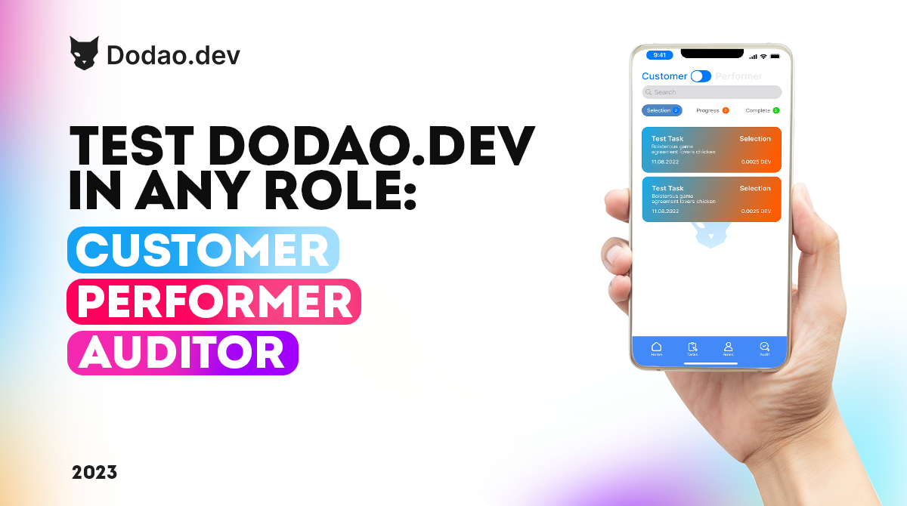

# Tester Program



**Where quality meets community, testing meets innovation.**

*"Great software isn't built by developers alone – it's forged by communities who care enough to break it, improve it, and perfect it together."*

Welcome to the frontlines of platform excellence, where your curiosity becomes our strength and your feedback shapes the future of decentralized work. The Tester Program isn't just about finding bugs – it's about being the guardian of user experience, the voice of the community, and the bridge between what we build and what people actually need.

Every click you make, every edge case you discover, every suggestion you offer helps create a platform that millions of people will depend on for their livelihoods. This is where attention to detail meets global impact, where user advocacy meets technical excellence.

Your testing. Our quality. Everyone's success.

## The quality revolution

### 🔍 Beyond traditional QA testing

**The old approach (what we're transforming):**
- Testing happens in isolation from real users
- QA teams disconnected from user needs and workflows
- Bug reports without context or user impact understanding
- Testing focused on technical functionality over user experience
- Limited feedback loops between testers and development teams
- Quality assurance as a final gate rather than continuous process

**The Dodao approach (your testing future):**
- Community-driven testing with real user perspectives
- Testers who understand and advocate for user needs
- Comprehensive feedback including user experience insights
- Testing that encompasses functionality, usability, and accessibility
- Direct communication channels with developers and product teams
- Quality assurance as continuous community collaboration

*"We're not just testing software – we're ensuring that the future of work actually works for everyone."*

### 🌟 What makes this revolutionary

**User-centric testing philosophy:**
You're not just checking if features work – you're ensuring they work well for real people with real needs. Your testing perspective comes from understanding how customers, performers, and auditors actually use the platform.

**Community impact and recognition:**
Your contributions are valued, recognized, and rewarded. Unlike traditional QA roles where your work disappears into corporate processes, here your testing insights directly influence platform development and user experience.

**Cross-chain complexity mastery:**
Test cutting-edge multi-chain functionality, cross-chain protocols, and interoperability features that are defining the future of blockchain technology.

**Governance participation:**
Your testing insights inform platform governance decisions. You don't just report what's broken – you help decide what gets built and how it gets prioritized.

## Program overview

### 🎯 Mission and vision

**Our mission:**
To ensure Dodao provides the highest quality, most reliable, and most user-friendly decentralized work platform through comprehensive community testing, continuous feedback, and collaborative quality improvement.

**Our vision:**
A platform so well-tested, so thoroughly validated, and so carefully refined that users can focus entirely on their work without worrying about technical issues, payment problems, or user experience friction.

**Core principles:**
- **User advocacy**: Testing from the perspective of real user needs and workflows
- **Quality excellence**: Uncompromising commitment to platform reliability and usability
- **Community collaboration**: Transparent communication and shared responsibility for quality
- **Continuous improvement**: Iterative testing and feedback loops for ongoing enhancement
- **Inclusive accessibility**: Ensuring the platform works for users of all backgrounds and abilities

### 🧪 Testing focus areas

**Functional testing:**
- Core platform features and user workflows
- Smart contract functionality and edge cases
- Cross-chain operations and protocol integrations
- Payment processing and token handling
- User authentication and security features
- API endpoints and integration points

**User experience testing:**
- Interface usability and accessibility
- Mobile responsiveness and cross-device compatibility
- User onboarding and guidance flows
- Error handling and recovery processes
- Performance and loading times
- Cross-browser compatibility

**Security and reliability testing:**
- Vulnerability assessment and penetration testing
- Stress testing and load capacity evaluation
- Data integrity and privacy protection
- Backup and recovery procedures
- Network resilience and failover testing
- Smart contract security and audit validation

**Cross-chain and integration testing:**
- Multi-chain functionality and protocol switching
- Bridge operations and cross-chain transfers
- Wallet integrations and connection stability
- Third-party service integrations
- API compatibility and version management
- Network-specific feature variations

## Membership tiers and opportunities

### 🌱 Community Tester (Entry Level)

**Qualification requirements:**
- Basic understanding of web applications and user interfaces
- Attention to detail and systematic testing approach
- Good communication skills for clear bug reporting
- Willingness to learn blockchain and crypto concepts

**Testing responsibilities:**
- Functional testing of new features and updates
- User experience feedback and usability insights
- Bug identification and detailed reproduction steps
- Cross-browser and device compatibility testing
- Community feedback collection and synthesis

**Benefits and opportunities:**
- Access to beta features and early releases
- Direct communication with development team
- Monthly tester community calls and updates
- Basic governance voting rights on quality-related proposals
- Recognition in platform credits and community showcases
- Educational resources for blockchain and testing skills

**Earning potential:**
- $200-1,000 per month
- Bounty rewards for critical bug discoveries
- Bonus payments for exceptional testing contributions
- Governance token allocations for participation

**Growth pathway:**
- Complete 20+ testing sessions with quality feedback
- Demonstrate expertise in specific testing areas
- Mentor newer testers and contribute to community knowledge
- Participate actively in quality discussions and governance

### 🔬 Expert Tester (Intermediate Level)

**Qualification requirements:**
- 6+ months as Community Tester with excellent track record
- Deep understanding of platform functionality and user workflows
- Demonstrated expertise in specific testing methodologies
- Leadership in testing community and knowledge sharing

**Advanced responsibilities:**
- Complex feature testing and integration validation
- Security testing and vulnerability assessment
- Performance testing and optimization recommendations
- Test case development and testing methodology improvement
- Mentorship of community testers and knowledge transfer

**Enhanced benefits:**
- Enhanced governance voting power (2x multiplier)
- Priority access to advanced testing tools and environments
- Direct collaboration with product and development teams
- Speaking opportunities at quality and testing conferences
- Access to platform analytics and user behavior data
- Participation in product roadmap and feature planning

**Earning potential:**
- $1,000-3,000 per month
- Performance bonuses for critical quality improvements
- Revenue sharing from platform growth and user satisfaction
- Consulting opportunities with partner projects

**Leadership opportunities:**
- Lead testing initiatives for major platform updates
- Represent Dodao at quality assurance and testing events
- Contribute to open-source testing tools and methodologies
- Guide testing strategy and quality standards development

### 🏆 Quality Assurance Lead (Expert Level)

**Qualification requirements:**
- 12+ months as Expert Tester with exceptional contributions
- Recognized expertise in quality assurance and testing methodologies
- Leadership of major testing initiatives and successful delivery
- Thought leadership in platform quality and user experience

**Strategic responsibilities:**
- Overall quality strategy and testing methodology design
- Cross-functional collaboration with all platform teams
- Quality metrics definition and performance monitoring
- Testing tool selection and process optimization
- Community quality culture development and maintenance

**Premium benefits:**
- Maximum governance voting power (3x multiplier)
- Direct input on platform quality standards and policies
- Equity participation in platform success and growth
- Global speaking and thought leadership opportunities
- Access to cutting-edge testing tools and technologies
- Collaboration with leading quality assurance organizations

**Earning potential:**
- $3,000-8,000+ per month
- Significant token allocations with long-term vesting
- Platform revenue sharing and quality-based bonuses
- Consulting and advisory opportunities across the ecosystem

**Strategic responsibilities:**
- Shape platform quality vision and standards
- Lead research into emerging testing technologies and methodologies
- Establish quality partnerships and industry collaborations
- Guide platform evolution from quality and user experience perspective

### 👑 Quality Ambassador (Leadership Level)

**Qualification requirements:**
- 18+ months as Quality Assurance Lead with exceptional leadership
- Recognition as thought leader in quality assurance and user experience
- Successful delivery of major quality initiatives and improvements
- Elected by tester community or appointed by governance

**Leadership responsibilities:**
- Platform quality vision and strategic direction
- External representation and quality advocacy
- Industry partnership development and collaboration
- Quality community building and ecosystem development
- Cross-platform quality standards and best practices

**Ambassador privileges:**
- Platform equity participation and ownership
- Board-level involvement in quality-related strategic decisions
- Authority to approve major quality initiatives and investments
- Global representation and speaking authority
- Access to platform financial and strategic information
- Ability to negotiate quality partnerships and collaborations

**Compensation structure:**
- Executive-level base compensation
- Significant equity-like token allocations
- Platform revenue sharing and quality success bonuses
- Professional development and conference support
- Research and innovation budget authority

## Testing methodologies and tools

### 🛠️ Testing frameworks and tools

**Manual testing tools:**
- **Browser DevTools**: Chrome, Firefox, Safari developer tools
- **Cross-browser testing**: BrowserStack, Sauce Labs, LambdaTest
- **Mobile testing**: Device labs, emulators, and real device testing
- **Accessibility testing**: WAVE, axe, Lighthouse accessibility audits
- **Performance testing**: PageSpeed Insights, GTmetrix, WebPageTest
- **Security testing**: OWASP ZAP, Burp Suite, security scanning tools

**Automated testing integration:**
- **Test automation**: Selenium, Cypress, Playwright for automated testing
- **API testing**: Postman, Insomnia, automated API test suites
- **Load testing**: JMeter, Artillery, k6 for performance validation
- **Smart contract testing**: Hardhat, Truffle, Foundry test frameworks
- **Cross-chain testing**: Custom tools for multi-chain validation
- **Continuous integration**: GitHub Actions, Jenkins, automated test execution

**Blockchain-specific tools:**
- **Wallet testing**: MetaMask, WalletConnect, hardware wallet validation
- **Network testing**: Testnet environments, local blockchain simulation
- **Transaction testing**: Gas optimization, transaction failure scenarios
- **Smart contract auditing**: Slither, Mythril, manual code review
- **Cross-chain testing**: Bridge protocol validation, multi-chain workflows
- **DeFi testing**: Token interactions, liquidity scenarios, edge cases

### 📋 Testing methodologies

**Functional testing approach:**
- **User story validation**: Testing from user perspective and workflow needs
- **Edge case exploration**: Boundary conditions and unusual scenarios
- **Integration testing**: Component interactions and data flow validation
- **Regression testing**: Ensuring new changes don't break existing functionality
- **Acceptance testing**: Validating features meet user requirements and expectations

**User experience testing methodology:**
- **Usability testing**: Task completion, user confusion points, workflow efficiency
- **Accessibility testing**: Screen reader compatibility, keyboard navigation, color contrast
- **Mobile responsiveness**: Touch interactions, screen size adaptations, performance
- **Cross-cultural testing**: Language support, cultural considerations, global usability
- **Performance testing**: Loading times, responsiveness, resource usage optimization

**Security testing protocols:**
- **Vulnerability assessment**: Common web vulnerabilities, injection attacks, XSS prevention
- **Authentication testing**: Login security, session management, access control validation
- **Data protection testing**: Privacy compliance, data encryption, secure transmission
- **Smart contract security**: Reentrancy attacks, overflow conditions, access control bugs
- **Cross-chain security**: Bridge vulnerabilities, multi-chain attack vectors, protocol security

## Testing workflows and processes

### 🔄 Testing lifecycle

**Feature testing workflow:**


**Bug reporting and resolution:**
1. **Discovery**: Identify issue through systematic testing or user feedback
2. **Documentation**: Create detailed bug report with reproduction steps and impact assessment
3. **Prioritization**: Collaborate with development team on severity and urgency classification
4. **Resolution**: Track fix implementation and provide additional testing support
5. **Validation**: Verify fix effectiveness and ensure no regression issues
6. **Closure**: Confirm resolution and update testing documentation

### 📊 Quality metrics and tracking

**Testing effectiveness metrics:**
- **Bug discovery rate**: Number and severity of issues identified per testing session
- **User experience insights**: Usability improvements and workflow optimizations suggested
- **Test coverage**: Percentage of features and workflows validated through testing
- **Regression prevention**: Issues caught before release vs. post-release discoveries
- **Community impact**: User satisfaction improvements attributed to testing feedback

**Quality improvement tracking:**
- **Platform stability**: Uptime, error rates, and performance consistency
- **User satisfaction**: Support ticket reduction, user feedback scores, retention rates
- **Feature adoption**: Successful feature launches and user engagement metrics
- **Security posture**: Vulnerability discovery and resolution, security incident prevention
- **Cross-chain reliability**: Multi-chain operation success rates and error handling

## Success stories and case studies

### 🌟 Elena Petrov - UX Tester from Prague

**Background:**
Elena was a UX designer who wanted to contribute to blockchain projects but felt intimidated by the technical complexity. She joined the Tester Program to learn while contributing her design and usability expertise.

**Testing journey:**
- **Month 1**: Started as Community Tester, focused on user interface and workflow testing
- **Month 4**: Promoted to Expert Tester, led major usability improvement initiative
- **Month 9**: Became Quality Assurance Lead, designed comprehensive UX testing methodology
- **Month 15**: Appointed as Quality Ambassador, now shapes platform user experience strategy

**Key contributions:**
- Identified 200+ usability issues and suggested improvements
- Led redesign of onboarding flow, reducing user drop-off by 40%
- Developed accessibility testing standards adopted platform-wide
- Mentored 30+ testers in UX and accessibility testing methods
- Spoke at 4 major conferences about blockchain UX testing

**Impact and recognition:**
- Platform user satisfaction increased from 6.8 to 8.9 during her leadership
- Her UX testing methodology adopted by 5+ other blockchain projects
- Received innovation grant to research Web3 accessibility standards
- Became recognized expert in blockchain user experience validation

**In her words:**
*"I thought testing was just about finding bugs, but it's really about being the voice of users who depend on the platform. Every improvement we make helps someone build a better career."*

### 🔐 Ahmed Hassan - Security Tester from Cairo

**Background:**
Ahmed was a cybersecurity professional interested in blockchain security but lacking hands-on experience with DeFi and smart contracts. He joined to learn while contributing his security expertise.

**Security testing evolution:**
- **Month 1**: Began as Community Tester, focused on basic security validation
- **Month 3**: Discovered critical smart contract vulnerability, earned rapid promotion
- **Month 7**: Led comprehensive security audit and penetration testing initiative
- **Month 13**: Became Quality Assurance Lead for security and risk management

**Security achievements:**
- Identified 25+ security vulnerabilities across platform and smart contracts
- Designed comprehensive security testing framework and methodology
- Established security testing standards adopted across all development
- Led integration of automated security scanning and validation tools
- Created security education program for all community testers

**Professional growth:**
- Became certified blockchain security auditor
- Built reputation as leading DeFi security testing expert
- Consulted for 12 other protocols on security testing and validation
- Published research on cross-chain security testing methodologies
- Earned $120,000+ in first year through testing and security consulting

**Philosophy:**
*"Security testing isn't just about finding vulnerabilities – it's about protecting people's financial futures. Every security issue we prevent protects someone's livelihood and dreams."*

### 📱 Maria Santos - Mobile Tester from São Paulo

**Background:**
Maria was a mobile app developer who wanted to contribute to the growing Web3 ecosystem but wasn't sure how her mobile expertise would translate to blockchain applications.

**Mobile testing specialization:**
- **Month 1**: Joined focusing on mobile responsiveness and cross-device compatibility
- **Month 5**: Led mobile user experience optimization and testing initiative
- **Month 10**: Designed comprehensive mobile testing methodology for Web3 applications
- **Month 16**: Became Quality Ambassador for mobile and accessibility

**Mobile testing contributions:**
- Tested platform across 50+ device configurations and operating systems
- Improved mobile user experience, increasing mobile usage by 150%
- Developed mobile-specific testing standards for Web3 applications
- Led accessibility improvements making platform usable for users with disabilities
- Created mobile testing education program for blockchain community

**Career transformation:**
- Became recognized expert in mobile Web3 user experience
- Consulted for 8 blockchain projects on mobile optimization
- Spoke at major mobile and blockchain conferences
- Built team of 15 mobile testers across Latin America
- Earned $95,000+ through testing, consulting, and community leadership

**Reflection:**
*"Mobile testing in Web3 is about more than responsive design – it's about making the decentralized economy accessible to everyone, everywhere, on any device."*

## Resources and learning

### 📚 Testing education and certification

**Quality assurance fundamentals:**
- **[ISTQB Certification](https://www.istqb.org/)** - International software testing certification
- **[Ministry of Testing](https://www.ministryoftesting.com/)** - Testing community and resources
- **[Test Automation University](https://testautomationu.applitools.com/)** - Free testing courses and certification
- **[Coursera QA Courses](https://www.coursera.org/courses?query=quality%20assurance)** - University-level QA education

**Blockchain and Web3 testing:**
- **[Ethereum Testing Guide](https://ethereum.org/en/developers/docs/testing/)** - Smart contract testing fundamentals
- **[DeFi Testing Best Practices](https://github.com/devopsdao/defi-testing-guide)** - DeFi-specific testing methodology
- **[Cross-chain Testing Resources](https://github.com/devopsdao/cross-chain-testing)** - Multi-chain testing approaches
- **[Web3 Security Testing](https://github.com/devopsdao/web3-security-testing)** - Blockchain security validation

**Specialized testing areas:**
- **[Accessibility Testing](https://www.w3.org/WAI/test-evaluate/)** - Web accessibility validation and improvement
- **[Performance Testing](https://www.guru99.com/performance-testing.html)** - Load testing and optimization
- **[Security Testing](https://owasp.org/www-project-web-security-testing-guide/)** - Web application security validation
- **[Mobile Testing](https://www.guru99.com/mobile-testing.html)** - Mobile application testing methodology

### 🛠️ Testing tools and setup

**Essential testing tools:**
- **Browser**: Chrome, Firefox, Safari with developer tools enabled
- **Cross-browser testing**: BrowserStack or LambdaTest account
- **Mobile testing**: Android Studio emulator, iOS Simulator
- **Screen recording**: OBS Studio, Loom for bug reproduction videos
- **Documentation**: Notion, Google Docs for test case and bug report creation

**Blockchain testing setup:**
- **Wallet**: MetaMask, WalletConnect for transaction testing
- **Testnet tokens**: Faucet access for testing transactions
- **Network switching**: Multiple testnet configurations
- **Block explorer**: Etherscan, Polygonscan for transaction verification
- **Smart contract interaction**: Remix, Hardhat for contract testing

**Testing environment configuration:**
```bash
# Install testing dependencies
npm install -g @playwright/test cypress

# Set up browser testing
npx playwright install

# Configure mobile testing
npm install -g appium
appium driver install uiautomator2

# Set up blockchain testing environment
npm install -g hardhat
npx hardhat node

# Install security testing tools
npm install -g @ethereum-waffle/chai
```

### 🤝 Community and support

**Tester community:**
- **Discord channels**: Daily discussions, bug reports, and collaboration
- **Weekly testing calls**: Community updates and testing coordination
- **Testing workshops**: Skill development and methodology training
- **Bug bash events**: Coordinated testing sessions for major releases
- **Mentorship program**: Pairing with experienced testers
- **Regional meetups**: Local tester gatherings and knowledge sharing

**Professional development:**
- **Conference speaking**: Represent Dodao at quality assurance events
- **Technical writing**: Publish testing methodology and best practices
- **Open source contributions**: Contribute to testing tools and frameworks
- **Certification support**: Funding for professional testing certifications
- **Research collaborations**: Work with academic institutions on testing research
- **Industry partnerships**: Collaborate with leading QA organizations

## Getting involved

### 🚀 Application process

**Step 1: Testing assessment**
Complete practical testing challenges demonstrating:
- Systematic testing approach and attention to detail
- Clear communication and bug reporting skills
- Understanding of user experience and workflow validation
- Basic technical knowledge and learning ability

**Assessment components:**
- **Feature testing**: Test new platform feature and provide comprehensive feedback
- **Bug reporting**: Document issues with clear reproduction steps and impact assessment
- **User experience evaluation**: Assess interface usability and suggest improvements
- **Cross-device testing**: Validate functionality across different browsers and devices
- **Communication skills**: Present findings clearly and constructively

**Step 2: Community interview**
Video call with testing team covering:
- Testing background and experience
- Interest in quality assurance and user advocacy
- Alignment with platform values and community standards
- Communication skills and collaborative approach
- Growth goals and learning objectives

**Step 3: Trial testing period**
Complete real testing contributions:
- Participate in beta testing for upcoming features
- Work with mentor to understand testing standards and processes
- Submit quality bug reports and user experience feedback
- Participate in community discussions and knowledge sharing
- Demonstrate ability to learn and adapt based on feedback

**Step 4: Onboarding and integration**
Upon acceptance, complete comprehensive onboarding:
- Platform functionality and user workflow overview
- Testing methodology and quality standards training
- Community guidelines and collaboration practices
- Tool setup and testing environment configuration
- Governance participation and voting processes

### 📋 Getting started checklist

**Week 1: Foundation**
- [ ] Complete testing assessment and community interview
- [ ] Set up testing environment and tools
- [ ] Join tester Discord and introduce yourself
- [ ] Complete first testing session with mentor guidance
- [ ] Review platform functionality and user workflows

**Week 2: Integration**
- [ ] Participate in first governance vote on quality-related proposal
- [ ] Attend weekly tester community call
- [ ] Complete independent testing session and submit feedback
- [ ] Begin building relationships with other testers
- [ ] Identify areas of interest for testing specialization

**Week 3: Contribution**
- [ ] Lead testing of specific feature or workflow area
- [ ] Participate in bug triage and prioritization discussions
- [ ] Share knowledge through documentation or presentation
- [ ] Explore cross-chain and advanced testing scenarios
- [ ] Plan next testing contributions and skill development

**Month 2-3: Growth**
- [ ] Take ownership of testing for major feature or update
- [ ] Mentor newer testers joining the community
- [ ] Contribute to testing methodology and process improvements
- [ ] Represent Dodao in external quality assurance communities
- [ ] Build expertise in specialized area of testing

### 📞 Support and contact

**Testing questions:**
- **Email**: testing@dodao.dev
- **Discord**: #tester-support channel
- **Office hours**: Weekly Q&A sessions with testing team
- **Documentation**: Comprehensive testing guides and best practices

**Career and growth:**
- **Mentorship**: Paired with experienced tester
- **Skill development**: Access to testing courses and certification programs
- **Career guidance**: Regular check-ins and goal setting
- **Conference support**: Speaking opportunities and professional development

**Community connections:**
- **Peer groups**: Connect with testers at similar levels
- **Special interest groups**: Focus areas like security, UX, or mobile testing
- **Regional meetups**: Local tester gatherings and collaboration
- **Industry events**: Represent Dodao at quality assurance conferences

---

**Ready to ensure quality for millions?** [Apply to Tester Program →](https://dodao.dev/testers/apply)

*Join the guardians of platform excellence – where your attention to detail protects everyone's success.*

---

*The Tester Program evolves continuously based on community feedback and platform development needs. This document reflects current program structure and may be updated as we grow and improve. For the latest information, join our tester community on Discord or contact the program team directly.*
