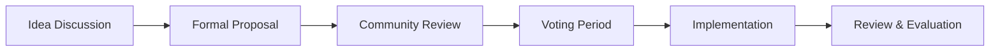

# Governance


**Community-driven decisions.**

What if the platforms you use every day were actually controlled by the people who use them? What if instead of faceless corporations making decisions that affect your livelihood, you had a real voice in shaping the rules, features, and future direction?

Dodao's governance isn't just about voting on proposals – it's about fundamentally reimagining how platforms should work. Every token holder becomes a stakeholder with real power. Every decision is transparent and recorded on-chain. Every voice matters, whether you're a developer in Delhi, a designer in Detroit, or a customer in Copenhagen.

This is democracy for the digital age: where your participation directly influences the platform you depend on, where transparency isn't a marketing buzzword but a technical guarantee, and where the community truly controls its own destiny.

Your voice. Your platform. Your future.

## Governance overview

### 🗳️ Decentralized decision making

**Power to the people who actually use the platform.** Traditional platforms make decisions in boardrooms behind closed doors. We make decisions in public forums where every voice can be heard and every vote can be verified.

**Core principles (the foundation of true democracy):**
- Community-driven development (users decide what gets built)
- Transparent decision processes (every discussion is public)
- Token-based voting rights (your stake gives you a voice)
- Merit-based influence (contribution earns respect)

**Governance scope (what you actually control):**
- Platform feature priorities (what gets built first)
- Token economics parameters (how value flows through the system)
- Community program funding (where resources go to grow the ecosystem)
- Partnership approvals (who we work with and why)
- Protocol upgrades (how the platform evolves)

*This isn't just voting – it's taking ownership of the platform you depend on.*

### 🎯 Governance goals

**Building a platform that serves its community, not corporate shareholders.** Every decision we make together moves us closer to a future where platforms are owned and controlled by the people who create value on them.

**Platform evolution (guided by user needs, not profit margins):**
- Prioritize user-requested features (build what people actually want)
- Balance stakeholder interests (fair outcomes for everyone)
- Ensure sustainable growth (long-term thinking over short-term gains)
- Maintain security standards (protect what we're building together)

**Community empowerment (democracy in action):**
- Give users control over platform (your platform, your rules)
- Reward active participation (engagement creates value and earns influence)
- Build long-term alignment (shared success through shared ownership)
- Foster collaborative development (better solutions through collective intelligence)

*Together, we're not just using a platform – we're building the future of work.*

## Governance structure

### 👥 Participants

**Every voice matters, but contribution earns influence.** This isn't just one-person-one-vote democracy – it's a system that recognizes both stake and merit, ensuring that those who contribute most to the platform have the strongest voice in its future.

**Token holders (the foundation of our democracy)**
- Basic voting rights on all proposals (your stake, your voice)
- Voting power proportional to token holdings (bigger stake, bigger voice)
- Can delegate votes to other participants (trust others to represent your interests)
- Earn rewards for participation (democracy pays when you engage)

**Governor NFT holders (earned leadership through contribution)**
- Enhanced voting power (2x multiplier) (merit amplifies influence)
- Proposal creation rights (shape the conversation)
- Access to governance discussions (insider access to decision-making)
- Priority in community programs (contribution opens doors)

**Core contributors (the builders and guardians)**
- Technical proposal creation (expertise guides implementation)
- Implementation oversight (ensure quality delivery)
- Security review participation (protect what we're building)
- Emergency response authority (rapid response when needed)

**Community council (elected representatives of the people)**
- Elected representatives (5 members) (democracy in action)
- 6-month terms with re-election (accountability through regular elections)
- Proposal moderation and guidance (shepherding good ideas forward)
- Conflict resolution authority (fair arbitration when needed)

*From token holder to core contributor – there's a path for everyone to grow their influence through contribution.*

### 🏛️ Governance tokens

**Voting tokens:**
- Platform utility tokens used for voting
- Earned through platform participation
- Tradeable on secondary markets
- Required for proposal submission

**Governor NFTs:**
- Limited supply governance tokens
- Enhanced voting power and privileges
- Earned through significant contributions
- Non-transferable to maintain merit-based system

**Delegation system:**
- Token holders can delegate voting power
- Delegates earn rewards for participation
- Delegation can be revoked at any time
- Transparent delegation tracking

## Proposal process

### 📝 Proposal lifecycle



### 1️⃣ Idea discussion (7 days)

**Forum discussion:**
- Community members discuss ideas
- Gather feedback and suggestions
- Refine proposal concepts
- Build initial support

**Requirements:**
- Clear problem statement
- Proposed solution outline
- Expected impact assessment
- Community benefit analysis

### 2️⃣ Formal proposal (3 days)

**Proposal creation:**
- Governor NFT holders or core contributors
- Detailed implementation plan
- Resource requirements
- Timeline and milestones

**Proposal format:**
```markdown
# Proposal Title

## Summary
Brief description of the proposal

## Motivation
Why this change is needed

## Specification
Detailed implementation plan

## Impact Analysis
Expected effects on platform and community

## Implementation Timeline
Milestones and deadlines

## Resource Requirements
Development time, funding, etc.
```

### 3️⃣ Community review (7 days)

**Review process:**
- Community council moderation
- Technical feasibility assessment
- Security impact evaluation
- Community feedback integration

**Review criteria:**
- Technical soundness
- Community benefit
- Resource availability
- Security implications
- Alignment with platform goals

### 4️⃣ Voting period (5 days)

**Voting mechanics:**
- Token-weighted voting
- Governor NFT multiplier (2x)
- Minimum participation threshold (10%)
- Simple majority for approval (>50%)

**Voting options:**
- **Yes** - Support the proposal
- **No** - Oppose the proposal
- **Abstain** - No preference

### 5️⃣ Implementation (Variable)

**Approved proposals:**
- Development team assignment
- Implementation timeline
- Progress tracking
- Community updates

**Implementation oversight:**
- Core contributor supervision
- Community council monitoring
- Regular progress reports
- Quality assurance

### 6️⃣ Review & evaluation (30 days post-implementation)

**Success metrics:**
- Implementation quality
- Community satisfaction
- Platform impact
- Goal achievement

**Lessons learned:**
- Process improvements
- Best practices
- Future considerations
- Community feedback

## Voting mechanics

### 🗳️ Voting power calculation

**Base voting power:**
```
Voting Power = Token Holdings × Participation Multiplier
```

**Governor NFT bonus:**
```
Enhanced Power = Base Power × 2 (for Governor NFT holders)
```

**Participation multiplier:**
- **Active participant** (voted in last 3 proposals): 1.0x
- **Regular participant** (voted in last 2 proposals): 0.9x
- **Occasional participant** (voted in last 1 proposal): 0.8x
- **Inactive participant** (no recent votes): 0.7x

### 📊 Quorum requirements

**Minimum participation:**
- **Standard proposals**: 10% of total voting power
- **Critical proposals**: 20% of total voting power
- **Emergency proposals**: 30% of total voting power

**Approval thresholds:**
- **Standard proposals**: >50% of votes cast
- **Critical proposals**: >60% of votes cast
- **Emergency proposals**: >75% of votes cast

### ⏰ Voting timeline

**Proposal phases:**
- **Discussion**: 7 days
- **Review**: 7 days
- **Voting**: 5 days
- **Implementation**: Variable
- **Evaluation**: 30 days

**Emergency procedures:**
- **Fast-track**: 24-hour voting for critical issues
- **Emergency council**: Immediate action for security threats
- **Community ratification**: Post-emergency community approval

## Governance categories

### 🔧 Technical proposals

**Platform development:**
- New feature implementations
- Performance optimizations
- Security improvements
- Bug fixes and patches

**Protocol upgrades:**
- Smart contract updates
- Cross-chain integrations
- API enhancements
- Infrastructure improvements

**Example proposals:**
- Add support for new blockchain
- Implement advanced task filtering
- Upgrade cross-chain protocols
- Enhance security measures

### 💰 Economic proposals

**Token economics:**
- Fee structure adjustments
- Reward distribution changes
- Token supply modifications
- Staking mechanism updates

**Funding decisions:**
- Community program budgets
- Development funding allocation
- Marketing and growth investments
- Partnership funding

**Example proposals:**
- Adjust platform fee from 5% to 3%
- Increase performer rewards by 20%
- Fund cross-chain expansion
- Allocate budget for security audit

### 🤝 Community proposals

**Program management:**
- Community program modifications
- Ambassador program updates
- Developer incentive changes
- Creator program enhancements

**Governance improvements:**
- Voting mechanism updates
- Proposal process refinements
- Community council changes
- Participation incentives

**Example proposals:**
- Launch new ambassador regions
- Increase developer bounty rewards
- Modify governance voting weights
- Create new community programs

### 🔗 Partnership proposals

**Strategic partnerships:**
- Integration partnerships
- Cross-platform collaborations
- Ecosystem partnerships
- Technology partnerships

**Community partnerships:**
- Educational institutions
- Developer communities
- Industry organizations
- Event partnerships

**Example proposals:**
- Partner with major DeFi protocol
- Integrate with popular wallet
- Sponsor blockchain conference
- Collaborate with coding bootcamp

## Participation incentives

### 🎁 Voting rewards

**Participation rewards:**
- **Active voters**: 10-50 tokens per proposal
- **Proposal creators**: 100-500 tokens for approved proposals
- **Community council**: 1,000-5,000 tokens per term
- **Delegates**: 5-25 tokens per delegated vote

**Achievement NFTs:**
- **First Vote** - Governance participation badge
- **Active Voter** - 10+ votes cast
- **Proposal Creator** - First approved proposal
- **Community Leader** - Elected to council

### 📈 Reputation building

**Governance reputation:**
- Voting participation history
- Proposal success rate
- Community engagement level
- Leadership contributions

**Benefits of high reputation:**
- Enhanced voting weight
- Proposal creation privileges
- Community council eligibility
- Platform governance roles

### 🏆 Recognition programs

**Monthly recognition:**
- Most active voter
- Best proposal creator
- Outstanding community contributor
- Helpful community member

**Annual awards:**
- Governance contributor of the year
- Most impactful proposal
- Community leadership award
- Innovation in governance

## Transparency and accountability

### 📊 Public records

**All governance data public:**
- Proposal details and discussions
- Voting results and participation
- Implementation progress
- Community feedback

**Transparency tools:**
- Governance dashboard
- Voting history tracking
- Proposal outcome analysis
- Community sentiment monitoring

### 🔍 Accountability measures

**Performance tracking:**
- Proposal implementation success
- Community satisfaction scores
- Platform improvement metrics
- Governance participation rates

**Regular reporting:**
- Monthly governance reports
- Quarterly impact assessments
- Annual governance reviews
- Community feedback summaries

### 📋 Audit and review

**Governance audits:**
- Process effectiveness review
- Participation analysis
- Outcome evaluation
- Improvement recommendations

**Community feedback:**
- Regular surveys
- Focus groups
- Open feedback sessions
- Continuous improvement

## Emergency procedures

### 🚨 Emergency governance

**Emergency triggers:**
- Security vulnerabilities
- Critical system failures
- Regulatory compliance issues
- Major partnership problems

**Emergency response:**
- **Immediate**: Core team emergency powers
- **24-hour**: Emergency council vote
- **7-day**: Community ratification
- **30-day**: Full governance review

### ⚡ Fast-track procedures

**Expedited voting:**
- 24-hour discussion period
- 24-hour voting period
- Higher approval threshold (75%)
- Post-implementation review required

**Emergency council:**
- 5 elected community representatives
- 6-month rotating terms
- Emergency decision authority
- Community accountability

## Getting involved

### 🚀 Start participating

**Step 1: Get tokens**
- Earn through platform participation
- Purchase on secondary markets
- Receive through community programs
- Delegate from other holders

**Step 2: Join discussions**
- Follow governance forum
- Participate in Discord discussions
- Attend community calls
- Engage with proposals

**Step 3: Vote on proposals**
- Review proposal details
- Consider community impact
- Cast informed votes
- Track implementation

**Step 4: Create proposals**
- Earn Governor NFT
- Identify improvement opportunities
- Draft detailed proposals
- Build community support

### 📋 Governance resources

**Documentation:**
- Governance handbook
- Proposal templates
- Voting guides
- Best practices

**Tools and platforms:**
- Governance dashboard
- Voting interface
- Discussion forums
- Analytics tools

**Community support:**
- Governance mentorship
- Proposal review assistance
- Voting guidance
- Technical support

## Future developments

### 🔮 Governance evolution

**Planned improvements:**
- Advanced voting mechanisms
- Improved proposal tools
- Enhanced participation incentives
- Better community representation

**Research areas:**
- Quadratic voting implementation
- Liquid democracy features
- AI-assisted proposal analysis
- Cross-chain governance

### 🌐 Ecosystem governance

**Multi-chain governance:**
- Cross-chain proposal execution
- Unified governance across networks
- Protocol-agnostic voting
- Interchain community coordination

**Ecosystem partnerships:**
- Governance collaboration with partners
- Shared decision-making processes
- Cross-platform governance standards
- Industry governance leadership

## Resources

### 📚 Documentation

- **[Community Programs](/docs/community/programs)** - Participation opportunities
- **[Developer Docs](/docs/developers/overview)** - Technical implementation
- **[Security Guide](/docs/features/security)** - Security considerations
- **[API Reference](/docs/developers/api-reference)** - Integration resources

### 🤝 Community

- **[Discord](https://discord.gg/qJwsv45QTd)** - Governance discussions
- **[Telegram](https://t.me/dodao_group)** - Updates and announcements
- **[Forum](https://forum.dodao.dev)** - Long-form discussions
- **[GitHub](https://github.com/devopsdao/governance)** - Governance code

### 📞 Contact

- **Governance team**: governance@dodao.dev
- **Community council**: council@dodao.dev
- **Technical questions**: tech@dodao.dev
- **General inquiries**: hello@dodao.dev

---

**Ready to participate?** [Join governance discussions →](https://discord.gg/qJwsv45QTd)

*Shape the future of decentralized work through community governance!*
