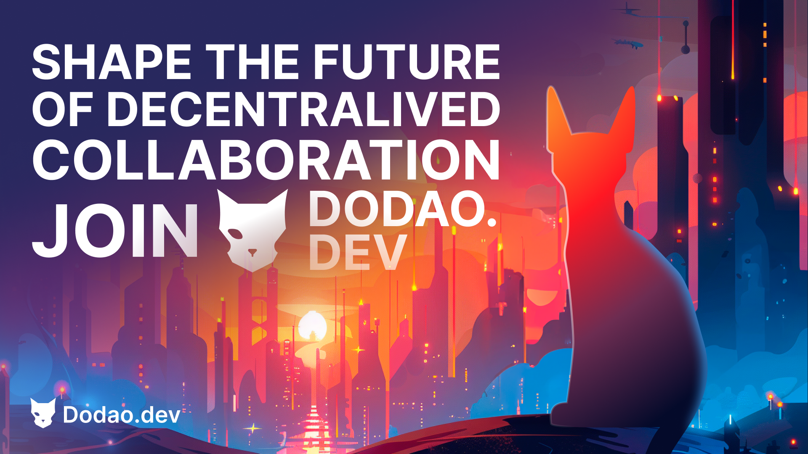

# Community Programs

**Join the movement.**

Every revolutionary platform starts with a community of believers – people who see the potential for something better and are willing to help build it. Dodao isn't just another platform; it's a movement toward fair, transparent, and truly global work opportunities.

Our community programs aren't traditional "marketing initiatives" designed to extract value from participants. They're genuine partnerships where your contributions directly shape the platform's future while building your own skills, reputation, and network. Whether you're a developer who wants to influence technical decisions, a creator who envisions new possibilities, or simply someone who believes work should be fair for everyone, there's a place for you here.

This is your chance to be part of something bigger than yourself – to help build the infrastructure that will power the future of work for millions of people worldwide.

## Program overview

Most blockchain projects treat community members as users to be monetized rather than partners to be empowered. Dodao takes the opposite approach – we recognize that the platform's success depends entirely on the community's success. Our programs aren't designed to extract value from you; they're designed to help you build value for yourself while contributing to something meaningful.

### 🎯 Why join?

**Earn rewards:**
Real compensation for real contributions. Unlike traditional "community programs" that offer worthless points or badges, Dodao rewards come in the form of tokens with actual utility, NFTs that prove your capabilities, and revenue sharing that grows with the platform's success.

- NFT achievements and badges that serve as permanent credentials
- Token incentives and bounties that provide immediate compensation
- Early access to features that give you competitive advantages
- Revenue sharing opportunities that align your success with the platform's growth

**Build reputation:**
Your contributions to Dodao become part of your permanent professional record. In a world where traditional credentials are losing value, blockchain-verified achievements and community recognition carry real weight.

- Verified skill credentials that prove your capabilities objectively
- Community recognition that opens doors to new opportunities
- Professional networking with other high-caliber contributors
- Career advancement through demonstrated expertise and leadership

**Shape the platform:**
This isn't just about using someone else's product – it's about building the future of work itself. Your voice matters, your ideas have impact, and your contributions directly influence how millions of people will work in the decentralized economy.

- Influence product development through direct feedback and proposals
- Participate in governance decisions that affect the entire ecosystem
- Access to core team for technical discussions and strategic planning
- Beta testing opportunities that let you experience the future first

## Developer Program

**Where innovation meets opportunity.** Traditional tech companies hire developers to build their vision. Dodao invites developers to build the future itself – and get rewarded for every contribution that makes the platform better.

### 💻 For builders and integrators

**The architects of decentralized work.** You're not just writing code – you're building the infrastructure that will power millions of work relationships. Every smart contract you improve, every feature you add, and every bug you fix directly impacts real people's livelihoods.

**Who should join (the builders of tomorrow):**
- Smart contract developers (who understand that code is law)
- Frontend/backend engineers (who create experiences that delight users)
- DevOps and infrastructure specialists (who ensure reliability at scale)
- Open source contributors (who believe in transparent, collaborative development)

**Program benefits (rewards that match your impact):**
- **Development bounties** - Earn tokens for contributions (immediate compensation for valuable work)
- **Technical mentorship** - Direct access to core developers (learn from the best while building the best)
- **Early API access** - Test new features before release (shape the platform before anyone else sees it)
- **Revenue sharing** - Earn from successful integrations (your success grows with the platform's success)

*When you build on Dodao, you're not just contributing to a project – you're investing in your own future.*

### 🚀 Participation levels

**Contributor (Entry level)**
- Requirements: Complete 1 bounty or contribution
- Benefits: Community access, basic mentorship
- Rewards: Contributor NFT, 100-500 tokens

**Developer (Intermediate)**
- Requirements: 5+ contributions, code review participation
- Benefits: Advanced API access, technical calls
- Rewards: Developer NFT, 1,000-5,000 tokens

**Core Developer (Advanced)**
- Requirements: Major feature contributions, community leadership
- Benefits: Revenue sharing, governance participation
- Rewards: Core Developer NFT, 10,000+ tokens

### 📋 Available opportunities

**Smart contract development:**
- New facet implementations
- Security improvements
- Gas optimization
- Cross-chain integrations

**Frontend development:**
- UI/UX improvements
- Mobile app features
- Web3 integrations
- Performance optimizations

**Infrastructure:**
- API development
- Database optimizations
- Monitoring systems
- DevOps automation

**Documentation:**
- Technical guides
- API documentation
- Tutorial creation
- Translation work

### 🎯 How to get started

1. **Join Discord** - [discord.gg/qJwsv45QTd](https://discord.gg/qJwsv45QTd)
2. **Explore GitHub** - [github.com/devopsdao/devopsdao](https://github.com/devopsdao/devopsdao)
3. **Pick a bounty** - Check issues labeled "bounty"
4. **Submit proposal** - Outline your approach
5. **Start building** - Get mentorship and support

## Arts Creator Program

**Where creativity meets purpose.** Most creative work gets lost in the noise of social media or buried in corporate marketing campaigns. Here, your creativity directly shapes how people understand and experience the future of work.

### 🎨 For designers and content creators

**The storytellers of the decentralized revolution.** You're not just creating pretty pictures or catchy videos – you're helping people visualize a better way to work. Every design you create and every story you tell helps someone understand why decentralized work matters.

**Who should join (the visual voices of change):**
- Graphic designers and illustrators (who can make complex ideas instantly understandable)
- Video producers and animators (who bring concepts to life through motion and story)
- Content writers and marketers (who translate technical innovation into human language)
- NFT artists and creators (who understand digital ownership and creative value)

**Program focus (creativity with impact):**
- Visual identity and branding (help people recognize and trust the Dodao ecosystem)
- Educational content creation (make blockchain technology accessible to everyone)
- Marketing materials (tell the story of fair work in compelling ways)
- NFT artwork and collections (create digital assets that represent real achievements)

*Your creativity doesn't just look good – it changes how people think about work itself.*

### 🎨 Creative opportunities

**Visual design:**
- Platform UI/UX design
- Marketing graphics
- Social media assets
- Brand identity work

**Content creation:**
- Educational videos
- Tutorial content
- Blog posts and articles
- Social media content

**NFT development:**
- Achievement NFT designs
- Skill badge artwork
- Collectible series
- Animated NFTs

**Marketing materials:**
- Website graphics
- Presentation templates
- Print materials
- Event branding

### 🏆 Creator benefits

**Compensation:**
- Per-project payments
- Royalties on NFT sales
- Revenue sharing
- Token incentives

**Recognition:**
- Creator spotlight features
- Portfolio showcasing
- Community recognition
- Professional references

**Growth opportunities:**
- Skill development
- Network building
- Career advancement
- Industry connections

### 📝 Application process

1. **Portfolio submission** - Show your best work
2. **Skill assessment** - Demonstrate relevant abilities
3. **Project proposal** - Suggest specific contributions
4. **Community review** - Get feedback from peers
5. **Program acceptance** - Start creating and earning

## Ambassador Program

**Where leadership meets global impact.** Traditional ambassadors represent companies. Dodao ambassadors represent a movement – the idea that work should be fair, transparent, and accessible to everyone, regardless of where they live or what traditional credentials they hold.

### 🌟 For community leaders and advocates

**The bridge between vision and reality.** You're not just promoting a platform – you're helping people discover opportunities they never knew existed. Every person you onboard, every question you answer, and every community you build brings us closer to a world where talent is the only thing that matters.

**Who should join (the connectors and enablers):**
- Community managers (who understand that great communities are built, not born)
- Content creators (who can explain complex ideas in simple, compelling ways)
- Event organizers (who bring people together and create lasting connections)
- Blockchain educators (who can demystify Web3 for newcomers)

**Ambassador mission (building bridges to the future):**
- Grow Dodao community (expand the network of people who believe in fair work)
- Educate users about platform (turn confusion into confidence and excitement)
- Organize events and meetups (create real-world connections in a digital ecosystem)
- Provide user support (be the helpful human face of decentralized technology)

*Every person you help discover Dodao is someone whose work life you've potentially transformed.*

### 🎯 Ambassador responsibilities

**Community building:**
- Moderate Discord/Telegram channels
- Welcome new members
- Facilitate discussions
- Resolve conflicts

**Education and outreach:**
- Create educational content
- Host workshops and webinars
- Speak at conferences
- Write blog posts

**Event organization:**
- Plan community meetups
- Organize hackathons
- Coordinate online events
- Manage partnerships

**User support:**
- Answer user questions
- Provide platform guidance
- Collect feedback
- Report issues

### 💰 Ambassador rewards

**Monthly stipend:**
- **Regional Ambassador**: 500-1,000 tokens/month
- **Global Ambassador**: 1,000-2,500 tokens/month
- **Lead Ambassador**: 2,500-5,000 tokens/month

**Performance bonuses:**
- Community growth metrics
- Event success rates
- Content engagement
- User satisfaction scores

**Additional benefits:**
- Ambassador NFT badge
- Exclusive merchandise
- Conference travel support
- Direct team access

### 📈 Advancement path

**Community Member → Regional Ambassador → Global Ambassador → Lead Ambassador**

Each level requires demonstrated community impact, leadership skills, and platform knowledge.

## Tester Program

**Where perfectionism meets protection.** Every bug you find is a problem that won't affect real users. Every security vulnerability you discover is money that won't be lost. Every UX issue you identify is frustration that won't be experienced. You're the guardian angels of the platform.

### 🔍 For quality assurance and feedback

**The protectors of user experience and security.** You're not just finding problems – you're preventing disasters. In a platform where people's livelihoods depend on everything working correctly, your attention to detail and commitment to quality directly protects the community.

**Who should join (the guardians of quality):**
- QA engineers and testers (who understand that quality is never an accident)
- Power users and early adopters (who push systems to their limits and beyond)
- Security researchers (who think like attackers to protect defenders)
- UX/UI specialists (who ensure technology serves humans, not the other way around)

**Testing focus (protection through detection):**
- Feature testing and validation (ensure new capabilities work as intended)
- Bug discovery and reporting (find problems before users experience them)
- Security vulnerability research (protect user funds and data from threats)
- User experience feedback (make complex technology feel simple and intuitive)

*Every test you run and every bug you find makes the platform safer and better for everyone.*

### 🧪 Testing opportunities

**Feature testing:**
- New feature validation
- Cross-browser compatibility
- Mobile app testing
- API endpoint testing

**Security testing:**
- Smart contract auditing
- Penetration testing
- Vulnerability research
- Security best practices

**User experience:**
- Usability testing
- Accessibility evaluation
- Performance testing
- User journey optimization

**Cross-chain testing:**
- Multi-network validation
- Bridge functionality
- Protocol integration
- Error handling

### 🎁 Tester rewards

**Bug bounties:**
- **Critical bugs**: 1,000-5,000 tokens
- **High severity**: 500-1,000 tokens
- **Medium severity**: 100-500 tokens
- **Low severity**: 50-100 tokens

**Testing achievements:**
- Tester NFT badges
- Leaderboard recognition
- Early access privileges
- Community status

**Special programs:**
- Security researcher rewards
- UX feedback incentives
- Performance optimization bounties
- Accessibility improvement rewards

### 🔒 Security research

**Responsible disclosure:**
- Report vulnerabilities privately
- Allow time for fixes
- Coordinate public disclosure
- Receive recognition and rewards

**Scope includes:**
- Smart contract vulnerabilities
- API security issues
- Frontend security flaws
- Infrastructure weaknesses

## Governance Participation

### 🗳️ Community decision making

**Governance structure:**
- **Token holders** - Basic voting rights
- **Governor NFT holders** - Enhanced voting power
- **Core contributors** - Proposal creation rights
- **Community council** - Execution oversight

**Voting topics:**
- Platform feature priorities
- Token economics adjustments
- Partnership approvals
- Community program changes

### 📊 Governance process

1. **Proposal creation** - Community members suggest changes
2. **Discussion period** - 7-day community debate
3. **Voting period** - 5-day token holder vote
4. **Implementation** - Approved proposals executed
5. **Review** - Results evaluated and documented

### 🏛️ Governance benefits

**Participation rewards:**
- Governance NFT badges
- Voting power increases
- Proposal creation rights
- Community recognition

**Influence platform:**
- Shape product roadmap
- Influence token economics
- Guide community programs
- Direct platform evolution

## Getting started

**Your journey from community member to ecosystem leader.** Every major contributor started exactly where you are now – curious about the potential, excited about the vision, and ready to turn ideas into reality.

### 🚀 Quick start guide

**From interest to impact in four simple steps.** The path from newcomer to valued contributor is well-traveled and well-supported. You're not figuring this out alone – you're joining a community that wants to see you succeed.

1. **Choose your path (find where your passion meets platform needs):**
   - Developer: Technical contributions (build the infrastructure of the future)
   - Creator: Visual and content work (tell the story of decentralized work)
   - Ambassador: Community building (connect people with opportunities)
   - Tester: Quality assurance (protect users through rigorous testing)

2. **Join community (become part of something bigger):**
   - Discord: [discord.gg/qJwsv45QTd](https://discord.gg/qJwsv45QTd) (real-time collaboration and support)
   - Telegram: [t.me/dodao_group](https://t.me/dodao_group) (updates and quick discussions)
   - GitHub: [github.com/devopsdao](https://github.com/devopsdao) (technical collaboration and code review)

3. **Complete onboarding (set yourself up for success):**
   - Read program guidelines (understand expectations and opportunities)
   - Introduce yourself (let the community know your skills and interests)
   - Find your first opportunity (start with something achievable and meaningful)
   - Start contributing (turn potential into action)

4. **Build reputation (establish yourself as a trusted contributor):**
   - Complete initial tasks (prove your reliability and quality)
   - Provide quality work (exceed expectations and build trust)
   - Help other members (contribute to the community culture)
   - Earn recognition (let your work speak for itself)

*Every expert was once a beginner. Every leader was once a follower. Your journey starts with a single contribution.*

### 📋 Application requirements

**All programs require:**
- Active Discord/Telegram participation
- Demonstrated relevant skills
- Commitment to community values
- Professional communication

**Additional requirements vary by program:**
- **Developer**: Portfolio of technical work
- **Creator**: Design/content portfolio
- **Ambassador**: Community leadership experience
- **Tester**: QA or testing background

## Program benefits summary

### 🎁 Rewards and incentives

**Token rewards:**
- Bounty completions: 50-10,000 tokens
- Monthly stipends: 500-5,000 tokens
- Performance bonuses: Variable
- Governance participation: 100-1,000 tokens

**NFT achievements:**
- Program-specific badges
- Skill verification NFTs
- Achievement milestones
- Governance tokens

**Professional benefits:**
- Portfolio building
- Network expansion
- Skill development
- Career advancement

### 🌟 Recognition and status

**Community recognition:**
- Leaderboards and rankings
- Spotlight features
- Social media mentions
- Conference speaking opportunities

**Platform benefits:**
- Early feature access
- Enhanced support
- Direct team communication
- Governance participation

## Success stories

**Real people building real careers while building the future.** These aren't just statistics – they're stories of individuals who saw an opportunity, took action, and transformed both their own lives and the platform itself.

### 🏆 Community highlights

**The pioneers who are shaping tomorrow's work landscape.** Each of these contributors started as a community member with an idea and the willingness to act on it. Their success stories show what's possible when talent meets opportunity in a truly meritocratic environment.

**Top contributors (leaders who emerged from the community):**
- **Alex Chen** - Lead smart contract developer, 50+ contributions (from curious newcomer to core architecture decisions)
- **Maria Rodriguez** - Community ambassador, 1,000+ members onboarded (from first-time user to global community leader)
- **David Kim** - Security researcher, 15 critical bugs found (from part-time tester to platform security guardian)
- **Sarah Johnson** - Content creator, 100+ educational videos (from blockchain beginner to trusted educator)

**Impact metrics (collective achievement through individual excellence):**
- 500+ active community contributors (a global network of builders and creators)
- 1,000+ bugs reported and fixed (quality improvements that protect every user)
- 50+ major features contributed (innovations that enhance the platform for everyone)
- 10,000+ community members onboarded (exponential growth through word-of-mouth advocacy)

*These numbers represent real people whose lives have been changed by participating in building the future of work.*

### 📈 Growth opportunities

**Career advancement:**
- Community members hired by core team
- Contributors starting their own projects
- Ambassadors becoming industry leaders
- Creators building successful businesses

**Skill development:**
- Technical skill advancement
- Leadership experience
- Project management
- Community building

## Resources and support

### 📚 Documentation and guides

- **[Developer docs](/docs/developers/overview)** - Technical integration
- **[User guides](/docs/users/customers)** - Platform usage
- **[API reference](/docs/developers/api-reference)** - Development resources
- **[Security guide](/docs/features/security)** - Best practices

### 🤝 Community support

**Communication channels:**
- **Discord**: Real-time chat and support
- **Telegram**: Updates and announcements
- **GitHub**: Technical discussions
- **Forum**: Long-form discussions

**Support resources:**
- Mentorship programs
- Office hours with core team
- Peer support networks
- Educational workshops

### 🎯 Program contacts

**Program managers:**
- **Developer Program**: dev-program@dodao.dev
- **Creator Program**: creators@dodao.dev
- **Ambassador Program**: ambassadors@dodao.dev
- **Tester Program**: testing@dodao.dev

**General inquiries:**
- **Community**: community@dodao.dev
- **Partnerships**: partnerships@dodao.dev
- **Support**: support@dodao.dev

---

**Ready to contribute?** [Join our Discord →](https://discord.gg/qJwsv45QTd)

*Build the future of decentralized work with the Dodao community!*
