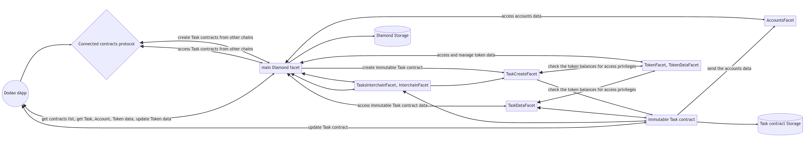
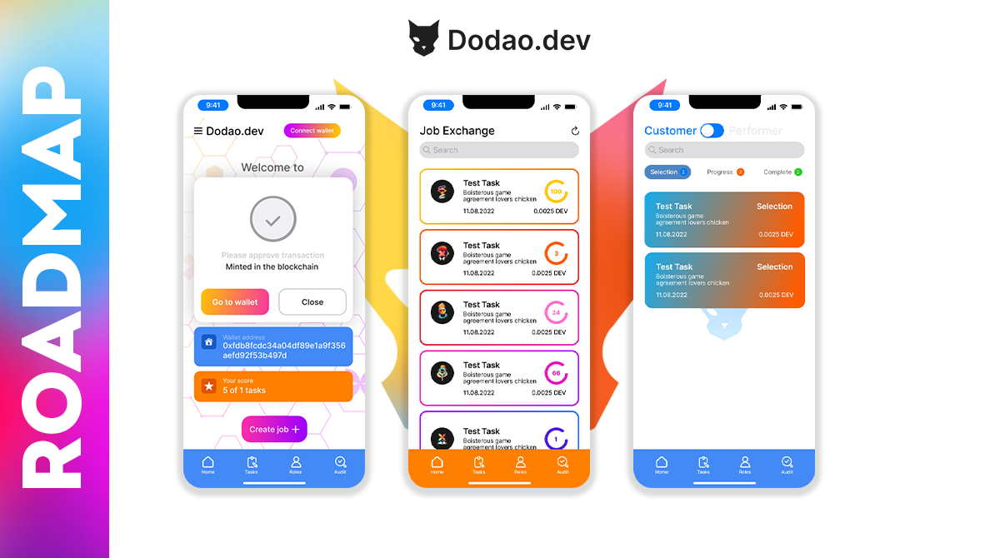

current-status.md

# Current Development Status

Here are the technical details on what was actually completed and the ongoing development.

## Definitions

I am using the word **implementation** when something is done to a certain state.
I am using the phrase **started implementation** when some development has been started but not completed.
I am using the phrase **refactoring** when there was a previous implementation, and it was significantly changed.
If something is not mentioned, it means that the development has not been started.

### Smart Contract:

- EIP-2535 Diamond smart contract architecture, which simplifies smart contract upgradeability and maintenance by using contract facets and contract libraries approach.

- The implemented architecture's strong point is that while remaining upgradable, it enforces immutability of created Task contracts, meaning that Task smart contract code cannot be changed by anyone after task creation, and the Task data can only be modified by the users involved in the Task upon their assigned privileges.

- Hardhat tasks and deployment scripts implementation, Dodao Task-related business flow unit tests and end-to-end test, improving smart contract tests coverage, preparation for automatic smart contract verification at contract deployment.

- Principal implementation of ERC-1155 support for Diamond contract, ERC-1155 unit test port to Hardhat.

- Implementation of tags support in smart contract.

- Implementation of Task contracts data accessor contract (TaskDataFacet), which enables batch Task load for faster startup and Task allowlists.

- Implementation of Task token balance collection function, which is a part of future multi-token Task contract functionality.

- Implementation of Task contracts data callbacks to the main diamond contract, which enables optimized user wallet address storage for faster Task data load and accounts allowlists, and future implementation of a statistical dashboard.

- Task contract refactoring to enable receiving original "msg.sender" via Connected contracts implementations (Axelar/Hyperlane/LayerZero/Wormhole).

- Started implementation of Connected contracts functionality and tested smart contract deployment to other chains.

### Diamond HLD Diagram

Here is how the current [Dodao smart contract diamond](https://github.com/devopsdao/devopsdao-smart-contract-diamond) architecture looks like:

*Note:*
- Diamond storage contains Tasks, Accounts lists, Token, Connected contracts configuration, and aggregated data.
- Task contract storage contains the Task data.

## Definitions

The current readiness status for the mainnet launch is mentioned in the [brackets].

[ready] - means generally ready, only minor changes may be required for the mainnet launch
[mvp] - means provides basic functionality, needs more development and testing for the mainnet launch
[dev] - under development, has some functionality, but is not ready for testing
[mock] - mocked-up contract, development has not yet started

### Task and User Account Facets:

TaskCreateFacet.sol [ready] - creates non-upgradable Task contracts using the factory pattern, which are not linked to the Diamond directly, use their own storage, and use CALLs to push necessary data back to the main diamond.

TaskDataFacet.sol [ready] - contains functions that read Tasks data from the Task contracts created by TaskCreateFacet. It also manages the Task contracts blacklist.

LibTasks.sol [ready] and LibTasksAudit.sol [ready] - provide underlying functions for the above facets.

LibChat.sol [ready] - provides in-Task chat functions.

AccountsFacet.sol [mvp] - manages user accounts. It is being called by Task contracts when a user participates in or completes the Task. It also manages the Accounts blacklist.

LibUtils.sol [dev] - provides some generic functions to be reused by multiple facets.

### Token Facets:

TokenFacet.sol [mvp] - creates ERC-1155 compatible fungible and non-fungible (NFT) tokens. Its implementation is based on the Enjin reference implementation rewritten to use Diamond storage and some project-specific functions and features added. It is generally ready for the implementation of complex user stories based on the already developed token functionality.

LibTokens.sol [ready] - provides ERC-1155 functions for the TokenFacet facet.

TokenDataFacet.sol [mvp] - contains more project-specific ERC-1155 related functions.

LibTokenData.sol [mvp] - provides underlying functions for the TokenDataFacet facet.

### Connected Contracts Facets:

InterchainFacet.sol [mock] - implements Moonbeam Connected contracts Axelar/Hyperlane/LayerZero/Wormhole protocol-specific functions.

LibInterchain.sol [dev] - provides underlying functions for the Interchain facet.

TasksInterchainFacet.sol [dev] - implements the Moonbeam Connected contracts concept by enabling interaction with the Task contracts via Axelar/Hyperlane/LayerZero and Wormhole Connected contracts protocols.

AxelarFacet.sol [dev] - implements Axelar-specific functions for interchain calls.

HyperlaneFacet.sol [dev] - implements Hyperlane-specific functions for interchain calls.

LayerzeroFacet.sol [dev] - implements LayerZero-specific functions for interchain calls.

WormholeFacet.sol [dev] - implements Wormhole-specific functions for interchain calls.

### Witnet Oracle Facets:

WitnetFacet.sol [dev] - implements the connection with Witnet oracles to query GitHub repository data used to automatically sign Task reviews.

LibWitnetRequest.sol [dev] - provides underlying functions for the WitnetFacet facet.

### App:

- Refactor of data loading to make use of data accessor contract by loading Task data in batches.

- Creation of Task contract events monitoring system, which enables instant Task refresh on contract updates.

- Started implementation of data analysis functions for the future dashboard.

- Refactoring in order to support the refactored Task contract and preparation for Connected contracts implementation.

- Refactoring wallet connection functions in order to provide a better user experience.

- Implementation of MetaMask connection for the Web version.

- Refactoring of Wallet Connect functions for WalletConnect 1.0, keeping close with the WalletConnect community for future migration to WalletConnect 2.0.

- Fixing bugs in WebThree dart library in order to support tuples in the smart contract interface dart code generator necessary for implementing the Connected contracts.

- Started implementation of Connected contracts functionality.

- Started implementation of user roles based on NFTs.

- Started implementation of NFT tags functionality.

- Successfully tested dApp builds for Web, Android, and Linux.

### UI:

- New UI design prototype, started implementation of the new design in code.

- Decided on the future Lottie usage for in-app animations and performed first tests in order for the team designer to start working on it.

- Task dialog widget to Task page refactor.

- Implementation of Material Design principles for the UI, such as FAB, widget animation, swipes.

- Implementation of a Telegram-like search widget and tags search.

- Refactor of in-app navigation, which enables task hyperlinks for future public and hackathon tasks, refactor of most widgets in order to support widget animation.

- Implementation of skeletons for data load, providing a better user experience.

- Implementation of a detailed Task Participant list for future connection with the smart contract.

- Implementation of Task details page and Task chat.

- Implementation of Auditor page.

- Started implementation of Accounts page, which will provide an account overview and details.

- Implementation of tags manager widget for future integration with the smart contract and NFT tags.

- Started implementation of NFT manager widget for future integration with the smart contract for creating, minting, and displaying available NFTs.

- Implementation of adding a GitHub repository to the Task and checking the repository pull requests via Witnet Oracle.