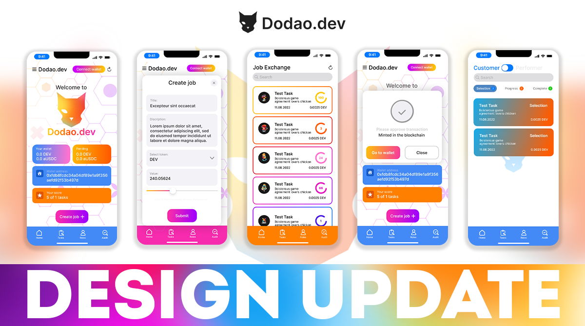

# Current Development Status

This document provides an overview of the technical details and current development status of the Dodao.dev platform.

## Definitions

We use the following terms to describe development status:
- **Implementation**: Feature or component is developed to a certain state
- **Started Implementation**: Development has begun but is not yet completed
- **Refactoring**: Previous implementation has been significantly changed or improved
- If a feature is not mentioned, development has not yet started

For mainnet launch readiness:
- **[ready]**: Generally ready, only minor changes may be required
- **[mvp]**: Provides basic functionality, needs more development and testing
- **[dev]**: Under development, has some functionality but not ready for testing
- **[mock]**: Mocked-up contract, development has not yet started

## Smart Contract Status

### Task and User Account Facets

- **TaskCreateFacet.sol** [ready]
  - Creates non-upgradable Task contracts using factory pattern
  - Contracts use their own storage and push data back to main diamond via CALL

- **TaskDataFacet.sol** [ready]
  - Reads Tasks data from Task contracts
  - Manages Task contracts blacklist
  - Enables batch Task loading

- **LibTasks.sol** [ready] and **LibTasksAudit.sol** [ready]
  - Provide underlying functions for Task facets

- **LibChat.sol** [ready]
  - Provides in-Task chat functions

- **AccountsFacet.sol** [mvp]
  - Manages user accounts
  - Handles Task participation and completion
  - Manages Accounts blacklist

### Token Facets

- **TokenFacet.sol** [mvp]
  - Creates ERC-1155 compatible tokens (fungible and NFT)
  - Based on Enjin reference implementation
  - Adapted for Diamond storage
  - Ready for complex token functionality

- **LibTokens.sol** [ready]
  - Provides core ERC-1155 functions

- **TokenDataFacet.sol** [mvp] and **LibTokenData.sol** [mvp]
  - Handle project-specific token functions

### Connected Contracts Facets

- **InterchainFacet.sol** [mock]
  - Implements protocol-specific functions for:
    - Axelar
    - Hyperlane
    - LayerZero
    - Wormhole

- **TasksInterchainFacet.sol** [dev]
  - Enables cross-chain Task contract interactions

- Protocol-specific facets [dev]:
  - AxelarFacet.sol
  - HyperlaneFacet.sol
  - LayerzeroFacet.sol
  - WormholeFacet.sol

### Witnet Oracle Facets

- **WitnetFacet.sol** [dev]
  - Connects with Witnet oracles
  - Queries GitHub repository data
  - Enables automatic Task review signing

## Application Status

### Core Functionality

- ✅ Batch data loading using accessor contract
- ✅ Task contract event monitoring system
- 🚧 Dashboard data analysis functions
- ✅ Refactored for Connected contracts
- ✅ Improved wallet connection UX
- ✅ MetaMask web integration
- ✅ WalletConnect 1.0 support
- 🚧 NFT-based user roles
- 🚧 NFT tags functionality
- ✅ Cross-platform builds (Web, Android, Linux)

### UI/UX Improvements

#### Completed
- ✅ New UI design implementation
- ✅ Material Design principles
- ✅ Advanced search functionality
- ✅ Task details and chat
- ✅ Auditor page
- ✅ Loading skeletons
- ✅ Task participant list
- ✅ Tags manager widget
- ✅ GitHub repository integration

#### In Progress
- 🚧 Accounts page
- 🚧 NFT manager widget
- 🚧 Lottie animations
- 🚧 Connected contracts UI

## Planned Features

1. Cross-chain Functionality
   - Complete Connected contracts implementation
   - Enhanced cross-chain message passing
   - Multi-chain asset management

2. NFT System
   - Role-based permissions
   - Enhanced tag system
   - Token economics

3. Platform Enhancements
   - Analytics dashboard
   - Dispute resolution system
   - Project management integrations
   - iOS app development

4. Developer Experience
   - Improved documentation
   - SDK development
   - API enhancements

*Note:*
- Diamond storage contains Tasks, Accounts lists, Token, Connected contracts configuration, and aggregated data
- Task contract storage contains the Task data
