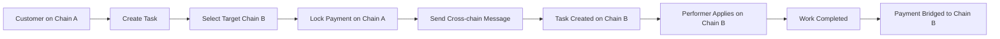

# Cross-chain Development


**Multi-chain integration guide.**

The future of blockchain isn't about choosing sides in the Layer 1 wars – it's about building applications that transcend network boundaries entirely. While others debate which blockchain will "win," forward-thinking developers are already building the infrastructure that makes the question irrelevant.

Dodao's cross-chain architecture isn't just a technical feature; it's a glimpse into the future where users never have to think about which blockchain they're using. Where a developer in Tokyo can seamlessly collaborate with a designer in São Paulo, regardless of their preferred networks or tokens. Where innovation isn't constrained by the artificial boundaries between ecosystems.

This is your guide to building that future – applications that work everywhere, for everyone, without compromise.

## Overview

### 🌐 Multi-protocol architecture

Dodao integrates four leading cross-chain protocols to provide maximum reliability, coverage, and optimization:

- **Axelar** - Secure cross-chain communication and token transfers
- **LayerZero** - Omnichain infrastructure with ultra-light nodes
- **Hyperlane** - Modular interoperability with custom security
- **Wormhole** - Battle-tested messaging with guardian network

### 🎯 Key benefits

**For developers:**
- Single API for all cross-chain operations
- Automatic protocol selection and optimization
- Fallback mechanisms for reliability
- Comprehensive error handling

**For users:**
- Seamless cross-chain experience
- Optimal cost and speed
- Maximum security through protocol diversity
- Future-proof network support

## Supported networks

**Your launchpad to a multi-chain future.** Each network we support represents a strategic choice – not just technical compatibility, but a commitment to the communities, developers, and innovations that make each ecosystem unique.

### 🚀 Currently active

**Your testing ground for cross-chain innovation.** These testnets give you everything you need to experiment with multi-chain applications before deploying to mainnet with real value at stake.

**Moonbase Alpha (Moonbeam testnet) - Ethereum compatibility with Polkadot power**
```javascript
{
  chainId: 1287,
  name: "Moonbase Alpha",
  symbol: "DEV",
  rpcUrl: "https://rpc.api.moonbase.moonbeam.network",
  explorerUrl: "https://moonbase.moonscan.io",
  protocols: ["axelar", "layerzero", "hyperlane", "wormhole"]
}
```

**Polygon Mumbai (Polygon testnet) - Scaling Ethereum for the masses**
```javascript
{
  chainId: 80001,
  name: "Polygon Mumbai", 
  symbol: "MATIC",
  rpcUrl: "https://rpc-mumbai.maticvigil.com",
  explorerUrl: "https://mumbai.polygonscan.com",
  protocols: ["axelar", "layerzero", "hyperlane", "wormhole"]
}
```

**Scroll Sepolia (Scroll testnet) - Zero-knowledge scaling for privacy and efficiency**
```javascript
{
  chainId: 534351,
  name: "Scroll Sepolia",
  symbol: "ETH", 
  rpcUrl: "https://sepolia-rpc.scroll.io",
  explorerUrl: "https://sepolia.scrollscan.dev",
  protocols: ["axelar", "layerzero", "hyperlane"]
}
```

*Each network brings unique strengths – Ethereum compatibility, scaling solutions, and cutting-edge technology.*

### 🔮 Coming soon

**The next frontier of decentralized work.** These mainnet integrations will unlock real-world value creation across the most important blockchain ecosystems, each bringing unique advantages to the global work marketplace.

**Ethereum Mainnet - The foundation of decentralized finance and innovation**
- Maximum security and decentralization (where the highest-value work deserves the strongest guarantees)
- High-value task support (enterprise-grade projects with enterprise-grade security)
- Premium protocol integrations (access to the most battle-tested cross-chain infrastructure)

**Arbitrum One - Ethereum scaling without compromise**
- Optimistic rollup scaling (Ethereum security with dramatically lower costs)
- Low fees and fast finality (making micro-tasks and frequent interactions economically viable)
- Strong DeFi ecosystem (deep liquidity and sophisticated financial tools for complex projects)

**Optimism - Building the future with optimistic innovation**
- Fast and cheap transactions (removing friction from everyday work interactions)
- Growing developer community (vibrant ecosystem of builders and innovators)
- Excellent tooling support (developer experience that accelerates innovation)

**Base - Bringing blockchain to the mainstream**
- Coinbase-backed L2 (institutional trust meets decentralized innovation)
- Easy fiat on-ramps (seamless transition from traditional to crypto payments)
- Mainstream adoption focus (designed for users who don't want to think about blockchain complexity)

*Each network expansion brings us closer to a truly global, accessible, and efficient work marketplace.*

## Protocol integration

### 🔗 Axelar integration

**Key features:**
- Secure cross-chain communication
- Token transfers with proof-of-stake security
- 50+ blockchain support
- Programmable token transfers

**Smart contract integration:**
```solidity
import { IAxelarGateway } from "@axelar-network/axelar-gmp-sdk-solidity";
import { IAxelarGasService } from "@axelar-network/axelar-gmp-sdk-solidity";

contract DodaoAxelarFacet {
    IAxelarGateway public immutable gateway;
    IAxelarGasService public immutable gasService;
    
    function sendCrossChainTask(
        string memory destinationChain,
        string memory destinationAddress,
        bytes memory payload
    ) external payable {
        // Pay for gas
        gasService.payNativeGasForContractCall{value: msg.value}(
            address(this),
            destinationChain,
            destinationAddress,
            payload,
            msg.sender
        );
        
        // Send message
        gateway.callContract(
            destinationChain,
            destinationAddress,
            payload
        );
    }
    
    function _execute(
        string calldata sourceChain,
        string calldata sourceAddress,
        bytes calldata payload
    ) internal override {
        // Handle incoming cross-chain message
        _processCrossChainTask(payload);
    }
}
```

**JavaScript SDK usage:**
```javascript
import { AxelarGMPRecoveryAPI, Environment } from "@axelar-network/axelarjs-sdk";

const api = new AxelarGMPRecoveryAPI({
  environment: Environment.TESTNET
});

// Send cross-chain task
const txHash = await dodao.crossChain.sendTask({
  sourceChain: "moonbeam",
  destinationChain: "polygon",
  taskData: {
    title: "Cross-chain audit",
    payment: "5.0",
    token: "USDC"
  },
  protocol: "axelar"
});

// Monitor transaction
const status = await api.queryTransactionStatus(txHash);
```

### ⚡ LayerZero integration

**Key features:**
- Omnichain infrastructure
- Ultra-light node validation
- Custom security configuration
- Unified liquidity access

**Smart contract integration:**
```solidity
import { ILayerZeroEndpoint } from "@layerzerolabs/solidity-examples";
import { ILayerZeroReceiver } from "@layerzerolabs/solidity-examples";

contract DodaoLayerZeroFacet is ILayerZeroReceiver {
    ILayerZeroEndpoint public immutable lzEndpoint;
    
    function sendCrossChainTask(
        uint16 dstChainId,
        bytes memory payload,
        address payable refundAddress,
        address zroPaymentAddress,
        bytes memory adapterParams
    ) external payable {
        lzEndpoint.send{value: msg.value}(
            dstChainId,
            abi.encodePacked(address(this)),
            payload,
            refundAddress,
            zroPaymentAddress,
            adapterParams
        );
    }
    
    function lzReceive(
        uint16 srcChainId,
        bytes memory srcAddress,
        uint64 nonce,
        bytes memory payload
    ) external override {
        require(msg.sender == address(lzEndpoint), "Invalid endpoint");
        _processCrossChainTask(payload);
    }
    
    function estimateFees(
        uint16 dstChainId,
        bytes memory payload,
        bool useZro,
        bytes memory adapterParams
    ) external view returns (uint256 nativeFee, uint256 zroFee) {
        return lzEndpoint.estimateFees(
            dstChainId,
            address(this),
            payload,
            useZro,
            adapterParams
        );
    }
}
```

**JavaScript SDK usage:**
```javascript
import { ChainId, ChainStage } from "@layerzerolabs/lz-sdk";

// Estimate fees
const fees = await dodao.crossChain.estimateFees({
  sourceChain: ChainId.MOONBEAM_TESTNET,
  destinationChain: ChainId.POLYGON_TESTNET,
  payload: taskData,
  protocol: "layerzero"
});

// Send cross-chain message
const result = await dodao.crossChain.sendTask({
  sourceChain: "moonbeam",
  destinationChain: "polygon", 
  taskData: taskData,
  protocol: "layerzero",
  fees: fees.nativeFee
});
```

### 🔧 Hyperlane integration

**Key features:**
- Modular interoperability
- Custom security models
- Permissionless deployment
- Configurable validation

**Smart contract integration:**
```solidity
import { IMailbox } from "@hyperlane-xyz/core/interfaces/IMailbox.sol";
import { IInterchainSecurityModule } from "@hyperlane-xyz/core/interfaces/IInterchainSecurityModule.sol";

contract DodaoHyperlaneFacet {
    IMailbox public immutable mailbox;
    
    function sendCrossChainTask(
        uint32 destinationDomain,
        bytes32 recipient,
        bytes memory messageBody
    ) external payable {
        uint256 quote = mailbox.quoteDispatch(
            destinationDomain,
            recipient,
            messageBody
        );
        
        require(msg.value >= quote, "Insufficient fee");
        
        mailbox.dispatch{value: quote}(
            destinationDomain,
            recipient,
            messageBody
        );
    }
    
    function handle(
        uint32 origin,
        bytes32 sender,
        bytes memory messageBody
    ) external {
        require(msg.sender == address(mailbox), "Invalid mailbox");
        _processCrossChainTask(messageBody);
    }
}
```

### 🌉 Wormhole integration

**Key features:**
- Battle-tested infrastructure
- Guardian network security
- High throughput messaging
- 20+ blockchain support

**Smart contract integration:**
```solidity
import { IWormhole } from "@certusone/wormhole-sdk/lib/cjs/solana/wormhole";

contract DodaoWormholeFacet {
    IWormhole public immutable wormhole;
    
    function sendCrossChainTask(
        uint16 targetChain,
        bytes32 targetAddress,
        bytes memory payload,
        uint32 nonce
    ) external payable {
        uint256 messageFee = wormhole.messageFee();
        require(msg.value >= messageFee, "Insufficient fee");
        
        uint64 sequence = wormhole.publishMessage{value: messageFee}(
            nonce,
            payload,
            1 // consistency level
        );
        
        emit CrossChainTaskSent(targetChain, sequence);
    }
    
    function receiveCrossChainTask(bytes memory encodedVM) external {
        (IWormhole.VM memory vm, bool valid, string memory reason) = 
            wormhole.parseAndVerifyVM(encodedVM);
            
        require(valid, reason);
        require(vm.emitterAddress == bytes32(uint256(uint160(address(this)))), "Invalid emitter");
        
        _processCrossChainTask(vm.payload);
    }
}
```

## Cross-chain workflows

### 📝 Cross-chain task creation

**Workflow overview:**


**Implementation example:**
```javascript
// Create cross-chain task
const crossChainTask = await dodao.tasks.createCrossChain({
  // Source chain (where payment is locked)
  sourceChain: "moonbeam",
  sourcePayment: {
    amount: "5.0",
    token: "DEV"
  },
  
  // Target chain (where work is done)
  targetChain: "polygon",
  
  // Task details
  task: {
    title: "Cross-chain DeFi integration",
    description: "Build bridge between Moonbeam and Polygon",
    tags: ["solidity", "defi", "cross-chain"],
    deadline: "2024-02-15T00:00:00Z"
  },
  
  // Protocol preferences
  protocols: ["axelar", "layerzero"], // Fallback order
  optimization: "cost" // or "speed" or "security"
});

console.log("Cross-chain task created:", crossChainTask.taskId);
console.log("Source transaction:", crossChainTask.sourceTx);
console.log("Target transaction:", crossChainTask.targetTx);
```

### 💰 Cross-chain payments

**Payment bridging workflow:**
```javascript
// Bridge payment after task completion
const bridgeResult = await dodao.payments.bridgeCrossChain({
  taskId: 123,
  sourceChain: "moonbeam",
  targetChain: "polygon",
  recipient: "0x8ba1f109551bD432803012645Hac136c22C177ec",
  amount: "5.0",
  token: "USDC",
  protocol: "axelar"
});

// Monitor bridge status
const status = await dodao.payments.getBridgeStatus(bridgeResult.bridgeId);
console.log("Bridge status:", status);
```

**Automatic protocol selection:**
```javascript
// Let Dodao choose optimal protocol
const optimizedBridge = await dodao.payments.bridgeOptimized({
  taskId: 123,
  targetChain: "polygon",
  recipient: performerAddress,
  optimization: {
    priority: "cost", // cost, speed, or security
    maxTime: 600, // max 10 minutes
    maxCost: "0.1" // max 0.1 ETH in fees
  }
});
```

### 🔄 Message verification

**Cross-chain message handling:**
```javascript
// Listen for cross-chain messages
dodao.crossChain.onMessage((message) => {
  console.log("Received cross-chain message:", {
    sourceChain: message.sourceChain,
    protocol: message.protocol,
    type: message.type,
    data: message.data
  });
  
  // Verify message authenticity
  if (message.verified) {
    handleCrossChainTask(message.data);
  }
});

// Manual message verification
const isValid = await dodao.crossChain.verifyMessage({
  messageId: "0xabc123...",
  sourceChain: "moonbeam",
  protocol: "axelar"
});
```

## Protocol optimization

### ⚡ Automatic routing

**Cost optimization:**
```javascript
const costOptimized = await dodao.crossChain.getOptimalRoute({
  sourceChain: "moonbeam",
  targetChain: "polygon",
  messageSize: 1024,
  priority: "cost"
});

console.log("Optimal route:", {
  protocol: costOptimized.protocol, // "axelar"
  estimatedCost: costOptimized.cost, // "0.05 DEV"
  estimatedTime: costOptimized.time, // "120 seconds"
  reliability: costOptimized.reliability // 0.99
});
```

**Speed optimization:**
```javascript
const speedOptimized = await dodao.crossChain.getOptimalRoute({
  sourceChain: "moonbeam", 
  targetChain: "polygon",
  messageSize: 1024,
  priority: "speed"
});

console.log("Fastest route:", {
  protocol: speedOptimized.protocol, // "layerzero"
  estimatedTime: speedOptimized.time, // "30 seconds"
  estimatedCost: speedOptimized.cost // "0.08 DEV"
});
```

### 🛡️ Security configuration

**Multi-protocol validation:**
```javascript
// Require validation from multiple protocols
const secureMessage = await dodao.crossChain.sendSecure({
  sourceChain: "moonbeam",
  targetChain: "polygon",
  payload: taskData,
  security: {
    requiredProtocols: ["axelar", "layerzero"], // Both must validate
    consensusThreshold: 2, // Minimum confirmations
    timeoutSeconds: 300 // 5 minute timeout
  }
});
```

**Custom security modules:**
```solidity
contract CustomSecurityModule is IInterchainSecurityModule {
    function verify(
        bytes calldata metadata,
        bytes calldata message
    ) external view override returns (bool) {
        // Custom validation logic
        return _validateMultiProtocol(metadata, message);
    }
    
    function _validateMultiProtocol(
        bytes calldata metadata,
        bytes calldata message
    ) internal view returns (bool) {
        // Require validation from at least 2 protocols
        uint256 validProtocols = 0;
        
        if (_validateAxelar(metadata, message)) validProtocols++;
        if (_validateLayerZero(metadata, message)) validProtocols++;
        if (_validateWormhole(metadata, message)) validProtocols++;
        
        return validProtocols >= 2;
    }
}
```

## Error handling

### 🚨 Common failure scenarios

**Network congestion:**
```javascript
try {
  const result = await dodao.crossChain.sendTask(taskData);
} catch (error) {
  if (error.code === 'NETWORK_CONGESTION') {
    // Retry with higher gas or different protocol
    const fallbackResult = await dodao.crossChain.sendTask({
      ...taskData,
      protocol: 'layerzero', // Switch protocol
      gasMultiplier: 1.5 // Increase gas
    });
  }
}
```

**Protocol failure:**
```javascript
// Automatic fallback handling
const robustSend = await dodao.crossChain.sendWithFallback({
  taskData: taskData,
  protocols: ['axelar', 'layerzero', 'hyperlane'], // Try in order
  maxRetries: 3,
  retryDelay: 5000 // 5 seconds between retries
});
```

**Message timeout:**
```javascript
// Handle message timeouts
dodao.crossChain.onTimeout((timeoutEvent) => {
  console.log("Message timeout:", {
    messageId: timeoutEvent.messageId,
    protocol: timeoutEvent.protocol,
    elapsedTime: timeoutEvent.elapsedTime
  });
  
  // Attempt recovery
  dodao.crossChain.recoverMessage(timeoutEvent.messageId);
});
```

### 🔄 Recovery mechanisms

**Message recovery:**
```javascript
// Recover stuck message
const recovery = await dodao.crossChain.recoverMessage({
  messageId: "0xabc123...",
  sourceChain: "moonbeam",
  targetChain: "polygon",
  protocol: "axelar"
});

if (recovery.success) {
  console.log("Message recovered:", recovery.newMessageId);
} else {
  console.log("Recovery failed:", recovery.error);
}
```

**Manual execution:**
```javascript
// Manually execute message on target chain
const manualExecution = await dodao.crossChain.executeManually({
  messageProof: "0xproof...",
  targetChain: "polygon",
  gasLimit: 500000
});
```

## Monitoring and analytics

### 📊 Cross-chain metrics

**Protocol performance:**
```javascript
// Get protocol statistics
const stats = await dodao.crossChain.getProtocolStats({
  timeframe: "24h",
  sourceChain: "moonbeam",
  targetChain: "polygon"
});

console.log("Protocol performance:", {
  axelar: {
    successRate: stats.axelar.successRate, // 0.99
    avgTime: stats.axelar.avgTime, // 120 seconds
    avgCost: stats.axelar.avgCost // 0.05 DEV
  },
  layerzero: {
    successRate: stats.layerzero.successRate, // 0.98
    avgTime: stats.layerzero.avgTime, // 45 seconds
    avgCost: stats.layerzero.avgCost // 0.08 DEV
  }
});
```

**Message tracking:**
```javascript
// Track message status
const tracking = await dodao.crossChain.trackMessage({
  messageId: "0xabc123...",
  protocol: "axelar"
});

console.log("Message status:", {
  status: tracking.status, // "pending", "confirmed", "executed"
  confirmations: tracking.confirmations,
  estimatedCompletion: tracking.estimatedCompletion,
  gasUsed: tracking.gasUsed
});
```

### 📈 Real-time monitoring

**WebSocket monitoring:**
```javascript
// Monitor cross-chain events
const monitor = dodao.crossChain.createMonitor({
  chains: ["moonbeam", "polygon"],
  protocols: ["axelar", "layerzero"],
  events: ["message_sent", "message_received", "execution_failed"]
});

monitor.on("message_sent", (event) => {
  console.log("Cross-chain message sent:", event);
});

monitor.on("execution_failed", (event) => {
  console.log("Execution failed:", event);
  // Trigger recovery
  dodao.crossChain.recoverMessage(event.messageId);
});
```

## Testing

### 🧪 Testnet testing

**Multi-chain test setup:**
```javascript
// Configure for testnet testing
const testConfig = {
  networks: {
    moonbeam: {
      rpc: "https://rpc.api.moonbase.moonbeam.network",
      chainId: 1287,
      contracts: {
        diamond: "0x...",
        axelarGateway: "0x...",
        layerzeroEndpoint: "0x..."
      }
    },
    polygon: {
      rpc: "https://rpc-mumbai.maticvigil.com", 
      chainId: 80001,
      contracts: {
        diamond: "0x...",
        axelarGateway: "0x...",
        layerzeroEndpoint: "0x..."
      }
    }
  }
};

const dodao = new DodaoSDK(testConfig);
```

**Cross-chain test scenarios:**
```javascript
describe("Cross-chain functionality", () => {
  it("should create task on source chain and execute on target", async () => {
    // Create task on Moonbeam
    const task = await dodao.tasks.createCrossChain({
      sourceChain: "moonbeam",
      targetChain: "polygon",
      taskData: testTaskData
    });
    
    // Wait for cross-chain message
    await waitForCrossChainMessage(task.messageId);
    
    // Verify task exists on Polygon
    const targetTask = await dodao.tasks.getById(task.taskId, "polygon");
    expect(targetTask.status).to.equal("open");
  });
  
  it("should bridge payment after completion", async () => {
    // Complete task and bridge payment
    const bridge = await dodao.payments.bridgeCrossChain({
      taskId: testTaskId,
      targetChain: "polygon",
      recipient: performerAddress
    });
    
    // Verify payment received
    const balance = await getBalance(performerAddress, "polygon");
    expect(balance).to.be.greaterThan(previousBalance);
  });
});
```

### 🔧 Local development

**Local cross-chain simulation:**
```javascript
// Use Dodao's cross-chain simulator
const simulator = new CrossChainSimulator({
  chains: ["moonbeam", "polygon"],
  protocols: ["axelar", "layerzero"],
  latency: 1000, // 1 second simulated latency
  failureRate: 0.01 // 1% failure rate for testing
});

// Test cross-chain operations locally
const result = await simulator.sendMessage({
  sourceChain: "moonbeam",
  targetChain: "polygon", 
  payload: testData,
  protocol: "axelar"
});
```

## Best practices

### 🎯 Development guidelines

**Protocol selection:**
- Use Axelar for token transfers and high-security operations
- Use LayerZero for fast messaging and omnichain applications
- Use Hyperlane for custom security requirements
- Use Wormhole for high-throughput applications

**Error handling:**
- Always implement fallback protocols
- Set appropriate timeouts for cross-chain operations
- Monitor message status and implement recovery
- Log all cross-chain events for debugging

**Security considerations:**
- Validate all cross-chain messages
- Use multi-protocol validation for high-value operations
- Implement replay protection
- Monitor for unusual cross-chain activity

### 🔒 Security best practices

**Message validation:**
```solidity
function validateCrossChainMessage(
    bytes memory message,
    bytes memory proof,
    address sourceContract
) internal view returns (bool) {
    // Verify message authenticity
    require(_verifyProof(message, proof), "Invalid proof");
    
    // Verify source contract
    require(sourceContract == trustedSource, "Untrusted source");
    
    // Verify message format
    require(_validateMessageFormat(message), "Invalid format");
    
    return true;
}
```

**Replay protection:**
```solidity
mapping(bytes32 => bool) public processedMessages;

function processCrossChainMessage(bytes memory message) external {
    bytes32 messageHash = keccak256(message);
    require(!processedMessages[messageHash], "Message already processed");
    
    processedMessages[messageHash] = true;
    _executeMessage(message);
}
```

## Resources

### 📚 Protocol documentation

- **[Axelar Documentation](https://docs.axelar.dev/)** - Axelar protocol guide
- **[LayerZero Documentation](https://layerzero.gitbook.io/)** - LayerZero development
- **[Hyperlane Documentation](https://docs.hyperlane.xyz/)** - Hyperlane integration
- **[Wormhole Documentation](https://docs.wormhole.com/)** - Wormhole development

### 🛠️ Development tools

- [Cross-chain examples](https://github.com/devopsdao/cross-chain-examples)
- [Protocol SDKs](https://github.com/devopsdao/protocol-sdks)
- [Testing utilities](https://github.com/devopsdao/cross-chain-testing)
- [Monitoring tools](https://github.com/devopsdao/cross-chain-monitor)

### 🤝 Community support

- **[Discord](https://discord.gg/qJwsv45QTd)** - Cross-chain development channel
- **[GitHub Discussions](https://github.com/devopsdao/devopsdao/discussions)** - Technical questions
- **[Developer calls](https://calendar.dodao.dev)** - Weekly cross-chain sessions

---

**Ready to build cross-chain?** [Start with examples →](https://github.com/devopsdao/cross-chain-examples)

*Build the future of multi-chain applications with Dodao!*
