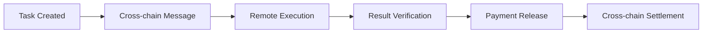

# Cross-chain


**Any blockchain. One platform.**

Imagine being a developer in Berlin who wants to hire a designer in Tokyo, but you prefer to pay in USDC on Polygon while they want to receive payment in ETH on Ethereum. Traditional platforms would make this impossible, forcing you to navigate multiple exchanges, bridge protocols, and payment systems.

Dodao eliminates these barriers entirely. We've built the infrastructure so you don't have to think about it. Post your task on any blockchain, work with anyone anywhere, and let our smart contracts handle the complex cross-chain coordination automatically. This isn't just technical innovation – it's freedom from the artificial boundaries that have limited global collaboration.

Your location, preferred blockchain, or payment token choice should never determine your opportunities. With Dodao, they don't.

## Why cross-chain matters

The blockchain world is intentionally fragmented – different networks optimize for different things. Ethereum prioritizes security, Polygon focuses on speed and cost, Moonbeam emphasizes compatibility. Traditional platforms force you to pick sides in these trade-offs. Dodao lets you have it all.

### 🌐 Network freedom
Why should your choice of blockchain limit your opportunities? A brilliant developer shouldn't miss out on high-paying Ethereum projects just because they prefer Polygon's low fees. Our cross-chain architecture means your skills are accessible to customers everywhere, regardless of their network preferences.

### 💰 Cost optimization
Smart money uses the right tool for the job. Small tasks benefit from Polygon's penny-cheap transactions, while high-value contracts deserve Ethereum's battle-tested security. With Dodao, you automatically get optimal cost-efficiency without sacrificing security or functionality.

### 🔗 Unified experience
Imagine managing separate accounts, reputations, and payment systems across five different blockchains. Exhausting, right? Dodao provides one account, one reputation, and one seamless experience that works across every supported network. Your achievements follow you everywhere.

### ⚡ Future-proof
New blockchains launch constantly, each promising to be the "Ethereum killer." Instead of betting on winners and losers, Dodao integrates them all. When the next breakthrough blockchain emerges, you'll have access automatically – no migration, no lost history, no starting over.

## Supported networks

**Your gateway to global opportunities.** Each network we support represents a different community, ecosystem, and set of opportunities. By connecting them all, we multiply your potential reach and earning power.

### 🚀 Currently active

**Moonbase Alpha (Moonbeam testnet) - The Innovation Playground**
- **Chain ID**: 1287
- **Token**: DEV
- **Features**: Fast transactions, low fees, EVM compatible
- **Best for**: Development tasks, quick iterations (where ideas become reality fast)
- **Why choose**: Perfect for rapid prototyping and testing new concepts
- **Faucet**: [Get DEV tokens](https://apps.moonbeam.network/moonbase-alpha/faucet/)

**Polygon Mumbai (Polygon testnet) - The Scaling Champion**
- **Chain ID**: 80001
- **Token**: MATIC
- **Features**: Ethereum-compatible, high throughput
- **Best for**: High-volume tasks, DeFi projects (where efficiency meets familiarity)
- **Why choose**: Ethereum's power without the cost burden
- **Faucet**: [Get MATIC](https://faucet.polygon.technology/)

**Scroll Sepolia (Scroll testnet) - The Privacy Pioneer**
- **Chain ID**: 534351
- **Token**: ETH
- **Features**: Zero-knowledge rollup, privacy-focused
- **Best for**: Privacy-sensitive work, advanced cryptography (where confidentiality matters)
- **Why choose**: Cutting-edge privacy technology with Ethereum security
- **Faucet**: [Get test ETH](https://scroll.io/alpha/faucet)

*Each network serves different needs, but together they create unlimited possibilities.*

### 🔮 Coming soon

**Ethereum Mainnet**
- High-value tasks and premium work
- Maximum security and decentralization
- Industry standard for serious projects

**Arbitrum**
- Optimistic rollup scaling
- Lower fees than Ethereum mainnet
- Strong DeFi ecosystem

**Optimism**
- Fast and cheap transactions
- Growing developer community
- Excellent tooling support

**Base**
- Coinbase-backed L2
- Easy fiat on-ramps
- Mainstream adoption focus

## Cross-chain protocols

**Redundancy that guarantees reliability.** We don't rely on a single bridge or protocol because your success is too important to risk on any single point of failure. Our multi-protocol approach ensures your transactions always find a way through.

### 🔗 Integrated protocols

**Four pillars of cross-chain reliability.** Each protocol brings unique strengths, and together they create an unbreakable network that connects every major blockchain ecosystem.

**Axelar Network - The Secure Messenger**
- **Strengths**: Secure cross-chain communication, token transfers
- **Use case**: Multi-token payments, cross-chain settlements (when security is paramount)
- **Security**: Proof-of-stake validator network (economic incentives ensure honest behavior)
- **Coverage**: 50+ blockchains supported (the most comprehensive network)

**LayerZero - The Efficiency Expert**
- **Strengths**: Omnichain infrastructure, unified liquidity
- **Use case**: Cross-chain task execution, state synchronization (when speed matters)
- **Security**: Ultra-light nodes, oracle validation (minimal overhead, maximum security)
- **Coverage**: 30+ blockchains connected (quality over quantity)

**Hyperlane - The Flexible Innovator**
- **Strengths**: Modular interoperability, custom security
- **Use case**: Flexible cross-chain messaging (when customization is needed)
- **Security**: Configurable security models (tailor protection to your specific needs)
- **Coverage**: Permissionless deployment (connect any blockchain)

**Wormhole - The Battle-Tested Veteran**
- **Strengths**: Battle-tested, high throughput
- **Use case**: Cross-chain data and asset transfers (when proven reliability is essential)
- **Security**: Guardian network validation (multiple independent validators)
- **Coverage**: 20+ major blockchains (focus on the most important networks)

*Diversity in protocols means resilience in operations.*

### 🛡️ Protocol optimization

**Intelligence that works behind the scenes.** You shouldn't have to become a cross-chain expert to benefit from cross-chain technology. Our optimization engine handles the complexity automatically.

**Automatic routing (smart decisions for every transaction):**
- Best protocol selected for each transaction (optimal choice every time)
- Cost and speed optimization (save money without sacrificing performance)
- Fallback options for reliability (backup plans that activate automatically)
- Real-time protocol health monitoring (proactive problem detection and avoidance)

**Security layers (protection that compounds):**
- Multiple protocol validation (redundant verification for critical operations)
- Economic security guarantees (financial incentives that align with your interests)
- Slashing conditions for misbehavior (penalties that deter bad actors)
- Insurance fund protection (financial backup for the unexpected)

*When multiple systems work together, the whole becomes stronger than any individual part.*

## Cross-chain workflows

### 📝 Task creation across chains

**Scenario**: Post task on Polygon, work delivered on Moonbeam

1. **Customer posts task** on Polygon Mumbai
2. **Payment locked** in Polygon smart contract
3. **Task visible** across all supported networks
4. **Performer applies** from any network
5. **Work delivered** on Moonbeam (if specified)
6. **Payment bridged** automatically to performer's preferred network

### 💱 Multi-token payments

**Supported token types:**

**Native tokens:**
- ETH (Ethereum, Scroll)
- MATIC (Polygon)
- DEV (Moonbeam)
- Network-specific gas tokens

**Cross-chain stablecoins:**
- USDC via Axelar
- USDT via Axelar
- DAI via bridges
- Other major stablecoins

**ERC-20 tokens:**
- Any standard token on supported networks
- Automatic bridging when needed
- Real-time exchange rates
- Slippage protection

**NFTs (ERC-721/ERC-1155):**
- Cross-chain NFT transfers
- Metadata preservation
- Ownership verification
- Collection bridging

### 🔄 Cross-chain execution

**Smart contract coordination:**



**Execution flow:**
1. **Task contract** deployed on source chain
2. **Cross-chain message** sent to target chain
3. **Work verification** on target chain
4. **Result confirmation** back to source chain
5. **Payment release** with automatic bridging

## Network selection guide

**Empowerment through informed choice.** The right network can make your project faster, cheaper, more secure, or more private. Understanding each network's strengths helps you optimize for what matters most to your specific needs.

### 🎯 Choosing the right network

**For development tasks (where speed and iteration matter most):**
- **Moonbeam** - Fast iteration, low fees (perfect for rapid prototyping and testing)
- **Polygon** - Ethereum compatibility (familiar tools and extensive ecosystem)
- **Scroll** - Advanced cryptography features (cutting-edge privacy and security)

**For design work (where creativity meets technology):**
- **Polygon** - NFT ecosystem, low minting costs (vibrant creative community)
- **Moonbeam** - Quick feedback cycles (fast iterations for creative workflows)
- **Any network** - Files stored off-chain (network choice doesn't limit creativity)

**For high-value projects (where security and trust are paramount):**
- **Ethereum** - Maximum security (coming soon - the gold standard)
- **Polygon** - Proven track record (battle-tested with billions in value)
- **Multiple networks** - Risk distribution (diversification reduces single points of failure)

**For privacy-sensitive work (where confidentiality is essential):**
- **Scroll** - Zero-knowledge features (mathematical privacy guarantees)
- **Private networks** - Custom deployments (complete control over access)
- **Encrypted communication** - Built-in privacy (end-to-end protection)

*The best network is the one that aligns with your project's priorities.*

### 💡 Network advantages

**Understanding trade-offs helps you optimize for what matters most.** Every network makes different choices about speed, cost, security, and features. Choose the one that matches your priorities.

**Moonbase Alpha (The Speed Demon):**
- ✅ Fastest transaction confirmation (instant feedback for rapid development)
- ✅ Lowest fees for testing (experiment freely without cost concerns)
- ✅ Excellent developer tools (polished experience for builders)
- ❌ Testnet only (for now - mainnet coming soon)

**Polygon Mumbai (The Reliable Workhorse):**
- ✅ Ethereum ecosystem compatibility (familiar tools and vast community)
- ✅ Large developer community (extensive support and resources)
- ✅ Proven scaling solution (billions in value secured)
- ❌ Occasional network congestion (popularity has its price)

**Scroll Sepolia (The Privacy Pioneer):**
- ✅ Zero-knowledge privacy features (mathematical confidentiality guarantees)
- ✅ Ethereum-equivalent security (inherit Ethereum's battle-tested security)
- ✅ Advanced cryptography support (cutting-edge privacy technology)
- ❌ Newer, smaller ecosystem (growing but not yet mature)

*Every limitation today becomes tomorrow's optimization opportunity.*

## Technical implementation

### 🔧 Diamond pattern architecture

**Upgradeable contracts:**
- Modular facet system
- Cross-chain functionality in dedicated facets
- Seamless protocol upgrades
- Backward compatibility maintained

**Cross-chain facets:**
- **AxelarFacet** - Axelar protocol integration
- **LayerzeroFacet** - LayerZero messaging
- **HyperlaneFacet** - Hyperlane communication
- **WormholeFacet** - Wormhole bridge integration

### 📡 Message passing

**Cross-chain communication:**
```solidity
// Example: Cross-chain task creation
function createTaskCrossChain(
    uint16 targetChain,
    TaskData memory taskData,
    address performer
) external payable {
    // Encode task data
    bytes memory payload = abi.encode(taskData);
    
    // Send via optimal protocol
    _sendCrossChainMessage(targetChain, payload);
    
    // Lock payment in escrow
    _lockPayment(taskData.payment);
}
```

**Protocol selection logic:**
- Cost optimization algorithms
- Speed requirements analysis
- Security level matching
- Network availability checks

### 🔒 Security measures

**Multi-protocol validation:**
- Messages validated by multiple protocols
- Consensus required for execution
- Economic security guarantees
- Slashing for malicious behavior

**Economic security:**
- Stake-based validator networks
- Insurance fund coverage
- Dispute resolution mechanisms
- Penalty systems for misbehavior

## User experience

**Simplicity that hides complexity.** Cross-chain technology is incredibly sophisticated, but using it should feel effortless. We've designed every interaction to be intuitive, even when managing assets across multiple blockchains.

### 🎮 Seamless interaction

**One interface, infinite possibilities.** Managing multiple blockchains used to mean juggling multiple wallets, interfaces, and mental models. Dodao unifies everything into a single, coherent experience.

**Single wallet, all networks (unified identity across the multichain world):**
- Connect once, work everywhere (your identity follows you across all blockchains)
- Automatic network switching (seamless transitions without manual configuration)
- Unified balance display (see all your assets in one place, regardless of chain)
- Cross-chain transaction history (complete record of all your activities)

**Intelligent routing (smart decisions made automatically):**
- Best network suggested automatically (optimization without the complexity)
- Cost and speed optimization (always get the best deal available)
- User preference learning (the system gets smarter about your preferences over time)
- Manual override available (expert control when you want it)

*Complexity handled automatically, control available when needed.*

### 📊 Cross-chain analytics

**Insights that span the entire blockchain universe.** Understanding your performance across multiple networks used to require spreadsheets and manual tracking. Now it's automatic and comprehensive.

**Unified dashboard (your command center for multi-chain success):**
- Tasks across all networks (complete view of all your activities)
- Earnings in preferred currency (see your total value regardless of token diversity)
- Performance metrics aggregated (understand your success patterns across chains)
- Network-specific insights (optimize your strategy for each blockchain)

**Portfolio tracking (financial intelligence across all chains):**
- Multi-network asset overview (complete picture of your digital wealth)
- Cross-chain transaction history (audit trail for all your activities)
- Yield optimization suggestions (maximize returns across all opportunities)
- Risk distribution analysis (understand and optimize your exposure)

*When data from all chains comes together, patterns emerge that single-chain analysis misses.*

## Advanced features

### 🤖 Automated bridging

**Smart routing:**
- Optimal bridge selection
- Cost minimization
- Speed optimization
- Slippage protection

**Batch operations:**
- Multiple transactions bundled
- Gas cost optimization
- Atomic execution guarantees
- Failure recovery mechanisms

### 🔮 Future capabilities

**Planned features:**
- **Intent-based execution** - Describe desired outcome, system handles routing
- **Cross-chain governance** - Vote from any network
- **Unified liquidity** - Access all network liquidity pools
- **AI-powered optimization** - Machine learning for best routing

**Research areas:**
- **Zero-knowledge bridges** - Privacy-preserving transfers
- **Quantum-resistant protocols** - Future-proof security
- **Interchain accounts** - Control accounts on multiple chains
- **Cross-chain MEV protection** - Fair transaction ordering

## Getting started

### 🚀 Quick start

1. **Connect wallet** to any supported network
2. **Get test tokens** from network faucets
3. **Post or find tasks** across all networks
4. **Experience seamless** cross-chain workflows

### 📚 Learn more

- **[How it works](/docs/how-it-works)** - Platform overview
- **[Get started](/docs/get-started)** - Setup guide
- **[Technical docs](/docs/developers/cross-chain)** - Integration details
- **[Security features](/docs/features/security)** - Protection mechanisms

---

**Ready to work across chains?** [Start now →](https://dodao.dev)

*Experience the future of cross-chain work on testnet!*
