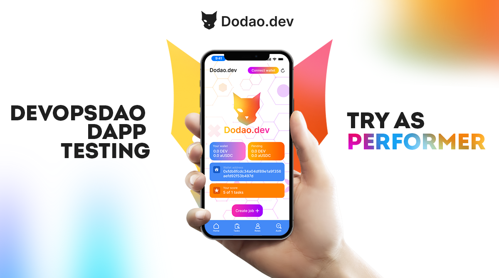

# Performer Getting Started Guide



**Your journey from application to expertise.**

*"The best time to start building your decentralized career was yesterday. The second best time is right now."*

Welcome to the future of work – where your skills matter more than your location, where your reputation belongs to you, and where every task completed builds toward true professional sovereignty. This isn't just another freelance platform; it's your gateway to a career that transcends borders, platforms, and traditional employment limitations.

Whether you're a seasoned developer tired of platform dependency or a newcomer ready to embrace the decentralized economy, this guide will transform you from curious observer to confident performer in the Dodao ecosystem.

Your decentralized career starts here.

## Before you begin: The mindset shift

### 🧠 From employee to entrepreneur

**Traditional work mindset:**
- Wait for opportunities to be assigned
- Compete based on lowest price
- Build reputation on someone else's platform
- Accept whatever terms are offered

**Dodao performer mindset:**
- Actively seek and create opportunities
- Compete based on value and expertise
- Own your reputation and professional identity
- Participate in platform governance and direction

**The sovereignty principle:**
In the decentralized work economy, you're not just a service provider – you're a stakeholder in the ecosystem itself. Your success contributes to platform growth, and platform growth amplifies your opportunities.

### 🌍 Global opportunities, local impact

**Think globally:**
- Your next customer could be anywhere in the world
- Payment can happen in any supported cryptocurrency
- Work across multiple blockchain ecosystems
- Build reputation that transcends geographic boundaries

**Act locally:**
- Leverage your unique cultural and linguistic advantages
- Build relationships within your time zone and region
- Contribute to local blockchain communities
- Mentor newcomers from your area

*"In the decentralized economy, your passport doesn't determine your opportunities – your skills do."*

## Phase 1: Foundation (Week 1-2)

### 🎯 Account setup and profile optimization

**Step 1: Create your account**
1. Connect your preferred wallet (MetaMask, WalletConnect, etc.)
2. Choose your primary blockchain network
3. Complete identity verification if required
4. Set up two-factor authentication for security

**Step 2: Build your professional profile**

**Profile essentials:**
```markdown
# Professional Summary
Brief, compelling overview of your expertise and value proposition

# Core Skills
- Primary technical skills (e.g., Solidity, React, Python)
- Secondary skills (e.g., UI/UX, project management)
- Blockchain-specific expertise (e.g., DeFi, NFTs, cross-chain)

# Experience Highlights
- Previous relevant work (traditional or crypto)
- Notable projects or achievements
- Certifications or education

# Portfolio Links
- GitHub repositories
- Live project demos
- Previous work samples
- Professional website
```

**Profile optimization tips:**
- Use keywords relevant to your target tasks
- Include specific technologies and frameworks
- Highlight blockchain and crypto experience
- Add links to verifiable work samples
- Keep it concise but comprehensive

**Step 3: Understand the platform**

**Essential reading:**
- [How Dodao Works](/docs/how-it-works) - Platform mechanics
- [Security Features](/docs/features/security) - Trust and safety
- [Cross-chain Capabilities](/docs/features/cross-chain) - Multi-chain opportunities
- [Community Governance](/docs/community/governance) - Your voice in platform direction

### 💰 Payment setup and optimization

**Multi-chain payment strategy:**
1. **Primary chain**: Choose your main receiving network (lower fees)
2. **Secondary chains**: Set up wallets for major networks
3. **Stablecoin preferences**: Configure preferred stable tokens
4. **Cross-chain optimization**: Understand bridging costs and times

**Recommended setup:**
```javascript
Primary Networks:
- Polygon (low fees, fast transactions)
- Moonbeam (Ethereum compatibility, Polkadot ecosystem)
- Arbitrum (Ethereum L2, growing ecosystem)

Preferred Tokens:
- USDC (widely accepted, stable value)
- ETH (high-value projects, ecosystem standard)
- Native tokens (network-specific opportunities)
```

**Tax and accounting preparation:**
- Set up crypto accounting software
- Understand tax implications in your jurisdiction
- Keep detailed records of all transactions
- Consider consulting with crypto-savvy accountant

### 🔍 Market research and positioning

**Analyze the opportunity landscape:**

**High-demand skills (current market):**
- Smart contract development (Solidity, Rust, Move)
- Cross-chain integration and bridge development
- DeFi protocol development and auditing
- Frontend development for Web3 applications
- DevOps and infrastructure for blockchain projects

**Emerging opportunities:**
- Zero-knowledge proof implementation
- Layer 2 scaling solution development
- Decentralized identity and reputation systems
- Cross-chain governance mechanisms
- Blockchain gaming and metaverse development

**Competitive analysis:**
- Review profiles of successful performers in your niche
- Analyze pricing strategies and value propositions
- Identify gaps in the market you could fill
- Study successful task completion patterns

## Phase 2: First tasks (Week 3-4)

### 🎯 Task selection strategy

**Start small, think big:**
Your first tasks should prioritize learning and reputation building over maximum earnings. Success breeds success in the decentralized economy.

**Ideal first task characteristics:**
- Clear, well-defined requirements
- Reasonable timeline (1-2 weeks max)
- Fair compensation for scope
- Responsive, communicative customer
- Technology stack you're confident with

**Red flags to avoid:**
- Vague or constantly changing requirements
- Unrealistic timelines or budgets
- Poor communication from customer
- Requests for work before task agreement
- Unusual payment terms or tokens

### 📝 Application best practices

**Winning application structure:**

**1. Demonstrate understanding (30% of application)**
```markdown
## Project Understanding
I understand you need [specific deliverable] that [solves specific problem].
The key challenges I see are:
- [Challenge 1 and your approach]
- [Challenge 2 and your approach]
- [Challenge 3 and your approach]
```

**2. Showcase relevant experience (40% of application)**
```markdown
## Relevant Experience
I've successfully delivered similar projects:
- [Project 1]: [Brief description and outcome]
- [Project 2]: [Brief description and outcome]
- [Relevant skills]: [Specific technologies/frameworks]

Portfolio examples:
- [Link to relevant work]
- [Link to code repository]
```

**3. Propose clear execution plan (20% of application)**
```markdown
## Execution Plan
Week 1: [Specific milestones]
Week 2: [Specific milestones]
Deliverables: [Exact list of what you'll provide]
Communication: [How and when you'll provide updates]
```

**4. Professional closing (10% of application)**
```markdown
## Next Steps
I'm available to start immediately and can deliver by [specific date].
Happy to discuss any questions or clarifications.
Looking forward to contributing to your project's success.
```

### 🤝 Customer communication excellence

**Communication principles:**
- **Proactive**: Update before being asked
- **Specific**: Use concrete details and examples
- **Professional**: Maintain business-appropriate tone
- **Solution-oriented**: Present problems with proposed solutions

**Communication schedule:**
- **Daily**: For complex or time-sensitive projects
- **Every 2-3 days**: For standard projects
- **Weekly**: For longer-term projects
- **Immediately**: For any blockers or scope changes

**Sample update message:**
```markdown
Hi [Customer Name],

Quick update on [Project Name]:

✅ Completed:
- [Specific milestone 1]
- [Specific milestone 2]

🔄 In Progress:
- [Current work with expected completion]

📅 Next Steps:
- [Next milestone with timeline]

❓ Questions/Blockers:
- [Any issues needing customer input]

On track for delivery by [date]. Let me know if you have any questions!

Best regards,
[Your Name]
```

### 🚀 Delivery and completion

**Quality delivery checklist:**

**Code projects:**
- [ ] Code is clean, commented, and follows best practices
- [ ] All requirements are met and tested
- [ ] Documentation is complete and clear
- [ ] Repository is organized and accessible
- [ ] Deployment instructions are provided

**Design projects:**
- [ ] All requested formats and sizes provided
- [ ] Source files included where appropriate
- [ ] Design rationale documented
- [ ] Responsive/cross-platform considerations addressed
- [ ] Brand guidelines followed

**Audit/Review projects:**
- [ ] Comprehensive report with findings
- [ ] Risk assessment and recommendations
- [ ] Code examples and explanations
- [ ] Remediation suggestions provided
- [ ] Executive summary for non-technical stakeholders

**Professional handoff:**
1. **Organize deliverables** in clear folder structure
2. **Write completion summary** highlighting key achievements
3. **Provide documentation** for future maintenance
4. **Offer brief support period** for questions
5. **Request feedback** and rating

## Phase 3: Growth and specialization (Month 2-3)

### 📈 Building reputation and expertise

**Reputation building strategy:**

**Quality over quantity:**
- Focus on delivering exceptional work rather than maximum volume
- Exceed expectations whenever possible
- Build long-term relationships with satisfied customers
- Seek repeat work and referrals

**Specialization development:**
- Choose 1-2 specific niches to focus on
- Become known for expertise in those areas
- Stay current with latest developments
- Contribute to relevant communities and discussions

**Portfolio expansion:**
- Document all completed work (with customer permission)
- Create case studies highlighting problem-solving approach
- Build demonstration projects showcasing skills
- Contribute to open-source projects in your niche

### 🌐 Cross-chain opportunities

**Multi-chain strategy:**
As you grow, expand your presence across different blockchain ecosystems to maximize opportunities.

**Network expansion plan:**
```
Month 1: Master one primary network
Month 2: Add complementary network (e.g., Polygon + Ethereum)
Month 3: Explore emerging networks (e.g., Cosmos, Polkadot)
Month 4+: Specialize in cross-chain development
```

**Cross-chain skill development:**
- Learn bridge protocols (Axelar, LayerZero, Hyperlane)
- Understand different consensus mechanisms
- Master multi-chain deployment strategies
- Develop expertise in cross-chain governance

### 💡 Advanced task strategies

**Premium positioning:**
As your reputation grows, you can command higher rates and more interesting projects.

**Value-based pricing:**
- Price based on value delivered, not time spent
- Offer fixed-price packages for common services
- Create premium tiers with additional services
- Develop retainer relationships with regular customers

**Thought leadership:**
- Write technical articles about your expertise
- Speak at blockchain conferences and meetups
- Mentor newcomers to the platform
- Participate actively in governance discussions

## Phase 4: Mastery and leadership (Month 4+)

### 🏛️ Governance participation

**Your voice in platform direction:**
As a successful performer, your insights are valuable for platform development.

**Governance activities:**
- Vote on platform improvement proposals
- Suggest new features based on performer needs
- Participate in working groups and committees
- Mentor new performers joining the platform

**Leadership opportunities:**
- Community council candidacy
- Working group leadership
- Ambassador program participation
- Conference speaking and representation

### 🤝 Community building

**Ecosystem contribution:**
Success in the decentralized economy comes from lifting others up, not just personal achievement.

**Community activities:**
- Host performer meetups in your region
- Create educational content for newcomers
- Organize skill-sharing sessions
- Build local blockchain communities

**Mentorship program:**
- Guide new performers through onboarding
- Share lessons learned and best practices
- Provide feedback on applications and profiles
- Connect newcomers with appropriate opportunities

### 🚀 Advanced opportunities

**Platform partnerships:**
- Represent Dodao at industry events
- Contribute to platform development
- Lead integration projects with other protocols
- Participate in strategic planning discussions

**Ecosystem expansion:**
- Help onboard new customers to the platform
- Identify and develop new market opportunities
- Contribute to cross-chain expansion efforts
- Build bridges with other decentralized work platforms

## Success metrics and tracking

### 📊 Key performance indicators

**Financial metrics:**
- Monthly earnings growth
- Average task value increase
- Customer retention rate
- Cross-chain payment optimization

**Reputation metrics:**
- Customer satisfaction scores
- Repeat customer percentage
- Referral generation rate
- Community recognition and awards

**Professional development:**
- New skills acquired
- Certifications earned
- Speaking engagements
- Open source contributions

**Platform engagement:**
- Governance participation rate
- Community contribution level
- Mentorship activities
- Leadership roles

### 📈 Growth tracking tools

**Personal dashboard:**
Create a simple tracking system to monitor your progress:

```markdown
## Monthly Review Template

### Financial Performance
- Total earnings: $X
- Number of tasks: X
- Average task value: $X
- Growth vs. last month: X%

### Reputation Building
- Customer ratings: X.X/5.0
- Repeat customers: X%
- New connections: X
- Portfolio additions: X

### Skill Development
- New technologies learned: [List]
- Courses completed: [List]
- Certifications earned: [List]
- Community contributions: [List]

### Goals for Next Month
- [Specific, measurable goals]
- [Skill development targets]
- [Community engagement plans]
- [Financial targets]
```

## Common challenges and solutions

### 🚧 Challenge: Finding your first customer

**Solution strategies:**
- Start with smaller, less competitive tasks
- Offer competitive pricing for initial reputation building
- Leverage any existing network or reputation
- Consider offering a small sample or proof of concept
- Be extremely responsive and professional in communications

### 🚧 Challenge: Pricing your services

**Solution approach:**
- Research comparable rates on traditional platforms
- Factor in crypto payment benefits (faster, lower fees)
- Consider the value you provide, not just time spent
- Start conservatively and increase as reputation grows
- Offer package deals for comprehensive services

### 🚧 Challenge: Managing cross-chain complexity

**Solution strategies:**
- Start with one network and expand gradually
- Use portfolio tracking tools for multi-chain assets
- Understand gas optimization strategies
- Build relationships with cross-chain bridge protocols
- Stay informed about network developments and upgrades

### 🚧 Challenge: Dealing with difficult customers

**Solution approaches:**
- Set clear expectations upfront
- Document all communications and agreements
- Use the platform's dispute resolution system when needed
- Maintain professionalism even in difficult situations
- Learn from each experience to improve future client selection

## Resources and tools

### 🛠️ Essential tools

**Development tools:**
- **Code editors**: VS Code, Sublime Text, Vim
- **Version control**: Git, GitHub, GitLab
- **Blockchain development**: Hardhat, Truffle, Foundry
- **Testing frameworks**: Jest, Mocha, Chai
- **Documentation**: GitBook, Notion, Confluence

**Design tools:**
- **Graphics**: Figma, Adobe Creative Suite, Sketch
- **Prototyping**: InVision, Marvel, Principle
- **Collaboration**: Miro, Whimsical, Lucidchart

**Project management:**
- **Task tracking**: Notion, Trello, Asana
- **Time tracking**: Toggl, RescueTime, Clockify
- **Communication**: Discord, Slack, Telegram
- **File sharing**: IPFS, Google Drive, Dropbox

**Crypto tools:**
- **Wallets**: MetaMask, WalletConnect, Ledger
- **Portfolio tracking**: CoinTracker, Koinly, Blockfolio
- **Tax reporting**: CoinTracker, TaxBit, CryptoTrader.Tax
- **Analytics**: DeFiPulse, DeFiLlama, Dune Analytics

### 📚 Learning resources

**Blockchain fundamentals:**
- [Ethereum.org](https://ethereum.org/en/developers/) - Ethereum development
- [Solidity Documentation](https://docs.soliditylang.org/) - Smart contract language
- [Web3 University](https://www.web3.university/) - Comprehensive Web3 education
- [Buildspace](https://buildspace.so/) - Project-based learning

**Cross-chain development:**
- [Axelar Documentation](https://docs.axelar.dev/) - Cross-chain communication
- [LayerZero Documentation](https://layerzero.gitbook.io/) - Omnichain protocols
- [Polkadot Academy](https://polkadot.network/development/academy/) - Substrate development
- [Cosmos Academy](https://academy.cosmos.network/) - IBC and Cosmos SDK

**Professional development:**
- [CryptoJobsList](https://cryptojobslist.com/) - Industry job trends
- [Bankless](https://bankless.com/) - DeFi and crypto insights
- [The Defiant](https://thedefiant.io/) - DeFi news and analysis
- [Messari](https://messari.io/) - Crypto research and data

### 🤝 Community support

**Dodao community:**
- **[Discord](https://discord.gg/qJwsv45QTd)** - Daily discussions and support
- **[Telegram](https://t.me/dodao_group)** - Updates and announcements
- **[Forum](https://forum.dodao.dev)** - Long-form discussions
- **[GitHub](https://github.com/devopsdao/devopsdao)** - Technical discussions

**Broader ecosystem:**
- **Developer DAOs**: Join relevant developer communities
- **Local meetups**: Attend blockchain events in your area
- **Online communities**: Participate in Reddit, Twitter discussions
- **Professional networks**: Build connections on LinkedIn, AngelList

## Next steps: Your action plan

### 🎯 Week 1 action items

**Day 1-2: Setup**
- [ ] Create and optimize your Dodao profile
- [ ] Set up multi-chain wallet configuration
- [ ] Complete security setup (2FA, backup phrases)
- [ ] Read essential platform documentation

**Day 3-4: Research**
- [ ] Analyze current task marketplace
- [ ] Identify your competitive positioning
- [ ] Research successful performers in your niche
- [ ] Set initial pricing strategy

**Day 5-7: First applications**
- [ ] Apply to 3-5 suitable tasks
- [ ] Join community Discord and introduce yourself
- [ ] Start following platform governance discussions
- [ ] Begin building your professional network

### 🚀 Month 1 goals

**Professional goals:**
- Complete first successful task with 5-star rating
- Build initial reputation and customer relationships
- Establish consistent communication and delivery patterns
- Begin specializing in chosen niche area

**Community goals:**
- Participate in first governance vote
- Make meaningful contributions to community discussions
- Connect with other performers and potential collaborators
- Understand platform roadmap and development priorities

**Financial goals:**
- Achieve target monthly earnings
- Optimize cross-chain payment strategies
- Build sustainable pricing model
- Establish emergency fund for crypto volatility

### 🌟 Long-term vision

**6-month targets:**
- Establish yourself as go-to expert in your niche
- Build portfolio of successful cross-chain projects
- Develop mentorship relationships with newcomers
- Participate actively in platform governance

**1-year aspirations:**
- Achieve top-tier performer status
- Lead community initiatives or working groups
- Speak at industry conferences about decentralized work
- Build sustainable, location-independent career

**Legacy goals:**
- Contribute to the growth and success of the decentralized work economy
- Help others achieve professional sovereignty
- Advance the state of cross-chain development and collaboration
- Build lasting relationships and reputation in the blockchain space

---

**Ready to start your performer journey?** [Create your profile →](https://dodao.dev/signup)

*Your decentralized career awaits – take the first step today.*

---

*This guide is maintained by the Dodao community and updated regularly based on performer feedback and platform evolution. For questions or suggestions, reach out in our Discord community or submit feedback through the platform.*
