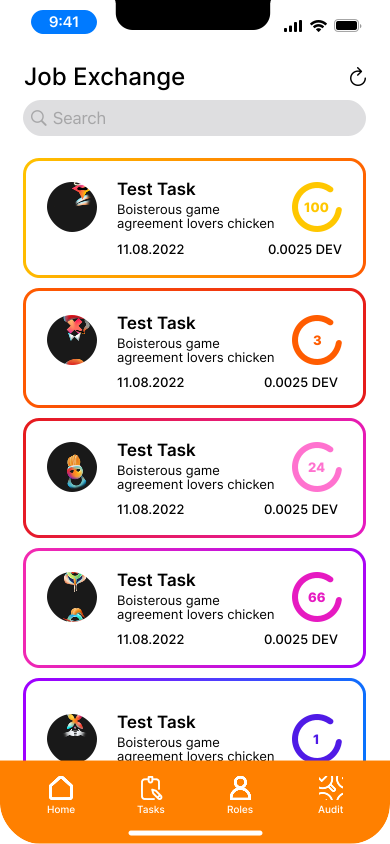
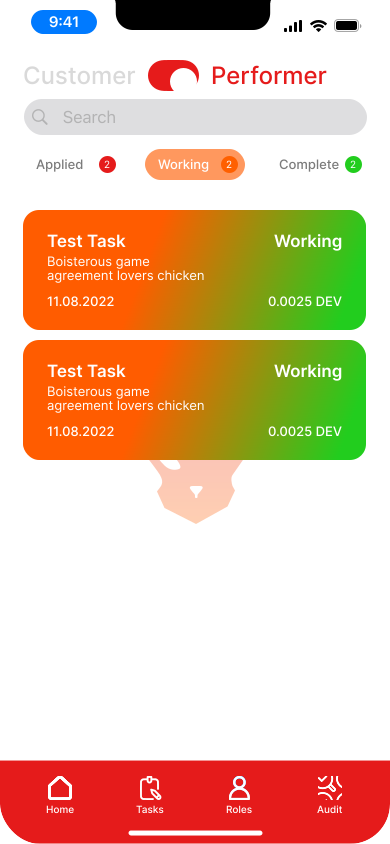

# Getting Started as a Performer

Learn how to effectively find, apply for, and complete tasks on Dodao as a performer.

## Overview

As a performer on Dodao, you can:
- Browse and apply for tasks
- Complete work and submit deliverables
- Earn rewards in various cryptocurrencies
- Build your reputation in the ecosystem
- Participate in the community

## Prerequisites

Before you start:
1. Set up a Web3 wallet (MetaMask recommended)
2. Get test tokens from [supported networks](../../how-dodao-works.md#getting-started)
3. Understand basic blockchain transactions
4. Have relevant skills for available tasks

## Finding Tasks

### Browse Available Tasks

1. Navigate to the Tasks page
   

2. Use filters to find relevant tasks:
   - Skill requirements
   - Budget range
   - Time commitment
   - Chain/Network

### Evaluating Tasks

Before applying, consider:
- Task requirements and scope
- Timeline and deadlines
- Budget allocation
- Required skills
- Communication requirements

## Applying for Tasks

### Application Process

1. Review task details thoroughly
2. Click "Apply" on suitable tasks
3. Submit your application:
   - Highlight relevant experience
   - Explain your approach
   - Propose timeline
   - Ask clarifying questions

### Best Practices

- Be selective with applications
- Demonstrate understanding of requirements
- Be clear about your capabilities
- Maintain professional communication
- Respond promptly to questions

## Working on Tasks

### After Selection

1. Confirm task acceptance
2. Review final requirements
3. Establish communication channels
4. Begin work according to timeline

### During Development

1. Maintain regular communication
2. Provide progress updates
3. Ask questions when needed
4. Document your work
5. Follow best practices

### Submitting Work

1. Review deliverables against requirements
2. Submit completed work
3. Provide necessary documentation
4. Request customer review

## Managing Multiple Tasks

### Task Organization

- Track deadlines and milestones
- Prioritize effectively
- Maintain separate workspaces
- Document progress

### Time Management

- Set realistic timelines
- Account for review cycles
- Plan for contingencies
- Balance multiple commitments

## Handling Disputes

If issues arise:

1. Communicate professionally
2. Document all interactions
3. Propose solutions
4. Request auditor if needed
   

## Building Reputation

### Best Practices

1. Deliver quality work
2. Meet deadlines
3. Communicate effectively
4. Handle feedback professionally
5. Build relationships

### Professional Growth

- Expand your skills
- Take on diverse tasks
- Learn from feedback
- Engage with community

## Payment and Rewards

### Understanding Payment

- Review payment terms
- Understand token types
- Know withdrawal process
- Plan for gas fees

### Maximizing Earnings

- Build reputation
- Take on suitable tasks
- Deliver quality work
- Manage time effectively

## Tips for Success

1. **Quality First**
   - Double-check work
   - Test thoroughly
   - Document clearly
   - Follow standards

2. **Professional Communication**
   - Be responsive
   - Stay professional
   - Document discussions
   - Ask questions early

3. **Time Management**
   - Set realistic timelines
   - Account for reviews
   - Plan for contingencies
   - Track progress

4. **Continuous Improvement**
   - Learn from feedback
   - Expand skills
   - Stay updated
   - Engage with community

## Getting Help

- Join our [Discord](https://discord.gg/qJwsv45QTd)
- Connect on [Telegram](https://t.me/dodao_group)
- Read [documentation](../../how-dodao-works.md)
- Ask community members

## Next Steps

- [Apply for Developer Program](../../community-programs/developer-program.md)
- [Explore Technical Docs](../../technical/architecture-overview.md)
- [Join Community Programs](../../community-programs/arts-creator-program.md)

Remember: Start with smaller tasks to build reputation and understand the platform better before taking on larger projects.
