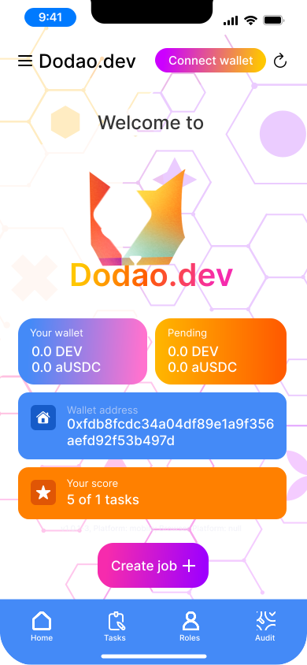
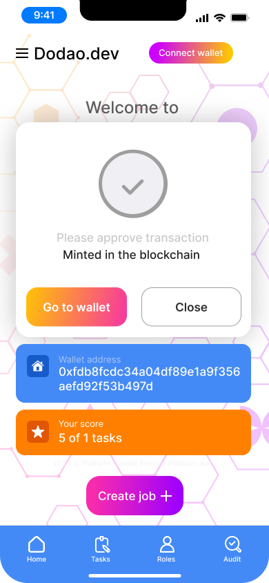
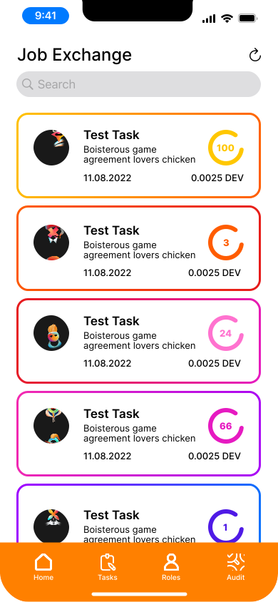
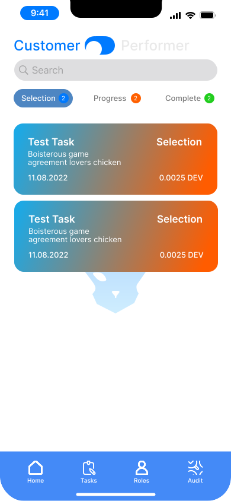
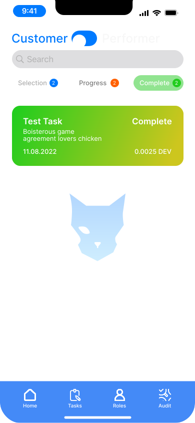
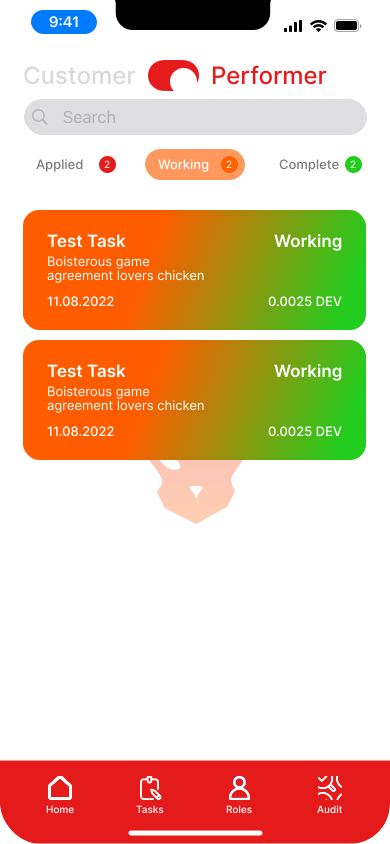
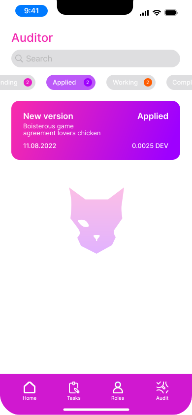

how-dodao-works.md

# How Dodao dApp Works

At the moment, you can test the Dodao WebApp on [dodao.dev](https://dodao.dev) or download the latest [Android release](https://github.com/devopsdao/devopsdao/tags). Later, we will release for iOS and Microsoft.

You can watch a video of how the dApp works here: https://youtu.be/aBmh6_0a_4s?si=WMZWDo5Jx_EmqvuJ

1. First, get some test tokens from the faucets of the supported chains:
   - Moonbase Alpha: [https://apps.moonbeam.network/moonbase-alpha/faucet/](https://apps.moonbeam.network/moonbase-alpha/faucet/)
   - Tanssi: [https://discord.gg/d5ZtpxCXZB](https://discord.gg/d5ZtpxCXZB)  
   - Fantom Testnet: [https://faucet.fantom.network/](https://faucet.fantom.network/)
   - Fantom Sonic Testnet: [https://docs.fantom.foundation/wallet/testnet-faucet](https://docs.fantom.foundation/wallet/testnet-faucet)
   - Polygon Mumbai Testnet: [https://faucet.polygon.technology/](https://faucet.polygon.technology/)
   - zkSync Testnet: [https://portal.zksync.io/faucet](https://portal.zksync.io/faucet)
   - zkEVM Testnet: [https://public.zkevm-test.net:3000/](https://public.zkevm-test.net:3000/)
   - Manta Testnet: [https://faucet.testnet.manta.network/](https://faucet.testnet.manta.network/)
   - Scroll Sepolia Testnet: [https://scroll.io/alpha/faucet](https://scroll.io/alpha/faucet)
   - Ethereum Sepolia Testnet: [https://faucet.sepolia.dev/](https://faucet.sepolia.dev/)
   - SatoshiVM Testnet: [https://satoshivm.network/faucet/](https://satoshivm.network/faucet/)
   - BTTC Testnet: [https://testfaucet.bt.io/#/](https://testfaucet.bt.io/#/)
   - Blast Sepolia Testnet: [https://blastapi.io/faucet.html](https://blastapi.io/faucet.html)

2. Open the dApp and connect your wallet.

3. Create a Job to find matching performers.

4. After your Job is minted in the Blockchain, Performers can apply.

5. Performers can find all open Tasks on the Tasks exchange page.

6. Customers can find all Tasks on the Customer page.

7. Performers can find all applied Tasks on the Performer page.

8. At certain stages of the Task, both the customer and performer can request an audit.

