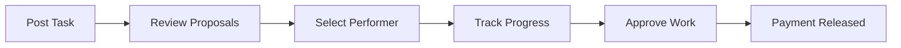
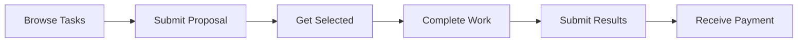
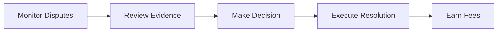

# How it works

**Three simple steps to get work done across any blockchain.**

Imagine posting a task and knowing with absolute certainty that you'll either get exactly what you asked for, or your money back. No more wondering if freelancers will disappear, no more payment disputes, no more platform fees eating into your budget.

Traditional freelance platforms turn simple work arrangements into complex negotiations filled with uncertainty. Dodao transforms this frustrating experience into a smooth, predictable process where smart contracts eliminate the guesswork and blockchain technology ensures everyone gets what they deserve.

Whether you're a startup founder in Singapore needing a smart contract audit, or a DeFi protocol in Amsterdam requiring frontend development, the process is the same: clear requirements, guaranteed escrow, and automatic verification. No human intermediaries, no arbitrary decisions, just code that works exactly as promised.

## The process

What used to require lawyers, escrow services, and weeks of negotiation now happens in three simple steps. Each step is designed to eliminate the friction and uncertainty that makes traditional freelance work so frustrating.

### 1. 📝 Post task
**Customers create tasks with clear requirements**

Think of this as writing a contract that enforces itself. Instead of hoping freelancers will deliver what you asked for, smart contracts guarantee it. Your payment is locked safely until you get exactly what you ordered.

- Set task description and requirements with crystal-clear expectations
- Choose payment token – ETH for simplicity, USDC for stability, or any token you prefer
- Select target blockchain based on your needs and preferences
- Set deadline and budget that work for your timeline
- Funds locked in smart contract escrow – secure until work is completed

### 2. 🏃 Get work  
**Performers compete for tasks**

The best talent rises to the top naturally when everyone competes on merit. No algorithm manipulation, no pay-to-play promotion schemes. Just skilled professionals presenting their best proposals for your consideration.

- Browse tasks across all supported networks without switching platforms
- Submit proposals with realistic timelines and detailed approaches
- Customer selects best performer based on skills and proposal quality
- Work begins with automated milestone tracking and progress updates

### 3. ✅ Auto-verify
**Smart contracts handle completion**

The moment work is submitted, verification begins automatically. No waiting for human reviewers, no "processing delays," no excuses. Code executes, quality is verified, payment flows.

- Performer submits work with GitHub integration for seamless code delivery
- Automated verification via oracles confirms completion standards
- Customer approves final work or requests specific changes
- Payment released automatically to performer's chosen address
- Ratings updated on both sides, building permanent reputation records

## User journeys

Each user type experiences Dodao differently, but all share the same core benefit: certainty. Whether you're paying for work, delivering it, or ensuring fairness, you know exactly what to expect at every step.

### 👤 As a customer

**Your emotional journey:** From frustration with traditional platforms to confidence in guaranteed results. You start with a problem that needs solving and end with exactly what you ordered, delivered on time and on budget.

**Your experience:**
1. **Connect wallet** - MetaMask or any Web3 wallet connects you to the global talent pool
2. **Get test tokens** - From network faucets to start experimenting risk-free
3. **Create task** - Transform your vision into clear requirements with guaranteed escrow
4. **Choose performer** - Review proposals knowing every applicant is verified and rated
5. **Monitor progress** - Built-in chat and updates keep you informed without micromanaging
6. **Approve completion** - Verify work meets your standards before automatic payment release

*From uncertainty to satisfaction: the customer journey that actually works.*

### 🛠️ As a performer

**Your emotional journey:** From competing with hundreds for scraps to showcasing your skills for fair compensation. You start looking for opportunities and end with guaranteed payment for quality work.

**Your experience:**
1. **Connect wallet** - Any Web3 wallet opens doors to global opportunities
2. **Browse tasks** - Filter by skills, payment, and blockchain to find perfect matches
3. **Apply for work** - Submit competitive proposals that highlight your unique value
4. **Deliver results** - Complete work with progress updates that build client confidence
5. **Get verified** - Automated or manual verification confirms your professional standards
6. **Earn tokens** - Receive payment in your chosen token, instantly and automatically

*From gig hunting to career building: the performer journey that respects your skills.*

### ⚖️ As an auditor

**Your emotional journey:** From witnessing platform injustice to actively creating fairness. You start as a community member and evolve into a trusted guardian of ecosystem integrity.

**Your experience:**
1. **Hold Auditor NFT** - Earn through community participation and proven judgment
2. **Monitor disputes** - Get notified of conflicts where your wisdom can restore balance
3. **Review evidence** - Examine work and communications with detective-like attention to detail
4. **Make fair decisions** - Resolve disputes objectively, knowing your judgment shapes the ecosystem
5. **Earn audit fees** - Get paid for maintaining platform quality and community trust

*From observer to guardian: the auditor journey that makes justice profitable.*

## Cross-chain magic

The blockchain world is fragmented by design, but work shouldn't be. While other platforms force you to choose a single ecosystem, Dodao connects them all. Your opportunities are no longer limited by which wallet you use or which tokens you hold.

### 🌐 Any blockchain
Why should network preferences limit your work opportunities? A great developer on Polygon shouldn't miss out on Ethereum projects, and Moonbeam users shouldn't be excluded from cross-chain collaborations.

- **Moonbase Alpha** - Fast and low-cost for rapid iteration and testing
- **Polygon Mumbai** - Ethereum-compatible scaling for familiar development
- **Scroll Sepolia** - Zero-knowledge rollup for privacy-focused projects
- **More coming** - Expanding network support based on community demand

### 💱 Any token
Traditional platforms lock you into their payment systems. Dodao lets you work with the tokens you actually want to use, whether that's ETH for simplicity, stablecoins for predictability, or even NFTs for unique arrangements.

- **Native tokens** - ETH, MATIC, and other network currencies you already hold
- **Stablecoins** - USDC, USDT via Axelar for predictable payments
- **ERC-20 tokens** - Any standard token, including project-specific currencies
- **NFTs** - ERC-721 and ERC-1155 support for creative compensation models

### 🔗 Protocol integration
We don't pick favorites in the cross-chain wars. Instead, we integrate the best protocols to ensure your transactions always find the optimal path for speed, cost, and security.

- **Axelar** - Secure cross-chain communication with proof-of-stake validation
- **LayerZero** - Omnichain infrastructure for seamless multi-chain experiences
- **Hyperlane** - Modular interoperability with customizable security models
- **Wormhole** - Multi-chain messaging with battle-tested reliability

## Smart contract automation

Traditional freelance work is full of manual processes that create delays, errors, and opportunities for disputes. Smart contracts eliminate these friction points by automating everything that can be automated, leaving humans to focus on the creative work that actually matters.

### 🔒 Escrow protection
No more wondering if you'll get paid, or if the work you paid for will actually be delivered. Smart contracts hold everyone accountable with mathematical certainty.

- Funds locked when task created – your payment is guaranteed safe
- Released only on completion approval – no work, no payment
- Dispute resolution via auditor system – fair resolution when conflicts arise
- No payment without verified work – protection for both sides

### 🤖 Automated verification
Why wait for humans to verify what code can check instantly? Our verification systems work around the clock, providing immediate feedback and eliminating processing delays.

- GitHub PR integration for code tasks – seamless integration with developer workflows
- Oracle-based verification systems – external validation for objective completion criteria
- Manual approval for creative work – human judgment where it's actually needed
- Multi-signature for large payments – enhanced security for high-value transactions

### ⚡ Instant settlements
The moment work is approved, payment flows automatically. No "processing time," no "business days," no excuses. Smart contracts execute faster than any traditional payment system.

- Cross-chain payments in seconds – faster than traditional bank transfers
- No manual intervention required – code executes automatically
- Automatic fee distribution – platform fees and auditor rewards handled seamlessly
- Real-time balance updates – see your earnings immediately

## Security features

Security isn't just a feature – it's the foundation that makes everything else possible. When you're working with people across the globe using digital money, trust becomes the most valuable currency. We've built multiple layers of protection so you can focus on work, not worry.

### 🛡️ Built-in protection

**Peace of mind through mathematical certainty.** Traditional platforms ask you to trust them with your money and hope for the best. We eliminate hope from the equation by making security automatic and verifiable.

- **Smart contract escrow** - Your funds are locked in code that can't be changed, bribed, or hacked by humans
- **Multi-signature controls** - Critical platform decisions require multiple trusted parties to agree
- **Oracle verification** - External systems validate work completion without human bias or error
- **Dispute resolution** - Fair conflict resolution through community auditors with skin in the game

*When code handles your money, human error and corruption become impossible.*

### 🔐 Cross-chain security

**Protection that follows you everywhere.** Moving money between blockchains traditionally means trusting bridges and hoping they don't get hacked. We use battle-tested protocols with billions in secured value.

- **Protocol verification** - Every cross-chain message is cryptographically verified by multiple validators
- **Bridge security** - We only integrate with protocols that have proven security track records
- **Economic incentives** - Validators stake their own money to guarantee honest behavior
- **Audit preparation** - Comprehensive security review in progress before mainnet launch

*Your security doesn't depend on a single chain – it's protected across all of them.*

## Ready to start?

The future of work isn't coming – it's here, waiting for you to take the first step. Every day you spend on traditional platforms is another day of unnecessary fees, payment delays, and platform limitations. Why settle for broken systems when better ones exist?

**Choose your path and transform how you work:**

  <a href="/docs/users/customers" className="button button--primary button--lg">
    Post a task
  </a>
  <a href="/docs/users/performers" className="button button--secondary button--lg">
    Find work
  </a>
  <a href="/docs/get-started" className="button button--outline button--lg">
    Quick start guide
  </a>

**For customers:** Stop gambling with freelancers and start guaranteeing results. Your next project could be the one that finally works exactly as planned.

**For performers:** Break free from platform limitations and start earning what you're actually worth. Your skills deserve better than race-to-the-bottom pricing.

**For everyone:** Join the movement that's making work fair, transparent, and profitable for everyone involved.

*The best projects are waiting. The best talent is ready. All that's missing is you.*

---

*All features available on testnet. Experiment risk-free with test tokens.*
