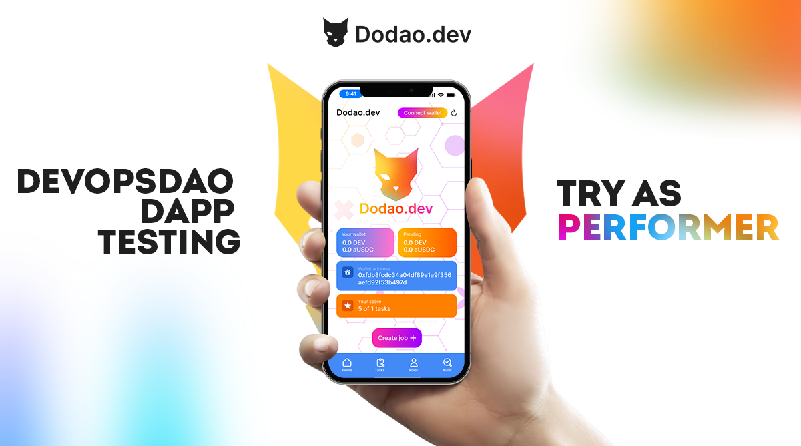

# About Dodao

Let's discover **Dodao in less than 5 minutes**.

Dodao.dev is a decentralized and permissionless marketplace for tech talents and art creators.
The dApp takes advantage of the EIP-2535 Diamond-based smart contract DAO upgradeability, ERC-1155 multi-token flexibility, Flutter cross-platform support, and several omnichain layers.
Dodao is built to be integrated into the Ethereum-compatible blockchain ecosystem and is a truly community-governed project.

Dodao.dev allows for greater scalability and flexibility. With Dodao and its NFT tag-enhanced workflow, teams can easily scale up or down as needed and can also easily add or remove team members. This allows for a more dynamic and flexible workflow, which is essential for successful software development and operations.

## Dodao Workflow Details

The Dodao.dev dApp is built as a uniform platform to bring all software development processes to the blockchain. It will be used as a work marketplace for developers and art creators. Dodao.dev users currently have three roles:

- Customer
- Performer
- Auditor

A Customer is able to create a Task contract with the native token of the selected chain and stablecoins as a reward. Once Performers apply for a Task, the Customer is able to select the Performer for Task implementation. After the Task is implemented, the Performer applies for a Customer review. Currently, all negotiations are performed off-chain via a Customer-selected method (such as Telegram or Discord, for example). When the Customer is happy with the work done, they sign the review, and the Performer will be able to withdraw the tokens to their preferred blockchain supported by Axelar (the chain where the task was created, Ethereum, BNB Chain, Fantom, Avalanche, Polygon). If any dispute occurs, an Auditor can be invited to review the task and settle it.

At the moment, we are live on Testnet, planning to launch on Mainnet soon. Because we build this dApp for all of us as a community, we need your feedback to build a dApp we all want to use.

## Dodao Technology Highlights

- Blockchain: Moonbeam, Scroll, Ethereum, Polygon, Fantom, zkSync, zkEVM, Mantle, BTTC, Blast
- Connected Contracts: Axelar, Hyperlane, LayerZero, Wormhole
- Storage: Arweave
- App: Dart, Flutter, WalletConnect
- Smart Contract: Solidity, Ethereum EIP-2535 Diamonds, EIP-1155 Multi-Token Contracts

The Dodao dApp is built on Flutter 3, powered by the Dart language, a framework optimized for fast native apps on any platform.

Dodao is an early-bird blockchain project based on Flutter, taking advantage of being presented on major platforms. Dodao EIP-2539 based smart contract Diamonds are compiled with Hardhat and depend on the Axelar GMP SDK for cross-chain interoperability. The Dodao web app is served from the decentralized Arweave cloud.

We have implemented Axelar, Hyperlane, LayerZero, and Wormhole smart contracts as Diamond facets to enable cross-chain features.

The Dodao dApp is deployed on Moonbase Alpha and is available via Axelar GMP from Axelar-supported blockchains. It is also available via Hyperlane, Wormhole, and LayerZero bridges.

For Web3 interaction, we support our own WebThree library.

### Contributing

- [Dodao.dev dAPP repository](https://github.com/devopsdao/devopsdao), Dart/Flutter
- [Dodao.dev smart contract repository](https://github.com/devopsdao/devopsdao-smart-contract-diamond), Solidity/Hardhat

## Testing

1. Apply for the [Dodao.dev dAPP testing program](https://www.devopsdao.com/devopsdao-dapp-testing-program/). Read more in this [Medium article](https://dodao.medium.com/test-the-devopsdao-dapp-from-customer-perspective-585b1c3babda).
2. Open the [Dodao.dev dApp](https://dodao.dev) or download the latest [Android release](https://github.com/devopsdao/devopsdao/tags).
3. Provide feedback on bugs on [Dodao Telegram](https://t.me/dodao_group) or [Dodao Discord](https://discord.gg/qJwsv45QTd).

## Promoting

1. Apply for the [Dodao.dev Ambassadorship](https://dodao.medium.com/become-a-devopsdao-ambassador-8c9a640f5156).
2. Share your activities on [Dodao Telegram](https://t.me/dodao_group) or [Dodao Discord](https://discord.gg/qJwsv45QTd).

## Earning

1. Based on your skill profile, apply for the [Dodao.dev developer](https://www.devopsdao.com/developer-onboarding-application/) or [Dodao.dev creator](https://www.devopsdao.com/creator-onboarding-application/) program.
2. Contribute and share on [Dodao Telegram](https://t.me/dodao_group) or [Dodao Discord](https://discord.gg/qJwsv45QTd).

## Budget

[Our budget](./assets/budget.xlsx)

## Contact Us

- Twitter: [https://twitter.com/dodaodev](https://twitter.com/dodaodev)
- Medium: [https://medium.com/@dodao](https://medium.com/@dodao)
- YouTube: [https://www.youtube.com/@dodaodev](https://www.youtube.com/@dodaodev)
- Instagram: [https://www.instagram.com/dodao.dev/](https://www.instagram.com/dodao.dev/)
- TikTok: [https://tiktok.com/@dodaodev](https://tiktok.com/@dodaodev)
- GitHub: [https://github.com/devopsdao](https://github.com/devopsdao)
- Telegram Announcement Channel: [https://t.me/dodao_announcements](https://t.me/dodao_announcements)
- Telegram Group: [https://t.me/dodao_group](https://t.me/dodao_group)
- Discord Server: [https://discord.gg/d5ZtpxCXZB](https://discord.gg/d5ZtpxCXZB)
