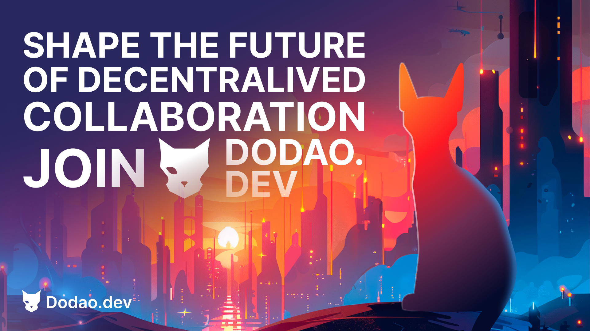

# Investment Overview

**The first blockchain-native freelance platform with proven traction and award-winning recognition.**

*"We're not just building another freelance platform – we're creating the infrastructure for the future of decentralized work, with permanent Skills NFTs and community ownership at its core."*

Dodao represents a paradigm shift from traditional freelance platforms to a blockchain-native ecosystem where professionals own their reputation, skills are permanently verified, and the community governs the platform's evolution.

## 🏆 Investment Highlights

### Award-Winning Platform with Proven Traction
- **🥇 Tanssi LFD Season 1 Winner** - Recognized as the leading blockchain work platform
- **23,946 active participants** with 82% conversion rate in 4-month campaign
- **99,684 Skills NFTs minted** across 1,241 unique collections
- **313.4k transactions** demonstrating technical scalability and user engagement

### First-Mover Advantage in $400B+ Market
- **No direct blockchain competitors** in the freelance space
- **Traditional platforms vulnerable** to Web3 disruption (Upwork, Fiverr, etc.)
- **Skills NFTs innovation** creating permanent, verifiable professional credentials
- **Cross-chain architecture** enabling global, borderless work coordination

### Self-Funded Development with Working Product
- **Fully functional platform** deployed and battle-tested
- **Strong technical foundation** with Diamond pattern smart contracts
- **Proven user engagement** with daily task creation of 150-350 tasks
- **Community-driven growth** with organic adoption and retention

## 💰 Investment Opportunity

### Seed Round: $1-3M
**Current Status:** Self-funded, seeking first institutional investment
**Use of Funds:**
- **40% Team Expansion** - Key hires and advisor recruitment
- **30% Marketing & Growth** - User acquisition and partnerships
- **20% Product Development** - Mainnet launch and advanced features
- **10% Legal & Compliance** - Token structure and regulatory framework

### Target Investors
- **Web3/Blockchain VCs** - Paradigm, a16z crypto, Coinbase Ventures
- **Future of Work VCs** - Bessemer, Greylock, First Round Capital
- **Strategic Angels** - Gitcoin founders, Web3 leaders, platform executives

## 📊 Proven Market Validation

### Tanssi LFD Campaign Results (4 Months)
| Metric | Result | Significance |
|--------|--------|--------------|
| **Campaign Views** | 29,468 | Strong market awareness |
| **Active Participants** | 23,946 | Real user demand |
| **Conversion Rate** | 82% | Product-market fit indicator |
| **Total Tasks** | 22,009 | Platform utility proven |
| **Completed Tasks** | 9,374 | User satisfaction and retention |
| **Skills NFTs Minted** | 99,684 | Core feature adoption |
| **Unique Collections** | 1,241 | Diverse skill verification |
| **Daily Task Creation** | 150-350 | Sustained platform activity |

### Technical Performance Metrics
- **313.4k blockchain transactions** - Scalability demonstrated
- **25.1k unique addresses** - Growing user base
- **223.5k contract calls** - Active platform engagement
- **720K DODAO tokens distributed** - Economic activity and incentives

## 🎯 Market Opportunity

### Global Freelance Market: $400B+ and Growing
- **Traditional platforms dominate** but have fundamental limitations
- **Web2 constraints**: Platform dependency, high fees, reputation lock-in
- **Web3 opportunity**: Ownership, verification, cross-chain capabilities
- **Skills NFTs innovation**: Permanent, portable professional credentials

### Competitive Landscape
- **Traditional platforms**: Upwork ($2.9B market cap), Fiverr ($3.1B market cap)
- **Web3 platforms**: No direct competitors in blockchain-native freelancing
- **Adjacent Web3**: Gitcoin (grants), Braintrust (talent network)
- **Dodao advantage**: First pure blockchain freelance platform with Skills NFTs

## 🚀 Technology & Innovation

### Blockchain-Native Architecture
- **Diamond Pattern Smart Contracts** - Upgradeable, modular, gas-efficient
- **Cross-Chain Functionality** - Multi-network support for global accessibility
- **Skills NFTs System** - Permanent, verifiable professional credentials
- **Community Governance** - Token-based platform decision making

### Technical Differentiators
- **ERC-1155 Skills NFTs** - Granular skill verification and reputation
- **Cross-Chain Payments** - Seamless multi-network transactions
- **Decentralized Dispute Resolution** - Community-driven conflict resolution
- **Permanent Reputation** - Blockchain-stored, platform-independent credentials

## 👥 Team & Advisors

### Current Team
- **Technical Leadership** - Experienced blockchain developers
- **Product Development** - Proven track record in platform building
- **Community Building** - Strong engagement and growth expertise

### Advisor Recruitment Strategy
**Seeking strategic advisors in:**
- **Web3 Industry Leadership** - Protocol founders, ecosystem builders
- **Freelance Platform Expertise** - Traditional platform executives
- **Tokenomics & DeFi** - Economic design and token strategy
- **Enterprise Sales** - B2B growth and partnership development
- **Legal & Regulatory** - Compliance and token structure guidance

## 📈 Growth Strategy

### Phase 1: Foundation (Current)
- ✅ **Product Development** - Core platform functionality
- ✅ **Initial Traction** - Award-winning campaign results
- ✅ **Community Building** - Active user base and engagement
- 🔄 **Seed Funding** - First institutional investment round

### Phase 2: Scale (6-12 months)
- **Mainnet Launch** - Production deployment with full features
- **User Acquisition** - Marketing campaigns and partnership development
- **Enterprise Adoption** - B2B sales and organizational NFTs
- **Mobile Application** - iOS and Android platform expansion

### Phase 3: Expansion (12-24 months)
- **Global Markets** - International expansion and localization
- **Advanced Features** - AI matching, reputation algorithms, analytics
- **Strategic Partnerships** - Integration with major Web3 protocols
- **Token Launch** - Native token and governance implementation

## 💡 Investment Thesis

### Why Dodao Will Win
1. **First-Mover Advantage** - No direct blockchain competitors
2. **Proven Traction** - Award recognition and user engagement
3. **Technical Innovation** - Skills NFTs and cross-chain architecture
4. **Market Timing** - Web3 adoption and remote work trends converging
5. **Community Ownership** - Sustainable competitive moat through governance

### Risk Mitigation
- **Technical Risk** - Proven platform with successful deployment
- **Market Risk** - Validated demand through campaign results
- **Regulatory Risk** - Proactive legal framework development
- **Competition Risk** - Strong technical and community moats

## 🎯 Call to Action

### For Investors
**Ready to invest in the future of decentralized work?**
- **Due Diligence Materials** - Comprehensive technical and business documentation
- **Platform Demo** - Live demonstration of working product
- **Team Meetings** - Direct access to founding team and advisors
- **Investment Process** - Streamlined onboarding for qualified investors

### For Advisors
**Want to shape the future of work?**
- **Strategic Advisory** - Equity-based advisor positions available
- **Industry Expertise** - Leverage your experience in our growth
- **Network Access** - Connect with leading Web3 and future-of-work investors
- **Platform Influence** - Direct input on product and strategy decisions

## 📞 Contact Information

### Investment Inquiries
- **Email**: investors@dodao.dev
- **Deck Request**: pitch@dodao.dev
- **Due Diligence**: dd@dodao.dev

### Advisor Opportunities
- **Strategic Advisors**: advisors@dodao.dev
- **Technical Advisors**: tech-advisors@dodao.dev
- **Business Advisors**: biz-advisors@dodao.dev

### General Information
- **Website**: [dodao.dev](https://dodao.dev)
- **Documentation**: [docs.dodao.dev](https://docs.dodao.dev)
- **Discord**: [Join Community](https://discord.gg/qJwsv45QTd)
- **Twitter**: [@dodao_dev](https://twitter.com/dodao_dev)

---

## 📚 Additional Resources

### Investor Materials
- **[Traction Metrics](/docs/investors/traction-metrics)** - Detailed campaign results and platform stats
- **[Market Analysis](/docs/investors/market-opportunity)** - Comprehensive market research and positioning
- **[Competitive Advantage](/docs/investors/competitive-advantage)** - Technical and strategic differentiation
- **[Tokenomics](/docs/investors/tokenomics)** - Token economics and investment structure
- **[Due Diligence](/docs/investors/due-diligence)** - Technical architecture and legal framework

### Platform Documentation
- **[How It Works](/docs/how-it-works)** - Platform overview and user experience
- **[Skills NFTs](/docs/features/skills-nfts)** - Core innovation and technical implementation
- **[Use Cases](/docs/use-cases/overview)** - Real-world applications and user stories
- **[Technical Architecture](/docs/technical/architecture-overview)** - Smart contract design and infrastructure

---

**The future of work is decentralized, verifiable, and community-owned. Join us in building it.**

*Dodao: Where skills are permanent, reputation is portable, and professionals own their future.*
