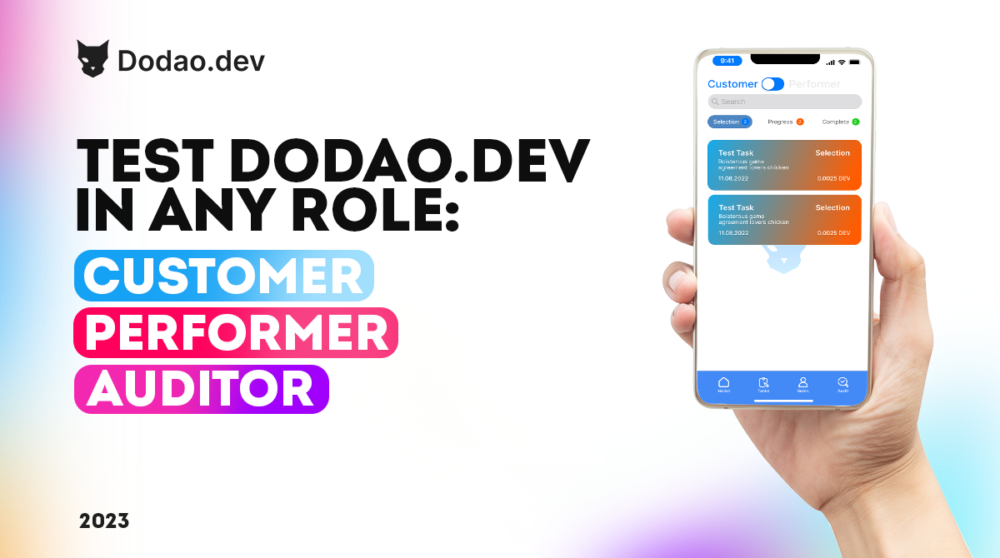

# Dodao Tester Program

The mission of Dodao is to become a major dApp platform for software development in the blockchain community. As the first decentralized job exchange platform, we're launching a fully decentralized mobile app available on iOS, Android, Microsoft, macOS, and Linux. Our success at our first hackathon validates our innovative approach to decentralized software development.

## Who Can Join?

We welcome passionate individuals who are:
- Enthusiastic about technology and Blockchain solutions
- Eager to get involved with the Dodao team
- Interested in networking with the Blockchain community
- Excited to impact the growth of Dodao

The program is open to various types of testers, including:
- Manual testers
- Automation testers
- Usability testers
- Security testers
- Accessibility testers

Whether you're a seasoned professional or just starting your testing journey, the Dodao Tester Program has a place for you.

## What You'll Do

As a Dodao Tester, you will:
- Test our dApp thoroughly
- Identify and report bugs
- Suggest improvement ideas
- Contribute to software quality
- Participate in technical discussions
- Help create a better user experience
- Exchange experiences with like-minded people

## Program Benefits

As you help advance our vision for a serverless, cross-chain, and multi-chain future, you'll enjoy:

### Resources
- Direct access to the Dodao team and leadership
- Step-by-step testing instructions
- Comprehensive support throughout your testing journey

### Networking
- Access to private Telegram groups
- Exclusive Discord channels
- Regular calls with team members and fellow testers

### Rewards and Recognition
- Participation in bug bounties and challenges
- Earn rewards for valuable contributions
- Recognition for impactful feedback
- Early access to new features
- Priority access to events, bounties, and hackathons

## Tester NFTs

One of the key features of the Dodao platform is the use of Tester NFTs. These unique digital assets represent your identity and achievements as a tester. As you participate in the program and contribute to the community, you'll have the opportunity to earn and level up your Tester NFT, unlocking new benefits and rewards along the way.

## How to Get Started

1. [Apply here](https://forms.gle/X1BoC8rVJaDinncQ6) to become a dApp Tester
2. Complete the selection process
3. Gain access to dedicated groups and resources
4. Follow testing instructions
5. Report bugs and suggest improvements
6. Help shape the future of Dodao

## Technical Resources

- GitHub: https://github.com/Dodao
- DevPost: https://devpost.com/Dodao
- Documentation on getting test tokens
- Testing guides and best practices

## Connect With Us

Join our growing community on:
- Twitter: https://twitter.com/devops_dao
- Instagram: https://www.instagram.com/devops_dao/
- Facebook: https://www.facebook.com/profile.php?id=100085403180235
- LinkedIn: https://www.linkedin.com/company/Dodao/
- YouTube: https://www.youtube.com/channel/UCh-32ii7YmUCFXCQf2nibrQ

## Expert Support

Dodao is built by a smart team of blockchain and database engineers and project managers, passionate about improving and scaling blockchain technologies. As a tester, you'll have direct access to this expertise to support your testing efforts.

Ready to help shape the future of decentralized job exchange? [Apply now](https://forms.gle/X1BoC8rVJaDinncQ6) and start your journey with Dodao today!
