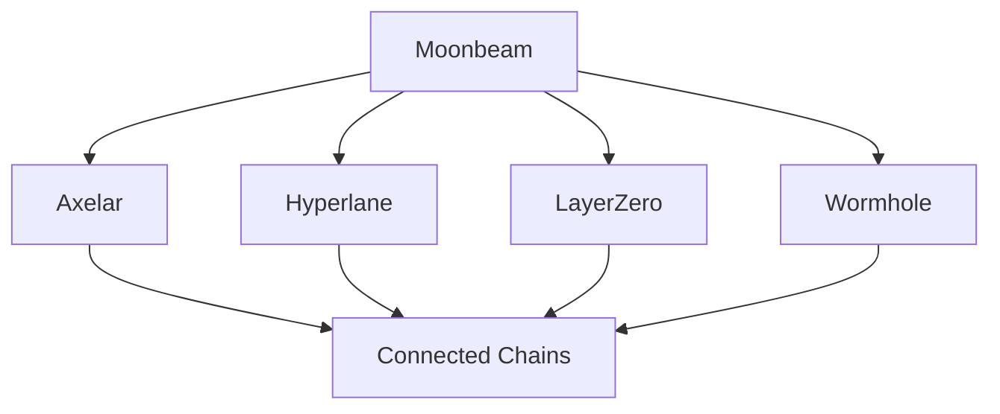

# Architecture Overview

This document provides a comprehensive overview of Dodao's technical architecture, helping developers understand how different components work together.

## System Architecture


### Core Components

1. **Smart Contracts (Blockchain Layer)**
   - Diamond Pattern Implementation (EIP-2535)
   - Multi-token Support (ERC-1155)
   - Cross-chain Communication
   - Task Management System

2. **Frontend Application**
   - Flutter/Dart Implementation
   - Cross-platform Support
   - Web3 Integration
   - Responsive UI/UX

3. **Storage Layer**
   - Arweave Decentralized Storage
   - IPFS Integration
   - On-chain Data Management

4. **Cross-chain Infrastructure**
   - Axelar GMP Integration
   - Hyperlane Support
   - LayerZero Protocol
   - Wormhole Implementation

## Smart Contract Architecture

### Diamond Pattern Implementation

```solidity
// Core Diamond Structure
Diamond (Main Contract)
├── TaskCreateFacet
├── TaskDataFacet
├── AccountsFacet
├── TokenFacet
└── InterchainFacet
```

### Key Components

1. **Task Management**
   - Task Creation and Management
   - User Account Management
   - Task State Transitions
   - Dispute Resolution

2. **Token System**
   - ERC-1155 Implementation
   - NFT Management
   - Token Economics
   - Reward Distribution

3. **Cross-chain Communication**
   - Message Passing
   - State Synchronization
   - Asset Transfers
   - Protocol Integration

## Network Architecture

### Supported Networks



### Cross-chain Features

1. **Asset Bridging**
   - Token Transfers
   - State Synchronization
   - Message Passing

2. **Protocol Integration**
   - Axelar GMP
   - Hyperlane
   - LayerZero
   - Wormhole

## Application Architecture

### Frontend Components

1. **Core Modules**
   - Wallet Integration
   - Task Management UI
   - User Profile System
   - Notification System

2. **Web3 Integration**
   - Custom WebThree Library
   - Transaction Management
   - Contract Interaction
   - Event Handling

### Backend Services

1. **Decentralized Storage**
   - Arweave Integration
   - Content Management
   - Data Persistence

2. **Oracle Services**
   - Witnet Integration
   - External Data Fetching
   - GitHub API Integration

## Security Architecture

### Smart Contract Security

1. **Access Control**
   - Role-based Permissions
   - Function Access Control
   - Diamond Cut Restrictions

2. **Asset Security**
   - Safe Transfer Patterns
   - Reentrancy Protection
   - Integer Overflow Prevention

### Cross-chain Security

1. **Message Verification**
   - Source Chain Validation
   - Message Integrity Checks
   - State Verification

2. **Protocol Security**
   - Bridge Security Measures
   - Transaction Validation
   - Error Handling

## Development Workflow

### Smart Contract Development

```bash
# Local Development
1. Clone Repository
2. Install Dependencies
3. Run Local Network
4. Deploy Contracts
5. Run Tests
```

### Frontend Development

```bash
# Setup Development Environment
1. Install Flutter SDK
2. Configure Web3 Dependencies
3. Run Local Development Server
4. Connect to Test Networks
```

## Integration Points

### External Systems

1. **GitHub Integration**
   - API Integration
   - Webhook Support
   - Automated Verification

2. **Oracle Integration**
   - Witnet Oracle Usage
   - Data Verification
   - External API Access

## Performance Considerations

1. **Smart Contract Optimization**
   - Gas Optimization
   - Storage Patterns
   - Function Delegation

2. **Cross-chain Efficiency**
   - Message Batching
   - State Synchronization
   - Resource Management

## Future Architecture

### Planned Improvements

1. **Scalability**
   - Layer 2 Integration
   - State Channel Support
   - Optimistic Rollups

2. **Feature Expansion**
   - Additional Chain Support
   - Enhanced Oracle Integration
   - Improved Cross-chain Communication

## Resources

- [Smart Contract Documentation](../smart-contract.md)
- [GitHub Repositories](https://github.com/devopsdao)

This architecture overview provides a foundation for understanding Dodao's technical implementation. For detailed implementation specifics, refer to the respective documentation sections.
