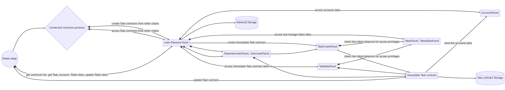

# Architecture Overview



**Building the infrastructure for the future of work.**

*"Great architecture isn't just about solving today's problems – it's about creating a foundation that can evolve, scale, and adapt to challenges we haven't even imagined yet."*

Welcome to the technical heart of Dodao, where cutting-edge blockchain technology meets real-world scalability requirements. This isn't just another smart contract system – it's a carefully architected ecosystem designed to handle millions of work relationships across multiple blockchain networks while maintaining security, efficiency, and user experience excellence.

Every design decision here reflects our commitment to building infrastructure that will power the global economy of the future, where work transcends borders, platforms, and traditional limitations.

## Architectural philosophy

### 🏗️ Design principles

**Modularity and upgradability:**
Built on the Diamond pattern (EIP-2535), our architecture allows for seamless upgrades and feature additions without disrupting existing functionality or requiring user migrations.

**Cross-chain by design:**
Native multi-chain support isn't an afterthought – it's fundamental to our architecture. Every component is designed to work seamlessly across different blockchain networks.

**Security first:**
Multiple layers of security, from smart contract audits to cross-chain validation, ensure that user funds and data remain protected at all times.

**Scalability without compromise:**
Designed to handle millions of transactions while maintaining decentralization and security. Performance optimizations at every layer.

**User experience focus:**
Complex blockchain operations are abstracted away, providing users with familiar, intuitive interfaces while maintaining full decentralization benefits.

### 🌐 Multi-chain vision

**Network agnostic design:**
Our architecture treats blockchain networks as interchangeable infrastructure, allowing users to work across any supported chain without friction.

**Unified user experience:**
Whether you're on Ethereum, Polygon, Moonbeam, or any other supported network, the user experience remains consistent and seamless.

**Cross-chain value flow:**
Payments, reputation, and work history flow seamlessly between chains, creating a truly unified global work ecosystem.

## System architecture

### 🔗 Core components


### 📊 Data flow architecture

**User interaction flow:**
1. **Flutter Interface**: User interacts with mobile or web application
2. **Web3 Integration**: Custom web3dart library handles wallet connections
3. **Smart Contract Calls**: Direct interaction with Diamond proxy contract
4. **Cross-chain Operations**: Bridge protocols handle multi-chain functionality
5. **Oracle Integration**: Witnet provides external data and randomness
6. **Storage Layer**: IPFS stores metadata and files in decentralized manner

**Payment processing flow:**
1. **Payment Initiation**: User initiates payment through Flutter app
2. **Token Approval**: ERC20 token approval if needed
3. **Smart Contract Execution**: Payment processed through Diamond contracts
4. **Cross-chain Bridging**: Bridge protocols handle cross-chain transfers
5. **Confirmation**: Blockchain confirmation and UI update
6. **Reputation Update**: On-chain reputation updates automatically

## Smart contract architecture

### 💎 Diamond pattern implementation

**Why Diamond pattern:**
The Diamond pattern (EIP-2535) allows us to create upgradeable smart contracts that can grow and evolve without the limitations of traditional proxy patterns.

**Core benefits:**
- **Unlimited contract size**: No 24KB contract size limit
- **Modular upgrades**: Add, replace, or remove functions without affecting others
- **Gas efficiency**: Only pay for functions you actually use
- **Transparent upgrades**: All changes are recorded on-chain
- **Backward compatibility**: Existing integrations continue to work

**Diamond structure:**
```solidity
// Diamond Proxy Contract
contract DodaoDiamond {
    // Core diamond functionality
    // Facet management
    // Access control
    // Emergency procedures
}

// Individual Facets
contract TaskCreateFacet {
    // Task creation and management
}

contract TaskDataFacet {
    // Task data retrieval and updates
}

contract AccountFacet {
    // User account management
}

contract TokenFacet {
    // Multi-token payment handling
}
```

### 🔧 Core facets and functionality

**TaskCreateFacet:**
- Task creation with comprehensive metadata
- Performer application and selection processes
- Milestone and payment schedule management
- Task state transitions and workflow control

**TaskDataFacet:**
- Task information retrieval and querying
- Performance metrics and analytics
- Historical data access and reporting
- Search and filtering capabilities

**AccountFacet:**
- User registration and profile management
- Reputation scoring and history tracking
- Skill verification and endorsements
- Cross-chain identity management

**TokenFacet:**
- Multi-token payment processing
- Cross-chain payment coordination
- Fee calculation and distribution
- Token approval and allowance management

**WitnetFacet:**
- Oracle integration for external data
- Price feeds for token conversions
- Random number generation for fair selection
- External API data integration

### 🌉 Cross-chain integration

**Bridge protocol integration:**
- **Axelar**: Secure cross-chain communication with validator network
- **LayerZero**: Ultra-light node architecture for efficient messaging
- **Hyperlane**: Modular interoperability with custom security models
- **Wormhole**: Battle-tested messaging with guardian network

**Cross-chain message flow:**


## Pure on-chain architecture

### 🔗 Web3 integration layer

**Custom web3dart library:**
Our Flutter applications use a custom-developed web3dart library that provides:
- **Direct contract interaction**: No intermediary APIs or backends
- **Wallet integration**: Native MetaMask and WalletConnect support
- **Cross-chain coordination**: Seamless multi-chain operations
- **Event listening**: Real-time blockchain event monitoring
- **Error handling**: Comprehensive transaction error management

**Flutter application architecture:**
```dart
// Core service structure
class DodaoService {
  final Web3Client _client;
  final String _contractAddress;
  final int _chainId;
  
  // Direct contract interactions
  Future<String> createTask(...) async {
    final contract = _getContract();
    final transaction = Transaction.callContract(...);
    return await _client.sendTransaction(...);
  }
  
  // Real-time event listening
  void listenToEvents() {
    _client.events(...).listen((event) {
      // Handle blockchain events
    });
  }
}
```

### 🗄️ Pure on-chain storage strategy

**On-chain storage:**
- All critical business logic and state
- Task information and metadata hashes
- Payment information and balances
- Reputation scores and metrics
- Access control and permissions
- Cross-chain bridge coordination

**IPFS storage (future):**
- NFT images and metadata
- Large file attachments
- Historical archives
- User profile images

**No traditional databases:**
- All data queried directly from smart contracts
- No caching layers or API endpoints
- Pure decentralized data access
- Real-time blockchain state queries

### 📊 Data models

**Task data structure:**
```typescript
interface Task {
  id: string;
  title: string;
  description: string; // IPFS hash
  customer: Address;
  performer?: Address;
  auditor?: Address;
  budget: TokenAmount;
  deadline: Timestamp;
  state: TaskState;
  requirements: string; // IPFS hash
  deliverables?: string; // IPFS hash
  milestones: Milestone[];
  applications: Application[];
  metadata: string; // IPFS hash
}

interface Account {
  address: Address;
  profile: string; // IPFS hash
  reputation: ReputationScore;
  skills: Skill[];
  completedTasks: number;
  totalEarnings: TokenAmount;
  joinDate: Timestamp;
  isVerified: boolean;
}
```

**Cross-chain data synchronization:**
- **Event-driven updates**: Blockchain events trigger data synchronization
- **Conflict resolution**: Timestamp-based conflict resolution for concurrent updates
- **Data integrity**: Cryptographic proofs ensure data hasn't been tampered with
- **Performance optimization**: Intelligent caching and prefetching strategies

## Security architecture

### 🔒 Multi-layered security

**Smart contract security:**
- **Formal verification**: Mathematical proofs of contract correctness
- **Multiple audits**: Independent security audits from leading firms
- **Bug bounty program**: Community-driven vulnerability discovery
- **Gradual rollout**: Phased deployment with monitoring and safeguards

**Infrastructure security:**
- **Zero-trust architecture**: Every request authenticated and authorized
- **Encryption everywhere**: Data encrypted in transit and at rest
- **Regular penetration testing**: Ongoing security assessment and improvement
- **Incident response plan**: Prepared procedures for security incidents

**Cross-chain security:**
- **Bridge validation**: Multiple independent validators for cross-chain messages
- **Timeout mechanisms**: Automatic rollback for failed cross-chain operations
- **Rate limiting**: Protection against spam and abuse
- **Emergency pause**: Ability to halt operations if threats detected

### 🛡️ Access control

**Role-based permissions:**
- **Customer permissions**: Task creation, performer selection, payment authorization
- **Performer permissions**: Task application, work submission, payment claiming
- **Auditor permissions**: Dispute resolution, quality assessment, final arbitration
- **Admin permissions**: System configuration, emergency procedures, governance

**Multi-signature requirements:**
- **High-value operations**: Multiple signatures required for large transactions
- **System upgrades**: Community governance approval for major changes
- **Emergency procedures**: Multi-sig requirements for emergency actions
- **Treasury management**: Distributed control over platform funds

## Performance and scalability

### ⚡ Optimization strategies

**Smart contract optimization:**
- **Gas efficiency**: Optimized contract code for minimal gas usage
- **Batch operations**: Multiple operations combined into single transactions
- **State management**: Efficient storage patterns and data structures
- **Proxy patterns**: Upgradeable contracts without migration costs

**Backend optimization:**
- **Caching strategies**: Multi-layer caching for improved response times
- **Database optimization**: Indexed queries and connection pooling
- **Load balancing**: Distributed traffic across multiple servers
- **CDN integration**: Global content delivery for static assets

**Cross-chain optimization:**
- **Route optimization**: Intelligent routing for lowest cost and fastest execution
- **Batch bridging**: Multiple operations combined for efficiency
- **Predictive caching**: Pre-loading likely cross-chain operations
- **Fallback mechanisms**: Alternative routes when primary bridges are congested

### 📈 Scalability planning

**Horizontal scaling:**
- **Microservices**: Independent scaling of different system components
- **Database sharding**: Distributed data storage for improved performance
- **Load distribution**: Traffic spread across multiple regions and servers
- **Auto-scaling**: Automatic resource allocation based on demand

**Layer 2 integration:**
- **Rollup support**: Integration with Optimistic and ZK rollups
- **State channels**: Direct peer-to-peer channels for frequent interactions
- **Sidechains**: Specialized chains for specific use cases
- **Hybrid approaches**: Combining multiple scaling solutions

## Monitoring and analytics

### 📊 System monitoring

**Real-time metrics:**
- **Transaction throughput**: Monitoring transaction volume and success rates
- **System performance**: Response times, error rates, and resource utilization
- **User activity**: Active users, task creation, and completion rates
- **Cross-chain operations**: Bridge performance and success rates

**Alert systems:**
- **Automated alerts**: Immediate notification of system issues
- **Escalation procedures**: Tiered response for different severity levels
- **Performance thresholds**: Proactive alerts before issues impact users
- **Security monitoring**: Real-time threat detection and response

### 📈 Business analytics

**Platform metrics:**
- **User growth**: Registration, retention, and engagement metrics
- **Economic activity**: Transaction volume, fee generation, token circulation
- **Quality metrics**: Task completion rates, user satisfaction scores
- **Geographic distribution**: Global usage patterns and regional growth

**Predictive analytics:**
- **Demand forecasting**: Predicting task volume and resource requirements
- **User behavior**: Understanding usage patterns and optimization opportunities
- **Market trends**: Identifying growth opportunities and potential challenges
- **Risk assessment**: Early warning systems for potential issues

## Development and deployment

### 🚀 Development workflow

**Continuous integration:**
- **Automated testing**: Comprehensive test suites for all components
- **Code quality**: Automated code review and quality checks
- **Security scanning**: Automated vulnerability detection
- **Performance testing**: Load testing and performance validation

**Deployment pipeline:**
- **Staging environment**: Full replica of production for testing
- **Gradual rollout**: Phased deployment with monitoring and rollback capability
- **Blue-green deployment**: Zero-downtime deployments
- **Rollback procedures**: Quick recovery from deployment issues

### 🔧 Development tools

**Smart contract development:**
- **Hardhat**: Development environment and testing framework
- **Foundry**: Fast, portable, and modular toolkit
- **OpenZeppelin**: Security-focused contract libraries
- **Slither**: Static analysis for vulnerability detection

**Backend development:**
- **TypeScript**: Type-safe JavaScript development
- **Jest**: Testing framework for unit and integration tests
- **Docker**: Containerization for consistent environments
- **Kubernetes**: Container orchestration and scaling

**Frontend development:**
- **React**: Modern web application framework
- **Next.js**: Full-stack React framework with SSR
- **Web3.js**: Blockchain interaction library
- **Tailwind CSS**: Utility-first CSS framework

## Future architecture evolution

### 🔮 Planned enhancements

**Advanced cross-chain features:**
- **Universal messaging**: Seamless communication across all blockchain networks
- **Cross-chain governance**: Unified governance across multiple chains
- **Interchain accounts**: Single identity across all supported networks
- **Cross-chain DeFi**: Integration with DeFi protocols across chains

**Scalability improvements:**
- **ZK-rollup integration**: Zero-knowledge proofs for enhanced privacy and scaling
- **Sharding support**: Horizontal scaling across multiple blockchain shards
- **State rent**: Efficient state management for long-term sustainability
- **Quantum resistance**: Preparation for post-quantum cryptography

**AI and automation:**
- **Intelligent matching**: AI-powered task and performer matching
- **Automated quality assessment**: ML-based work quality evaluation
- **Predictive analytics**: Advanced forecasting and optimization
- **Smart contracts 2.0**: Self-adapting contracts with AI integration

### 🌟 Innovation roadmap

**Research areas:**
- **Decentralized identity**: Self-sovereign identity integration
- **Privacy preservation**: Zero-knowledge proofs for sensitive data
- **Governance evolution**: Advanced voting mechanisms and representation
- **Economic mechanisms**: Novel tokenomics and incentive structures

**Ecosystem expansion:**
- **Protocol partnerships**: Integration with leading DeFi and Web3 protocols
- **Developer tools**: Enhanced SDKs and development frameworks
- **Enterprise features**: B2B functionality and enterprise integrations
- **Global expansion**: Support for additional regions and regulatory frameworks

---

**Ready to build on our architecture?** [Explore Developer Docs →](/docs/developers/overview)

*Join us in building the infrastructure that will power the future of work.*

---

*This architecture overview represents our current implementation and planned evolution. As we continue to innovate and respond to community needs, our architecture will evolve while maintaining backward compatibility and security. For the most current technical specifications, visit our developer documentation or join our technical community discussions.*
