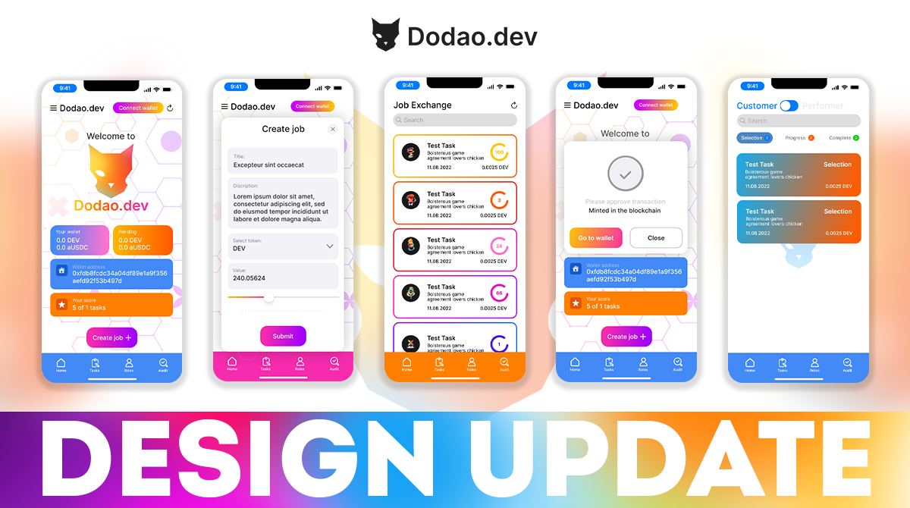
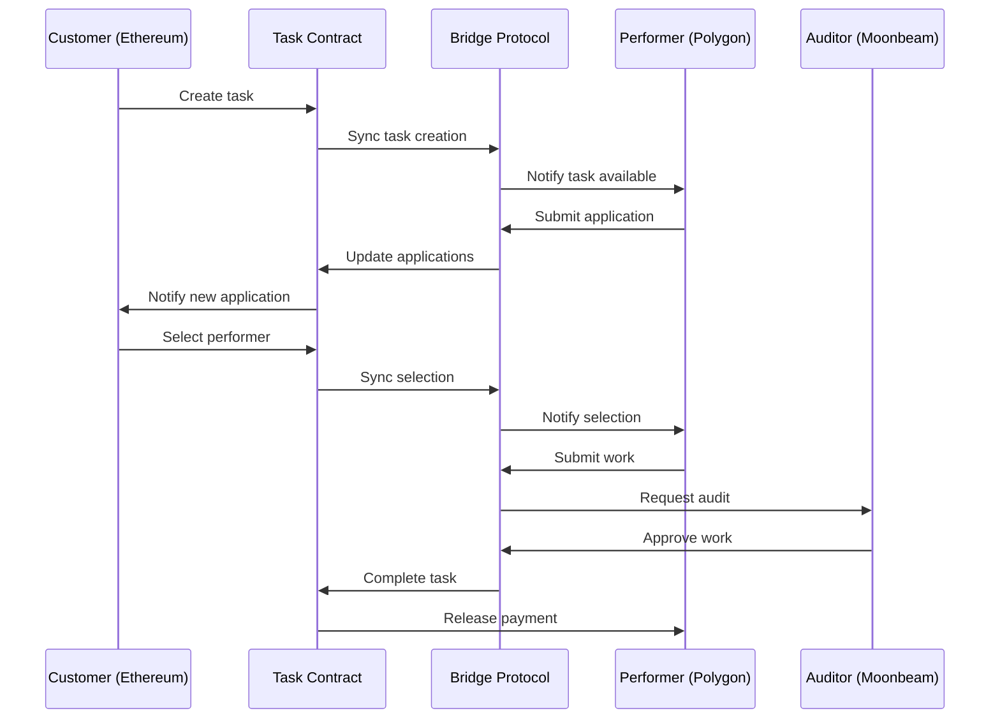

# Cross-Chain Infrastructure



**Connecting the multiverse of blockchain networks.**

*"The future isn't about choosing the right blockchain – it's about building applications that transcend blockchain boundaries entirely."*

Welcome to the technical foundation that makes Dodao truly universal. Our cross-chain infrastructure isn't just about moving tokens between networks; it's about creating a seamless, unified experience where users can work, transact, and build reputation across any blockchain without friction or compromise.

This is where cutting-edge interoperability protocols meet real-world usability, where complex multi-chain operations become as simple as a single click, and where the promise of a truly connected blockchain ecosystem becomes reality.

## Cross-chain vision

### 🌐 Beyond single-chain limitations

**The multi-chain reality:**
The blockchain ecosystem has evolved into a diverse landscape of specialized networks, each optimized for different use cases. Rather than seeing this as fragmentation, we embrace it as specialization – and build infrastructure to connect it all.

**Our approach:**
- **Network agnostic**: Users shouldn't need to know or care which blockchain they're using
- **Seamless experience**: Cross-chain operations feel like native single-chain interactions
- **Optimal routing**: Automatically choose the best path for cost, speed, and security
- **Universal compatibility**: Support for any blockchain that meets our security standards

**The Dodao difference:**
While other platforms force users to choose a single blockchain, we let them use them all. Your work history on Ethereum is accessible on Polygon. Your reputation on Moonbeam transfers to Arbitrum. Your payments flow seamlessly between any supported networks.

### 🔗 Interoperability principles

**Security first:**
Cross-chain operations introduce additional complexity and potential attack vectors. Our infrastructure prioritizes security above all else, using battle-tested protocols and multiple validation layers.

**User experience focus:**
Complex multi-chain operations are abstracted away. Users see simple, familiar interfaces while sophisticated routing and optimization happen behind the scenes.

**Economic efficiency:**
Intelligent routing finds the most cost-effective path for each operation, considering gas fees, bridge costs, and exchange rates across all supported networks.

**Reliability and redundancy:**
Multiple bridge protocols and fallback mechanisms ensure operations complete successfully even if individual components experience issues.

## Supported networks

### 🏗️ Primary networks

**Ethereum (Mainnet)**
- **Role**: Primary smart contract deployment and high-value operations
- **Strengths**: Maximum security, largest ecosystem, established infrastructure
- **Use cases**: Major contracts, governance, high-value payments
- **Bridge protocols**: All supported bridges for maximum connectivity

**Polygon (Matic)**
- **Role**: High-throughput operations and cost-effective transactions
- **Strengths**: Low fees, fast confirmation, Ethereum compatibility
- **Use cases**: Frequent transactions, micro-payments, user onboarding
- **Bridge protocols**: Polygon PoS Bridge, Axelar, LayerZero

**Moonbeam (Polkadot)**
- **Role**: Polkadot ecosystem integration and specialized functionality
- **Strengths**: Polkadot interoperability, unique features, growing ecosystem
- **Use cases**: Cross-ecosystem operations, specialized DeFi integrations
- **Bridge protocols**: Axelar, Wormhole, native Polkadot bridges

**Arbitrum (Layer 2)**
- **Role**: Ethereum scaling with optimistic rollup technology
- **Strengths**: Ethereum compatibility, lower fees, faster transactions
- **Use cases**: DeFi integrations, complex smart contract operations
- **Bridge protocols**: Native Arbitrum bridge, LayerZero, Axelar

### 🚀 Expansion networks

**Optimism**
- **Status**: Integration in progress
- **Benefits**: Ethereum L2 scaling, OP Stack ecosystem
- **Timeline**: Q2 2024 deployment

**Base (Coinbase L2)**
- **Status**: Planned integration
- **Benefits**: Mainstream adoption, enterprise partnerships
- **Timeline**: Q3 2024 deployment

**Avalanche**
- **Status**: Research phase
- **Benefits**: High throughput, subnet customization
- **Timeline**: Q4 2024 evaluation

**Cosmos Hub**
- **Status**: Research phase
- **Benefits**: IBC protocol, sovereign chains
- **Timeline**: 2025 exploration

## Bridge protocols

### 🌉 Axelar Network

**Architecture:**
Axelar provides secure cross-chain communication through a decentralized validator network that reaches consensus on cross-chain transactions.

**Key features:**
- **Validator network**: Decentralized set of validators securing cross-chain messages
- **Universal translator**: Standardized message format across all connected chains
- **Programmable**: Support for arbitrary cross-chain function calls
- **Battle-tested**: Securing billions in cross-chain value

**Integration benefits:**
- **Security**: Proven track record with large-scale deployments
- **Flexibility**: Support for complex cross-chain operations
- **Developer experience**: Comprehensive SDKs and documentation
- **Network effects**: Growing ecosystem of connected applications

**Technical implementation:**
```solidity
// Axelar cross-chain message example
contract DodaoAxelarIntegration {
    IAxelarGateway public gateway;
    IAxelarGasService public gasService;
    
    function sendCrossChainTask(
        string memory destinationChain,
        string memory destinationAddress,
        bytes memory payload
    ) external payable {
        // Pay for gas on destination chain
        gasService.payNativeGasForContractCall{value: msg.value}(
            address(this),
            destinationChain,
            destinationAddress,
            payload,
            msg.sender
        );
        
        // Send cross-chain message
        gateway.callContract(
            destinationChain,
            destinationAddress,
            payload
        );
    }
}
```

### ⚡ LayerZero

**Architecture:**
LayerZero uses ultra-light nodes and oracles to enable direct cross-chain communication without intermediate tokens or wrapped assets.

**Key features:**
- **Ultra-light nodes**: Minimal on-chain footprint for maximum efficiency
- **Oracle + relayer**: Dual validation system for enhanced security
- **Native assets**: No wrapped tokens or intermediate steps
- **Omnichain**: Single application across multiple chains

**Integration benefits:**
- **Efficiency**: Direct cross-chain operations without token wrapping
- **Cost-effective**: Minimal gas overhead for cross-chain operations
- **User experience**: Seamless multi-chain application experience
- **Composability**: Easy integration with existing smart contracts

**Technical implementation:**
```solidity
// LayerZero cross-chain implementation
contract DodaoLayerZeroIntegration is ILayerZeroReceiver {
    ILayerZeroEndpoint public endpoint;
    
    function sendCrossChainMessage(
        uint16 dstChainId,
        bytes memory payload
    ) external payable {
        // Estimate fees
        (uint256 fee, ) = endpoint.estimateFees(
            dstChainId,
            address(this),
            payload,
            false,
            bytes("")
        );
        
        // Send message
        endpoint.send{value: fee}(
            dstChainId,
            abi.encodePacked(address(this)),
            payload,
            payable(msg.sender),
            address(0),
            bytes("")
        );
    }
    
    function lzReceive(
        uint16 srcChainId,
        bytes memory srcAddress,
        uint64 nonce,
        bytes memory payload
    ) external override {
        // Process received message
        _processMessage(srcChainId, payload);
    }
}
```

### 🔗 Hyperlane

**Architecture:**
Hyperlane provides modular interoperability infrastructure where applications can customize their security models and validation mechanisms.

**Key features:**
- **Modular security**: Choose your own validators and security model
- **Permissionless**: Deploy to any chain without permission
- **Customizable**: Tailor security and performance to application needs
- **Sovereign**: Applications control their own interoperability stack

**Integration benefits:**
- **Flexibility**: Customize security model for specific use cases
- **Sovereignty**: Full control over cross-chain operations
- **Scalability**: Deploy to new chains without protocol upgrades
- **Innovation**: Experiment with novel security models

### 🌊 Wormhole

**Architecture:**
Wormhole uses a guardian network to validate and relay messages between chains, with a focus on asset transfers and message passing.

**Key features:**
- **Guardian network**: Decentralized validator set securing cross-chain messages
- **Asset transfers**: Specialized support for token bridging
- **Message passing**: General-purpose cross-chain communication
- **Ecosystem support**: Wide range of supported chains and applications

**Integration benefits:**
- **Proven security**: Battle-tested with billions in secured value
- **Asset focus**: Optimized for token transfers and DeFi operations
- **Broad support**: Extensive chain coverage and ecosystem integration
- **Reliability**: Consistent performance across different market conditions

## Cross-chain operations

### 💰 Payment processing

**Cross-chain payment flow:**
1. **Payment initiation**: User initiates payment on source chain
2. **Route calculation**: System determines optimal cross-chain path
3. **Bridge selection**: Choose best bridge based on cost, speed, security
4. **Token transfer**: Execute cross-chain token transfer
5. **Destination execution**: Complete payment on destination chain
6. **Confirmation**: Update user interfaces and reputation systems

**Optimization strategies:**
- **Route optimization**: Compare costs across all available bridges
- **Batch processing**: Combine multiple operations for efficiency
- **Predictive routing**: Pre-calculate routes for common operations
- **Fallback mechanisms**: Alternative routes if primary bridge fails

**Example payment scenarios:**
```typescript
// Cross-chain payment examples
interface CrossChainPayment {
  sourceChain: string;
  destinationChain: string;
  token: string;
  amount: bigint;
  recipient: string;
  bridge: BridgeProtocol;
}

// Ethereum to Polygon USDC payment
const ethToPolygonPayment: CrossChainPayment = {
  sourceChain: "ethereum",
  destinationChain: "polygon",
  token: "USDC",
  amount: parseUnits("1000", 6),
  recipient: "0x...",
  bridge: BridgeProtocol.AXELAR
};

// Moonbeam to Arbitrum ETH payment
const moonbeamToArbitrumPayment: CrossChainPayment = {
  sourceChain: "moonbeam",
  destinationChain: "arbitrum",
  token: "ETH",
  amount: parseEther("0.5"),
  recipient: "0x...",
  bridge: BridgeProtocol.LAYERZERO
};
```

### 📊 Reputation synchronization

**Cross-chain reputation system:**
User reputation and work history are synchronized across all supported chains, creating a unified professional identity.

**Synchronization mechanisms:**
- **Event-driven updates**: Reputation changes trigger cross-chain updates
- **Merkle proofs**: Cryptographic proofs of reputation data integrity
- **Consensus validation**: Multiple validators confirm reputation updates
- **Conflict resolution**: Timestamp-based resolution for concurrent updates

**Data structures:**
```typescript
interface CrossChainReputation {
  userAddress: string;
  totalScore: number;
  completedTasks: number;
  totalEarnings: TokenAmount[];
  skillRatings: SkillRating[];
  lastUpdated: number;
  merkleRoot: string;
  signatures: ValidatorSignature[];
}

interface ReputationUpdate {
  userAddress: string;
  taskId: string;
  scoreChange: number;
  sourceChain: string;
  timestamp: number;
  proof: MerkleProof;
}
```

### 🔄 Task lifecycle management

**Cross-chain task operations:**
Tasks can be created on one chain, worked on another, and paid from a third, all while maintaining data consistency and security.

**Supported operations:**
- **Task creation**: Create tasks on any supported chain
- **Application submission**: Apply for tasks across chains
- **Work submission**: Submit deliverables to any chain
- **Payment processing**: Receive payments on preferred chain
- **Dispute resolution**: Resolve disputes with cross-chain evidence

**State synchronization:**


## Technical implementation

### 🔧 Smart contract architecture

**Cross-chain contract structure:**
```solidity
// Main cross-chain coordinator contract
contract CrossChainCoordinator {
    mapping(string => IBridge) public bridges;
    mapping(string => uint256) public chainIds;
    mapping(bytes32 => CrossChainOperation) public operations;
    
    struct CrossChainOperation {
        string sourceChain;
        string destinationChain;
        bytes payload;
        OperationStatus status;
        uint256 timestamp;
    }
    
    function initiateCrossChainOperation(
        string memory destinationChain,
        bytes memory payload,
        BridgeProtocol bridge
    ) external returns (bytes32 operationId) {
        // Validate destination chain
        require(chainIds[destinationChain] != 0, "Unsupported chain");
        
        // Generate operation ID
        operationId = keccak256(abi.encodePacked(
            msg.sender,
            destinationChain,
            payload,
            block.timestamp
        ));
        
        // Store operation
        operations[operationId] = CrossChainOperation({
            sourceChain: "current",
            destinationChain: destinationChain,
            payload: payload,
            status: OperationStatus.PENDING,
            timestamp: block.timestamp
        });
        
        // Execute through selected bridge
        bridges[bridgeToString(bridge)].sendMessage(
            destinationChain,
            payload
        );
        
        emit CrossChainOperationInitiated(operationId, destinationChain);
    }
}
```

### 📡 API integration

**Cross-chain API endpoints:**
```typescript
// Cross-chain operation endpoints
POST   /api/v1/cross-chain/estimate     // Estimate costs and times
POST   /api/v1/cross-chain/execute      // Execute cross-chain operation
GET    /api/v1/cross-chain/status/:id   // Check operation status
GET    /api/v1/cross-chain/history      // Get operation history

// Bridge-specific endpoints
GET    /api/v1/bridges/supported        // List supported bridges
GET    /api/v1/bridges/status           // Bridge health status
POST   /api/v1/bridges/route            // Calculate optimal route

// Chain information endpoints
GET    /api/v1/chains/supported         // List supported chains
GET    /api/v1/chains/:id/info          // Get chain information
GET    /api/v1/chains/:id/status        // Check chain status
```

**Route optimization service:**
```typescript
interface RouteOptimizer {
  calculateOptimalRoute(
    sourceChain: string,
    destinationChain: string,
    token: string,
    amount: bigint,
    preferences: RoutePreferences
  ): Promise<OptimalRoute>;
}

interface OptimalRoute {
  bridge: BridgeProtocol;
  estimatedCost: bigint;
  estimatedTime: number;
  confidence: number;
  fallbackRoutes: AlternativeRoute[];
}

interface RoutePreferences {
  prioritizeCost: boolean;
  prioritizeSpeed: boolean;
  prioritizeSecurity: boolean;
  maxSlippage: number;
  maxTime: number;
}
```

### 🔐 Security measures

**Multi-layer validation:**
- **Bridge validation**: Each bridge protocol validates messages independently
- **Consensus requirements**: Multiple validators must agree on cross-chain operations
- **Timeout mechanisms**: Operations automatically fail if not completed within time limits
- **Fraud proofs**: Mechanisms to challenge and revert fraudulent operations

**Risk management:**
- **Bridge monitoring**: Continuous monitoring of bridge health and security
- **Circuit breakers**: Automatic pause mechanisms for detected anomalies
- **Rate limiting**: Limits on cross-chain operation frequency and volume
- **Emergency procedures**: Rapid response protocols for security incidents

**Security implementation:**
```solidity
contract CrossChainSecurity {
    mapping(address => bool) public trustedValidators;
    mapping(bytes32 => uint256) public validatorConfirmations;
    uint256 public constant REQUIRED_CONFIRMATIONS = 3;
    uint256 public constant OPERATION_TIMEOUT = 24 hours;
    
    modifier onlyWithConsensus(bytes32 operationId) {
        require(
            validatorConfirmations[operationId] >= REQUIRED_CONFIRMATIONS,
            "Insufficient validator consensus"
        );
        _;
    }
    
    modifier notExpired(bytes32 operationId) {
        require(
            operations[operationId].timestamp + OPERATION_TIMEOUT > block.timestamp,
            "Operation expired"
        );
        _;
    }
    
    function confirmOperation(bytes32 operationId) external {
        require(trustedValidators[msg.sender], "Not a trusted validator");
        validatorConfirmations[operationId]++;
        
        if (validatorConfirmations[operationId] >= REQUIRED_CONFIRMATIONS) {
            _executeOperation(operationId);
        }
    }
}
```

## Performance optimization

### ⚡ Speed optimization

**Parallel processing:**
- **Concurrent operations**: Multiple cross-chain operations processed simultaneously
- **Batch optimization**: Group related operations for efficiency
- **Predictive execution**: Pre-calculate likely operations for faster execution
- **Caching strategies**: Cache frequently accessed cross-chain data

**Network optimization:**
- **Regional routing**: Route operations through geographically optimal paths
- **Load balancing**: Distribute operations across multiple bridge instances
- **Failover mechanisms**: Automatic switching to alternative routes
- **Performance monitoring**: Real-time tracking of operation speeds

### 💰 Cost optimization

**Fee optimization strategies:**
- **Dynamic routing**: Choose cheapest available route for each operation
- **Gas price monitoring**: Execute operations during low gas price periods
- **Batch processing**: Combine multiple operations to reduce per-operation costs
- **Token optimization**: Use most efficient tokens for cross-chain transfers

**Cost calculation engine:**
```typescript
interface CostCalculator {
  calculateTotalCost(
    operation: CrossChainOperation,
    route: BridgeRoute
  ): Promise<OperationCost>;
}

interface OperationCost {
  sourceFees: bigint;
  bridgeFees: bigint;
  destinationFees: bigint;
  totalCost: bigint;
  estimatedSlippage: bigint;
  confidence: number;
}

class OptimizedCostCalculator implements CostCalculator {
  async calculateTotalCost(
    operation: CrossChainOperation,
    route: BridgeRoute
  ): Promise<OperationCost> {
    // Get real-time gas prices
    const sourceGasPrice = await this.getGasPrice(operation.sourceChain);
    const destGasPrice = await this.getGasPrice(operation.destinationChain);
    
    // Calculate bridge-specific fees
    const bridgeFees = await route.bridge.estimateFees(operation);
    
    // Calculate total cost with slippage
    return {
      sourceFees: sourceGasPrice * operation.gasLimit,
      bridgeFees: bridgeFees,
      destinationFees: destGasPrice * operation.destGasLimit,
      totalCost: sourceFees + bridgeFees + destinationFees,
      estimatedSlippage: this.calculateSlippage(operation),
      confidence: this.calculateConfidence(route)
    };
  }
}
```

## Monitoring and analytics

### 📊 Cross-chain metrics

**Operation metrics:**
- **Success rates**: Percentage of successful cross-chain operations
- **Average completion time**: Time from initiation to completion
- **Cost efficiency**: Average cost per operation type
- **Bridge performance**: Comparative performance across bridge protocols

**User experience metrics:**
- **User satisfaction**: Feedback on cross-chain operation experience
- **Error rates**: Frequency and types of operation failures
- **Support requests**: Cross-chain related support ticket volume
- **Adoption rates**: Usage growth across different chains

**System health monitoring:**
```typescript
interface CrossChainMonitor {
  trackOperation(operationId: string, status: OperationStatus): void;
  getBridgeHealth(bridge: BridgeProtocol): BridgeHealthStatus;
  getChainStatus(chainId: string): ChainStatus;
  generateReport(timeframe: TimeFrame): CrossChainReport;
}

interface BridgeHealthStatus {
  isOperational: boolean;
  successRate: number;
  averageTime: number;
  currentLoad: number;
  lastIncident?: Date;
}

interface CrossChainReport {
  totalOperations: number;
  successRate: number;
  averageCost: bigint;
  averageTime: number;
  bridgePerformance: BridgePerformance[];
  chainDistribution: ChainUsage[];
  userSatisfaction: number;
}
```

### 🚨 Alert systems

**Automated monitoring:**
- **Bridge downtime**: Immediate alerts for bridge service interruptions
- **High failure rates**: Alerts when operation failure rates exceed thresholds
- **Cost anomalies**: Notifications for unusual fee spikes or cost changes
- **Security incidents**: Immediate alerts for potential security threats

**Escalation procedures:**
- **Level 1**: Automated retry and fallback mechanisms
- **Level 2**: Engineering team notification and manual intervention
- **Level 3**: Emergency procedures and user communication
- **Level 4**: Service suspension and security response

## Future developments

### 🔮 Planned enhancements

**Advanced routing:**
- **AI-powered optimization**: Machine learning for optimal route selection
- **Predictive analytics**: Anticipate network congestion and route accordingly
- **Dynamic pricing**: Real-time cost optimization based on market conditions
- **Multi-hop routing**: Complex routes through multiple intermediate chains

**New protocol integrations:**
- **Cosmos IBC**: Integration with Cosmos Inter-Blockchain Communication
- **Polkadot XCM**: Cross-Consensus Message format support
- **Ethereum 2.0**: Native support for Ethereum beacon chain
- **Zero-knowledge bridges**: Privacy-preserving cross-chain operations

**Enhanced security:**
- **Formal verification**: Mathematical proofs of cross-chain operation correctness
- **Quantum resistance**: Preparation for post-quantum cryptography
- **Advanced monitoring**: AI-powered anomaly detection and threat response
- **Insurance integration**: Automated insurance for cross-chain operations

### 🌟 Innovation roadmap

**Research areas:**
- **Universal messaging**: Standardized cross-chain communication protocols
- **Atomic cross-chain swaps**: Trustless multi-chain asset exchanges
- **Cross-chain governance**: Unified governance across multiple networks
- **Interchain accounts**: Single identity across all blockchain networks

**Ecosystem expansion:**
- **Enterprise features**: B2B cross-chain functionality and compliance
- **Mobile optimization**: Enhanced mobile experience for cross-chain operations
- **Developer tools**: Advanced SDKs and development frameworks
- **Regulatory compliance**: Support for regulatory requirements across jurisdictions

---

**Ready to build cross-chain?** [Explore Cross-Chain Development →](/docs/developers/cross-chain)

*Join us in connecting the multiverse of blockchain networks.*

---

*Our cross-chain infrastructure continues to evolve as new protocols emerge and existing ones improve. This documentation reflects our current implementation and planned developments. For the most up-to-date technical specifications and integration guides, visit our developer documentation or join our technical community discussions.*
